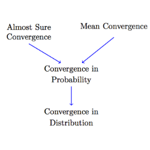
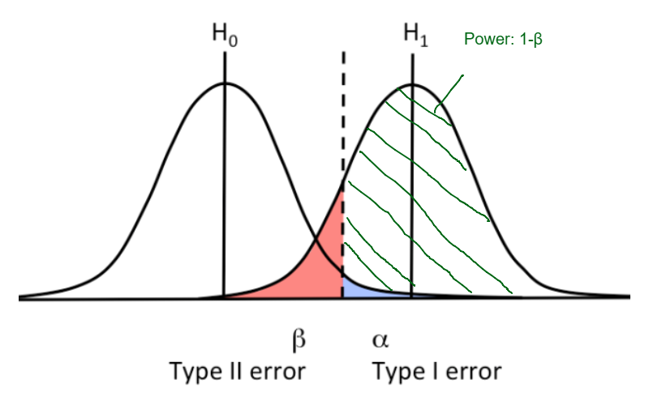

* Probability
** Basic concepts
    1. Axioms of probability
       - Axiom 1: For any event A, P(A)≥0
       - Axiom 2: Probability of the sample space S is P(S)=1
       - Axiom 3: If A1,A2,A3,⋯ are disjoint events, then P(A1∪A2∪A3⋯)=P(A1)+P(A2)+P(A3)+⋯
    2. Conditional probability
       - P(A|B) = P(A∩B)/P(B) = P(A,B)/P(B) = P(B|A)P(A)/P(B) 
       - Chain rule for conditional probability: P(A1∩A2∩⋯∩An)=P(A1)P(A2|A1)P(A3|A2,A1)⋯P(An|An−1An−2⋯A1)
    3. Independence
       - Two events A  and B are independent if and only if P(A∩B)=P(A)P(B) or equivalently, P(A|B)=P(A).
       - Đối với nhiều event A1, A2, ...,Ak  hơn thì tất cả các event này độc lập với nhau khi và chỉ khi tất cả các loại kết hợp P(Ai,...., Aj) = P(Ai)...(PAj).
    4. Law of Total Probability
       - If B1,B2,B3,⋯  is a partition of the sample space S , then for any event A  we have P(A)=∑P(A∩Bi)=∑P(A|Bi)P(Bi).
    5. Conditional Independence
       - Two events A and B  are conditionally independent given an event C with P(C)>0  if P(A∩B|C)=P(A|C)P(B|C)
       - or equivalently P(A|B,C)= P(A|B∩C) = P(A|C)
** Discrete Random variable
   1. Random Variables: 
      - A random variable X is a function from the sample space to the real numbers. X:S→R
      - X is a discrete random variable, if its range is countable.
   2. Probability Mass Function (PMF)
      - P_X(x_k)=P(X=x_k)
   3. Independent Random Variables
      - Consider two discrete random variables X and Y. We say that X  and Y are independent if P(X=x,Y=y)=P(X=x)P(Y=y), for all x,y.
      - In general, if two random variables are independent, then you can write P(X∈A,Y∈B)=P(X∈A)P(Y∈B), for all sets A and B.
   4. Special distributions
      - Bernuoli: 
        + Mô tả xác xuất mặt Head khi toss a coin
        + X ~ Bernouli(p)
      - Gemometric: 
        + X ~ Gemometric (p). P_X(k)
        + Mô tả số lần tung đồng xu đến khi thấy mặt head đầu tiên. Repeating indepent Bernouli until observing the first success. 
      - Binomial:  
        + X ~ Binomial(n, p). P_X(k)
        + Mô tả tung đồng xu n lần, x = k là số lần thấy mặt head. Là tổng của n independent bernouli random variables
      - Negative binomial (Pascal): 
        + X ~ Pascal (m,p). P_X(k)
        + Mô tả số lần tung đồng tung đồng xu (k) để xuất hiện m mặt head, xác xuất 1 lần là p. Tổng quát hóa geometric distribution. Pascal(1,p) = Gemometric(p)
      - Hypergeometric(b,r,k)
        + b bi xanh, r bi đỏ, lấy ra k bi (no replace), x là số bi xanh
      - Poisson: 
        + X ~ Poisson(lamda). P_X(k)
        + Mô tả: X là số lần (k) một sự kiện xuất hiện trong một khoảng thời gian cố định (biết trung bình có lamda sự kiện xảy ra trong khoảng thời gian đó), các sự kiện này độc lập với nhau. (số người đến của hàng trong một khoảng thời gian EX = lamda)
      - Poisson as an approximation for binomial
        + Let X ~ Binomial(n, p=lamda/n). Lim_{n \to \infinity} P_X(k) = e^{-lamda}lamda^k/k!
        + $Binomial(n,p) \approx Poisson(\lambda), np=\lambda, n \approx \infty, p \approx 0$
        + Giả định n-> /infinity thì thử nghiệm trong một khoảng thời gian có thể xấp xỉ là một đại lượng liên tục với trung bình số sự kiện xảy ra là np=lamda, suy ra X ~ Poisson. 
   5. Expectation
      - Theorem: Expectation is linear
        + E(aX + b) = aEX + b
        + E(X1 + ... + Xn) = EX1 + ... + EXn
   6. Functions of random variables
      - Funtion of a random variable is a random variable
      - Y = g(X) then $P_Y(y) = \sum_{x:g(x)=y)}P_X(x)$
      - Expectation: /law of unconscious statistician (LOTUS)/
        + $E[g(X)] = \sum_{x_k \in R_x} P_{X}(x_{k})g(x_{k})$
   7. Variance
      - Theorem: $Var(aX + b) = a^2Var(X)$
      - Theorem: if X1, ..., Xn are independent then $Var[X1 + ... + Xn)= Var(X1) + ... + Var(Xn)$
** Continuous and mixed random variables
   1. Continuous random varibale
      - A random variable X  with CDF F_X(x) is said to be continuous if F_X(x) is a continuous function for all x∈R.
      - f_X(x) = F'_X(x) (PDF)
   2. Expectation
      - $EX = \int_{-\infty}^{+\infty} xf_X(x)dx$
      - LOTUS: $E[g(x)] = \int_{-\infty}^{+\infty} g(x)f_X(x)dx$
   3. Functions of continuous random variables
      - Suppose that X is a continuous random variable and g:R→R  is a strictly monotonic differentiable function. Let Y=g(X). Then the PDF of Y is given by:
      - $f_Y(y) = \begin{cases} \frac{f_X(x_1)}{|g'(x_1)|} = f_X(x_1).|\frac{dx_1}{dy}| &\text{where } g(x_1) = y \\ 0 &\text{if } g(x) = y \text{ does not have a solution} \end{cases}$
      - Thế $x=g^{-1}(y)$ vào phương trình trên ta có phương trình chuyển đổi từ x ->y
   4. Special Distributions
      - Uniform(a,b)
      - Exponential(lamda)
        + Thời gian chờ đến khi xảy ra một sự kiện EX = 1/lamda
        + Tiệm cận của Geometric distribution
      - Normal distribution
        + Standard normal: Z ~N(0,1)
        + $f_Z(z) = \frac{1}{\sqrt{2\pi}}e^{-z^2/2}$
      - Gama distribution: X~Gama(alpha, lamda)
        + Gama function: is an extension of the factorial function. 
          + $\Gama(n)=(n-1)!$
          + $\Gama(\alpha)= \int_{0}^{\infty}x^{\alpha -1}e^{-x}dx \quad \alpha>0$
        + Gama(1, lamda) = Exponential(lamda)
        + sum of n random variables Exponential(lamda) = Gama(n, lamda)
        + EX = alpha/lamda, Var(X) = alpha/lamda^2
   5. Mixed random variables
      - Delta function: We define the delta function δ(x) as an object with the following properties:
        + $\delta(x) = \begin{cases} \infty &x=0 \\ 0 &x\neq0 \end{cases}$
        + $\delta(x) = \frac{d}{dx}u(x) \quad \text{ where u(x) is the unit step function} = \begin{cases} 1 &x \geq 0 \\ 0 &x<0 \end{cases}$
        + $\int_{-\epsilon}^{\epsilon}\delta(x)dx = 1, \forall \epsilon > 0$
        + $\int_{-\infty}^{\infty}g(x)\delta(x-x_0)dx =  \int_{x_0-\epsilon}^{x_0 + \epsilon} g(x)\delta(x-x_0)dx = g(x_0), \forall g(x) \text{ is continuous on } (x_0-\epsilon, x_0  + \epsilon), \epsilon > 0$
      - Generalizd PDF
        + Discrete random variable X và PMF P_X(x_k) $f_X = \sum_{x \in R_X} P_X(x_k)\delta(x-x_k)$
** Joint distributions
*** Two discrete random variables
    1. The joint PMF
       - $P_{XY}(x,y) = P(X=x,y=y)$
    2. Marginal PMFs
       - $P_X = \sum_{y_i \in R_Y}P_{XY}(x,y_j)$ và tương tự cho Y
    3. Marginal CDFs
       - $F_X(x) = F_{XY)(x, \infty)$
    4. Conditional PMF và CDF
       - $P_{X|A}(x) = P(X=x|A) = \frac{P(X=x \text{ and } A)}{P(A)}
         + Lưu ý đây là PMF x có điều kiện tập A
       - $F_{X|A}(x) = P(X \leq x|A)$
       - $P_{X|Y}(x_i|y_j) = \frac{P_{XY}(x_i,y_j)}{P_Y(y_j)}$
         + Còn đây là PMF x có điều kiện là random variale Y, phải chỉ rõ varible Y nhận giá trị nào
    5. Conditional expectation
       - $E[X|A] = \sum_{x_i \in R_X}x_iP_{X|A}(x_i)$
       - $E[X|Y=y_j] = \sum_{x_i \in R_X}x_iP_{X|Y}(x_i|y_j)$
       - Law of iterated expectation: E[X] = E[E[X|Y]] (xem E[X|Y] là một function theo y -> E[X|Y] là một random variable)
       - Law of total Variance: Var(X) = E[Var(X|Y)] + Var(E[X|Y])
*** Two continuous random variables
    1. Expected value of X given Y=y
       - $E[X|Y=y] = \int_{-\infty}^{\infty}xf_{X|Y}(x|y)dx$
    2. Conditional variance
       - $Var(X|Y=y) = E[X^2|Y=y] - (E[X|Y=y])^2$
*** Covariance and Correlation
    1. Covariance
       - Cov(X,Y) = E[(X-EX)(Y-EY)] = E[XY] - (EX)(EY)
       - if X, Y are independent => Cov(X,Y)=0
       - Cov(aX,Y) = aCov(X,Y)
       - Cov(X+Y,Z) = Cov(X,Z) + Cov(Y,Z)
       - Var(aX+bY) = a^2Var(X) + b^2Var(Y) + 2abCov(X,Y)
    2. Correlation coefficent
       - Normalized covariance = Correlation coefficent
       - $\rho_{XY} = \rho(X,Y) = \frac{Cov(X,Y)}{\sqrt{Var(X)Var(Y)}} = \frac{Cov(X,Y)}{\sigma_X\sigma_Y}$
       - $\rho(aX + b, cY + d) = \rho(X,Y) \text{ for } a, c >0$
       - if X and Y are uncorrelated => Var(X+Y)=Var(X)+Var(Y)
*** Bivariate Normal Distribution
    1. Definition
       - if aX + BY has a normal distribution for all a, b \in R, then X and Y are bivariate normal or jointly normal
       - Nếu tưởng tượng Marginal PDF của X hoặc Y tạo ra bằng cách ép dẹp joint distribution theo trục Y hoặc X thì câu định nghĩa trên có nghĩa là ta có thể ép dẹp joint distribution theo bất cứ phương nào (ax+by) cũng được một phân phối chuẩn
    2. Theorems
       - If X and Y are bivariate normal and uncorrelated, then they are independent.
** Multiple random variables
*** Independent and identically distributed(iid)
    - Definition: Random variables X1, X2, ..., Xn  are said to be independent and identically distributed (i.i.d.) if they are independent, and they have the same marginal distributions: FX1(x)=FX2(x)=...=FXn(x), for all x∈R.
*** Sums of random variables
    - E(X1 + X2 + ... + Xn) = EX1 + EX2 + ... + EXn
    - $Var(\sum_{i=1}^{n}X_i) = \sum_{i=1}^{n}Var(X_i) + 2\sum_{i<j}Cov(X_i,X_j)$
*** Moment generating function
    1. nth moment of random variable X
       - E[X^n]
    2. nth central moment of X
       - E[(X - EX)^n]
    3. Moment generating function (MGF) 
       - $M_X(s) = E[e^{sX}]
       - MGF of X exist if there is a constan a>0 | M_X(s) is finite for all s \in [-a,a]
    4. Moment generating dùng làm gì
       - MGF cho ta tất cả moment của X
       - the MGF (if it exists) uniquely determines the distribution. That is, if two random variables have the same MGF, then they must have the same distribution. This method is very useful when we work on sums of several independent random variables. 
    5. Finding moments from MGF
       - Sử dụng chuỗi Taylor ta được:
         + $M_X(s) = \sum_{k=0}^{\infty}E[X^k]\frac{s^k}{k!}$
       - Do đó Lấy đạo hàm thứ k tại s=0 ta được moment thứ n
         + $E[X^k] = \frac{d^k}{ds^k}M_X(s)|_{s=0}$
       - Các bước thường làm
         + Sử dụng PDF hoặc PMF để tìm hàm $M_x(s) = E[e^{sX}]$
         + sau đó lấy đạo hàm thứ k tại s=0 để có kth moment của X
    6. Sum of independent random variables
       - If X1, X2, ..., Xn are n independent random variables, then $M_{X_1 + X_2 + ... + X_n}(s) = M_{X_1}(s)...M_{X_n}(s)$
*** Characteristic Functions
    1. Define
       - $\phi_X(\omega) = E[e^{j\omegaX}]$ where $j=\sqrt{-1}$ and $\omega \in R$
       - The advantage of the characteristic function is that it is defined for /all real-valued random variables/
       - The characteristic function has similar properties to the MGF
         + if X1, ..., Xn are n independent random variables, then $\phi_{X_1 + ... + X_n}(\omega) = \phi_{X_1}...\phi_{X_n}(\omega)$
** Probability bounds
   1. Union bound
      - P(A∪B)=P(A)+P(B)−P(A∩B)≤P(A)+P(B).
      - P hợp nhỏ hơn tổng P thành phần
   2. Markov's inequality
      - If X >=0, P(X≥a) ≤ (EX)/a, for any a>0.
   3. Chebyshev's inequality
      - f X is any random variable, then for any b>0  we have P(|X−EX|≥b) ≤ Var(X) / b^2
   4. Chernoff Bounds
      - $P(X \geq a) \leq e^{−sa}M_X(s)$ for all s>0
      - $P(X \leq a) \leq e^{−sa}M_X(s)$  for all s<0
      - Chọn s sao cho $e^{−sa}M_X(s)$ nhỏ nhất ta tìm được best bound
   5. Cauchy-Schwarz Inequality
      - $|EXY| \leq \sqrt{E[X^2]E[Y^2]}$ 
      - "=" <=> X = aY, a \in R
   6. Jensen's Inequality
      - If g(x) is a convex function on R_X, and E[g(X)] and g(E[X]) are finite, then E[g(X)] ≥ g(E[X]).
** Limit and Convergence
*** Limit theorems
    1. Law of large numbers
       - The weak law of large numbers
         + Let X1,... , Xn be i.i.d. random variables with a finite expected value EXi=μ<∞. Then, for any $\epsilon >0, \lim_{n\to\infty}P(|\overline{X} - \mu| \geq \epsilon) = 0$
         + Với $\overline{X} = \frac{X_1 +... + X_n}{n}$. we call random variable $\overline{X}$ the sample mean.
    2. Central limit theorem
       - Sum of n iid random variables with finte mean and finte variance /converges in distribution/ to the normal random variable as n goes to infinity.
*** Convergence of random variables
    1. Sequence of random variables
       - a sequence of random variables is in fact a /sequence of functions/ X_n:S→R. 
       - it is useful to remember that we have an underlying sample space S
    2. Different Types of Convergence
       - In distribution, probability, mean, and almost sure
       - Relations between different types of convergence 
       - Convergence in Distribution
         + A sequence of random variables X1, X2, ⋯ converges in distribution to a random variable X, if lim_{n→∞}F_Xn(x)=F_X(x), /for all x at which F_X(x) is continuous/.
         + Những chỗ F_X(x) không liên tục (step) là những chỗ F_Xn(x)sẽ dần thẳng đứng, F_Xn(x) có thể nhận bất kỳ giá trị nào giữa "step" của F_X(x). 
       - Convergence in mean
         + Convergence in the rth mean or in the L^r norm $\lim_{n\to\infty}E(|X_n-X|^r)=0$ with r>=1, if r=2 it is called the mean-square convergence
       - Almost sure convergence
         + Bước 1: tìm tập $A = {s \in S:\lim_{n\to\infty}X_n(s) = X(s)}$, nghĩa là tất cả các điểm trong sample space của random variable X_n - X sao cho n→∞ thì X_n-X = 0. 
         + Bước 2: tính P(A), nếu P(A) = 1 thi ta có almost sure convergence
         + Một số trường hợp chứng minh trực tiếp almost sure convergence từ định nghĩa có thể khó khăn, có thể dựa vào các theorems (xem thêm)
         + The strong law of large numbers: $\overline(X) = \frac{X_1 + ...+ X_n}{n}$ almost sure convergence to $EX_i = \mu < \infty$
       - So sánh almost sure và in probability convergence
         + Trong in probability convergence: bước 1 ta tính tập A gồm những điểm trong sample space sao cho $|X_n-X| \geq \epsion$, bước 2 tính lim của P(A) dần đến 0 nghĩa là "mass" của những điểm này dẫn đến 0, vẫn có thể có những ngoại lệ |X_n-X| lớn nhưng càng ngày càng hiếm dần so với tổng thể
         + Trong Almost sure, các điểm này dần "settle down" xuống 1 giá trị ổn định, nghĩa là với một n>N_0 đủ lớn |X_n-X| sẽ luôn nhỏ hơn \epsilon, ta chắc chắn không có ngoại lệ nào Khiến |X_n-X| lớn bất thường. Điều này quan trọng trong thiết kế các hệ thống cần tin cậy cao, và sai lầm có thể dẫn đến nguy hiểm nghiêm trọng, điều có thể xảy ra trong in probability convergence but not in Almost sure convergence. Một điều lưu ý là vẫn có những điểm ngoại lệ trong sample space nhưng các điểm này chỉ rải rác, miễn P(A) = 1. 
         + Các này tương tự sự khác biêỵ giữa pointwise convergence và uniform convergence trong real analysis
** Statistical inference: classical methods
*** Random sampling
    1. Random sample
       - The collection of random variables X1, ..., Xn is a random sample of size n if they are iid.
*** Point estimation
    1. Assumption
       - Chúng ta cần ước tính $\theta$ từ dữ liệu, ta giả định $\theta$ là một sự thật, fixed, không random. 
    2. Point Estimator
       - A point estimator $\hat{\Theta}$ is a function of the random sample, i.e., $\hat{\Theta} = h(X_1,X_2,...,X_n)$.
    3. Evaluating Estimators
       - Bias: $B(\hat{\Theta}) = E[\hat{\Theta}] - \theta$.
         + Lưu ý $B(\hat{\Theta})$ có thể phụ thuộc vào giá trị của $\theta$, $\hat{\Theta}$ is unbiased nếu $B(\hat{\Theta})$ = 0 với mọi giá trị cá thể có của $\theta$
       - Mean square error (MSE)
         + $MSE(\hat{\Theta}) = E[(\hat{\Theta} - \theta)^2] = Var(\hat{\Theta}) + B(\hat{\Theta})^2
       - Consistent
         + $\lim_{n\to\infty}P(|\hat{\Theta}-\theta| \geq \epsilon) = 0, \forall \epsilon >0$
       - Theorem
         + if $\lim_{n\to\infty}MSE(\hat{\Theta}_n})=0$ then $\hat{\Theta}$ is a consistent estimator of $\theta$.
    4. Maximum likelihood estimation (MLE)
       - Likelihood function là xác xuất quan sát được random sample from distribution with parameter $\theta$, tổng quát hóa $\theta$ có thể là vector $\theta=(\theta_1, ..., \theta_k)$. 
       - $L(\vec{x};\vec{\theta})=P_{\vec{X}}(\vec{x};\vec{\theta})$
       - Asymptotic Properties of MLEs
         + asymptotically consistent
         + asymptotically unbiased
         + approximately a normal random variable
         + *Lưu ý* /Asymptotic/, MLE thường hay biased
*** Interval estimation
    1. Pivotal Quantity
       - $Q = Q(X_1, ..., Xn, \theta)$, the probability  distribution of Q does not depend on θ or any other unknown parameters. 
    2. The Chi-squared Distribution
       - If $Z_1, ..., Z_n$ are independent standard normal random variables then $Y = Z_1^2 + ... + Z_n^2 \sim \chi^2(n)$
       - The chi-squared distribution is a special case of the gamma distribution Y ~ Gamma(n/2, 1/2). 
       - EY = n, Var(Y) = 2n
    3. The t-Distribution
       - Z ~ N(0,1), $Y \sim \chi^2(n)$, Z and Y are independent. $T = \frac{Z}{\sqrt{Y/n}}$ is a t-distribution with n degrees of freedom shown by T ~ T(n). 
*** Hypothesis testing
    1. Statistic
       - /A statistic is a real-valued function of the data./
       - A test statistic is a statistic based on which we build our test. 
    2. Errors
       - Sai lầm loại I (α) và loại 2 (β) và power (1-β)
** Statistical inference: Bayesian Inference
   1. Bayesian Statistical Inference
      - The goal is to draw inferences about an unknown variable X by observing a related random variable Y
      - The unknown variable is modeled as a random variable X, with /prior distribution/ f_X(x) or P_X(x)
      - The /posterior distribution/ of X: $f_{X|Y}(x|y)$ or $P_{X|Y}(x|y)$
      - The posterior distribution is usually found using Bayes' formula. Using the posterior distribution, we can then find point or interval estimates of X.
   2. Maximum A Posteriori (MAP) Estimation
      - To find the MAP estimate, we need to find the value of x  that maximizes $f_{X|Y}(x|y) = \frac{f_{Y|X}(y|x)f_X(x)}{f_Y(y)}$. that equivalently find the value of x that maximizes $f_{Y|X}(y|x)f_X(x)$
      - *Comparison to MLE*: 
        + MLE find the value of x that maximizes: $f_{Y|X}(y|x)$
        + MAP find the value of x that maximizes: $f_{Y|X}(y|x)f_X(x)$
        + The difference is that MAP has an extra term, f_X(x). if X is uniformly distributed over a finite interval, then the ML and the MAP estimate will be the same.
   3. Minimum mean squared error (MMSE)
      - Tên khác: least mean squares (LMS) estimate or Bayes' estimate. $\hat{x} = E[X|Y=y]$
      - Scenario: We have X, Y. X is related to Y in some way (not independent). We know the distributions of X and Y but can only observer Y. If we observer value Y=y, what value of X should be?
      - Method for solving: let $\hat{x}$ is an estimator of X. $\hat{x} =g(y)$ is a function of y. we need to find g(y) such that minimize the mean squared error $E[(X-g(y))^2|Y=y]$
      - the posterior distribution, fX|Y(x|y), contains all the knowledge that we have about the unknown quantity X. Therefore, /to find a point estimate of X, we can just choose a summary statistic of the posterior such as its mean, median, or mode/. If we choose the mode (the value of x that maximizes fX|Y(x|y)), we obtain the MAP estimate of X. Another option would be to choose the posterior mean, i.e., E[X|Y=y], this value minimizes the mean quared error, therefore the name MMSE. 
   4. Linear MMSE Estimation of Random Variables
      - Bối cảnh: E[X|Y=y] có thể có dạng khó phức tạp, khó tính toán. 
      - Giải quyết vấn đề: thay vì tính trực tiếp E[X|Y=y] ta có thể giả định $\hat{X} = aY+b$ thay vào $MSE = E[(X-\hat{X})^2] = E(X−aY−b)^2]$ => tính a, b => Linear MMSE Estimation
   5. *Compare MMSE (conditonal mean) vs Linear MMSE Estimation (1) vs MLE vs simple regression (least square error) (2)*
      - (1) deal with population (bayesian, ta biết distribution/moments of X, Y) vs (2) deal with sample data
      - (1) nếu X và Y jointly normal (the noise is Gaussian) thì conditional mean E[X|Y=y] <=> Linear MMSE Estimation vs (2) MLE <=> simple regression (least square error) nếu the noise is Gaussian, nếu không MLE sẽ theo distribution của noise. Như vậy MLE tương tự MMSE (conditional mean) [không giả định distribution của noise] và Linear MMSE Estimation tương tự least square error [giả định Gaussian noise]
   6. Bayesian hypothesis testing
      - MAP Hypothesis Test
        + Bối cảnh: Suppose we need to decide between two hypotheses H_0 and H_1. Assume that we know the prior distribution of H, it mean we know P(H_0) and P(H_1) = 1 - P(H_0). We observe the random variable Y, and we know $f_{Y|H}$. 
        + Giải quyết:  Using Bayes' rule, we can compute the posterior P(H|Y). Có thể mở rộng cho trường hợp nhiều giả thuyết H_i. MAP Choose the hypothesis with the highest posterior probability, P(H_i|Y=y). Equivalently, choose hypothesis H_i with the highest f_Y(y|H_i)P(H_i) 
      - Minimum Cost Hypothesis Test: 
        + Bối cảnh: Giả sử chúng ta buid một hệ thống báo cháy vì lợi ích - thiệt hại, cần hạn chế tác hại của báo động giả (ít ngân sách) hoặc hạn chế tác hại của âm tính giả (tác hại lớn)
        + Giải quyết: Ta chỉ chọn H_1 (báo động) khi P(H_1|Y=y)/P(H_0|Y=y) lớn hơn một ngưỡng nào đó 
   7. Bayesian interval estimation (Credible Intervals)
      - Một khi ta có posterior distribution, ta chỉ đơn giản là tính $P(a \leq X \leq b|Y=y) = 1 - \alpha$ từ $f_{X|Y}(x|y)$. 
** Random Process
   1. Basic concepts
      - A random process is a collection of random variables usually indexed by time X(t). 
      - A random process is a random function of time. Khi ta lấy sample theo thời gian, ta được một đồ thị của một function, we call each of these possible functions of X(t) a sample function or sample path. It is also called a realization of X(t).
      - In engineering applications, random processes are often referred to as /random signals/.
      - Deal with dynamic concept, How events occur over time. 
* Statistics
** Wald's test:
  - Tương tự z test cho multivariable
  - lúc này \theta - \theta_0 sẽ thành norm || \theta - \theta_0||, normal distribution -> Chi-squared
** Method of moments:
  - Một các khác (MLE, MAP, least squared) để estimate parameter, các moment ước tính bằng sample. từ moment ước tính ta có thể suy ngược ra được CDF, PMF...
  - vd: estimate u và ơ của Z (u, ơ) -> 1st moment: E[X] = u, 2nd moment: E[X^2] = u^2 + ơ^2
** Fisher information:
  - ước tính độ nhạy (thông tin) mà data có thể estimate parameter (theta) bằng cách đo lường độ cong của log(f(x|theta)) dùng đạo hàm bậc 2. Có thể ứng dụng để thiết kế cách lấy số liệu nghiên cứu sao cho fisher information là lớn nhất.
** KL divergence:
  - một cách dùng đo lường sự khác biệt giữa 2 distributions, MLE có thể suy ra từ KL divergence
** Monter Carlo intergation:
  - dùng xác suất để tính tích phân, (vd tính diện tích 1/4 hình tròn, từ đó có thể ước tính số pi)
** Likelihood ratio test:
  - The primary goal of the LRT is to determine if a more complex model (the alternative hypothesis, H1​) provides a significantly better fit to the observed data than a simpler, constrained model (the null hypothesis, H0​).
  - vd: fit cox model 4 biến , sau đó fit lại với 3 biến (set coefition 1 biến cần test =0) -> dùng likelihood ratio test để kiểm định có ý nghĩa thống kê không.
  - Bối cảnh Giả sử ta có một mô hình cox 4 biến, trong có có một biến \beta_1 nhỏ hơn nhiều so với các biến còn lại, ta nghĩ rằng biến này không giải thích dữ liệu, ta không chắc nó có ý nghĩa thống kê hay không => ta dùng mô hình nhỏ hơn 3 biến không có \beta_1 => LRT không có khác biệt ý nghĩa giữa 2 mô hình này -> \beta_1 không giải thích dữ liệu".
** Boostraping
   - Bối cảnh: ta có một random sample tốt từ population nhưng không có closed form, hoặc closed form phức tạp. Làm thế nào tính toán được các statistic đáng tin cậy
   - Giải quyết: resampling with replacement (boostraping), chúng ta thu được một distribution tiệm cận với distribution của sample, từ dữ liệu simulation này ta tính ra được, mean, CL, variance...
   - Caveat: Boostrap chỉ giúp ta khảo sát distribution của sample, nếu sample is gabage then boostrap is gabage. 
** Slutsky's theorem
   - Let (X_n), (Y_n) be to sequences of r.v., such that
     + (i) $X_n \xrightarrow[n\to\infty]{(d)} X;$
     + (ii) $Y_n \xrightarrow[n\to\infty]{P} c,
   - where X is a r.v. and c is a given real number. Then, 
   - $(X_n,Y_n) \xrightarrow[n\to\infty]{(d)} (X,c)$, in particular $X_n + Y_n \xrightarrow[n\to\infty]{(d)} X + c$, $X_nY_n \xrightarrow[n\to\infty]{(d)} cX,...$
** Non-parametric test
   - Sự phân chia kiểm định tham số với kiểm định phi tham số chỉ mang tính tương đối để tiện cho việc giảng dạy. Kiểm định phi tham số nghĩa là kiểm định ít hoặc không giả định liên quan đến tham số. Khi dùng bất cứ loại kiểm định nào cũng phải kiểm tra kỹ càng xem kiểm định này có những giải định nào, dữ liệu của ta có thỏa mãn những giả định đó hay không.
** Fisher exact test 
   - Dùng cho biến rời rạc (bảng đếm) khi dữ liệu ít, tính chính xác p bằng cách tính tất của các khả năng (giả định H_0 dữ liệu thu được by chance)
   - Khi dữ liệu nhiều, dùng kiểm định chi bình phương dễ dàng hơn (dùng Fisher exact test tốn tính toán nhiều)
   - Xem ví dụ Lady tasting tea
** Permutation test
  - Ý tưởng tương tự Fisher exact test nhưng nếu dữ liệu lớn tính tất cả khả năng sẽ khó -> chọn ngẫu nhiên trong các khả năng và tính p dựa trên random sample
  - Lưu ý không lẫn lộn với boostrap (dùng để ước lượng các statistic từ sample: mean, variance, CL...)