* Secondary hypertension
** Diagnosis of Secondary Hypertension: An Age-Based Approach
*** Các nguyên nhân thường gặp theo tuổi
    - https://www.aafp.org/pubs/afp/issues/2010/1215/p1471.html
    - 5-10% người lớn THA là thứ phát
    - Người trẻ, đặc biệt phụ nữ, thường gặp renal artery stenosis caused by fibromuscular dysplasia. (chẩn đoán băng MRI có cản từ hoặc CT cản quang)
    - Người lớn tuổi, thường gặp hẹp ĐM thận do xơ vữa
    - Người trung niên, thường gặp nhất cường aldosteron, initial diagnostic test is an aldosterone/renin ratio
    - 70-85% trẻ em THA có nguyên nhân, thường gặp nhất là bệnh nhu mô thận
*** Tiếp cận
    - 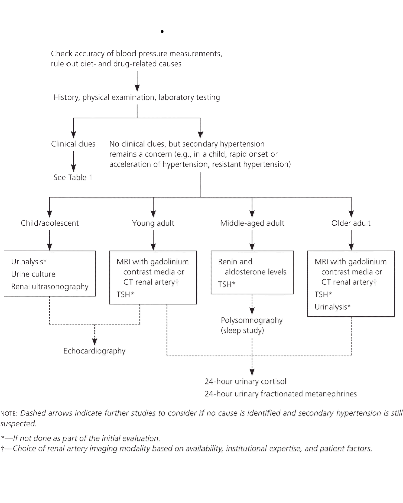
    - 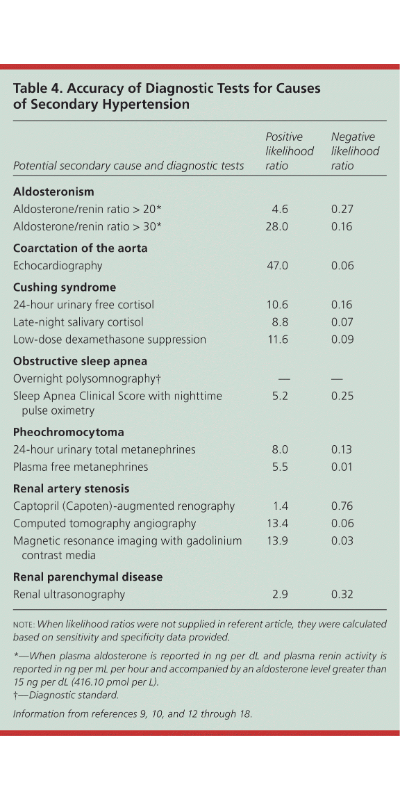
    - Do thuốc?
    - Trẻ em 0-12y
      +  70-85% thứ phát, bệnh nhu mô thận, hẹp eo ĐMC (khác biệt huyết áp tay-chân >20mmHg)
    - Trẻ lớn 12 - 18y
      + 10-15%, bệnh nhu mô thận, hẹp eo ĐMC
    - Người trẻ 19-39y
      + 5%, bệnh lý tuyến giáp, hẹp ĐM thận do loạn sản xơ cơ, bệnh nhu mô thận
    - Trung niên, 40-64y
      + 8-12%, cường aldosteron, bệnh lý tuyến giáp, hội chứng ngưng thở khi ngủ, hội chứng cushing, pheochromocytoma
    - Lớn tuổi, >65y
      + 17%, hẹp ĐM thận do xơ vữa, suy thận, suy giáp
** ESH 2014 2nd Hypertesion: when who and how to screen
*** who
    - Age: trẻ em; người < 30 tuổi không có yếu tố nguy cơ, không có tiền căn gia đình; người lớn tăng huyết áp cấp tính, tăng huyết áp kháng trị
    - Habitus: người thừa cân với tăng huyết áp kháng trị (OSA, nội tiết)
    - Huyết áp: 
      + Tăng huyết áp kháng trị
      + Huyết áp rất cao (>180/110 mmHg)
      + Tăng huyết áp cấp cứu
      + Huyết áp cao đột ngột ở người trước đó ổn định
      + Non-dipping or reverse dipping during 24 h ambulatory BP monitoring
    - Gợi ý nguyên nhân sau khi khởi trị thuốc
      + Giảm Kali với liều nhỏ lợi tiểu: primary aldosteronism or other endogenous or exogenous mineralocorticoid excess
      + Giảm độ lọc cầu thận với liều nhỏ ức chế men chuyển
      + Tăng huyết áp kháng trị
      + Huyết áp dao động nhiều
** Nguyên nhân
   - Primaryaldosteronism (Conn syndrome)
     + Lâm sàng: Hạ kali máu, yếu cơ, mệt, táo bón.
     + Chẩn đoán 4 bước: xem thêm 
       1. Tỷ lệ aldosteron/renin (ARR)
       2. Confirmation test với sodium loading or captopril suppression
       3. Adrenal imaging (CT or MRI)
       4. Adrenal vein sampling. xem thêm: https://primaryaldosteronism.org/step-4-adrenal-venous-sampling/
     + Chuẩn bị bệnh nhân trước test ARR 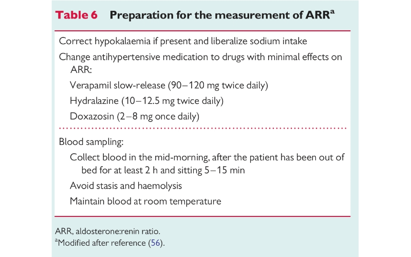
     + Các thuốc ảnh hưởng đến ARR và metanephrine 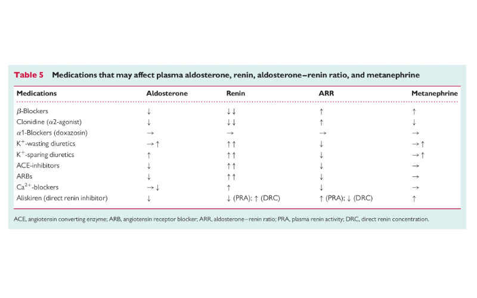
   - Phaeochromocytoma
     + Lâm sàng: 5P paroxysmal hypertension; palpitation; perspiration (sweat); pallor; pounding headache.
     + Screen: chỉ tầm soát khi có tăng huyết áp kháng trị và 5P; tiền căn gia đình; bát thường gen có liên quan; khối u thượng thận có tính chất gợi ý (large size .4 cm, cystic and haemorrhagic changes)
     + Chẩn đoán: catecholamine  và metanephrine nước tiểu 24 giờ hoặc fractionated metanephrine máu. Chú ý các thuốc gây thay thay đổi metanephrine (betablocker gây tăng) . Nếu XN tầm soát dương tính thì chẩn đoán hình ảnh với adrenal CT hoặc MRI. Nếu hình ảnh âm tính thì scintigraphiclocalization with 123I-metaiodobenzylguanidine (MIBG) or additional imaging (i.e. whole body MRI, or others) is indicated. 
     + Chuẩn bị bệnh nhân trước lấy mẫu: Several studies have shown that plasma metanephrine concentrations tend to be higher when measured in the seated position compared to the supine position, leading to reduced specificity and an increase in false positive results. Guidelines recommend drawing blood with the patient in the supine position after they have been fully recumbent for at least 30 minutes before sampling
* Dịch, Điện giải, và kiềm toan
** Phân bố dịch trong cơ thể
   1. Dịch nội bào 2/3
   2. Dịch ngoại bào 1/3
      - Trong lòng mạch 1/4. Ước tính lượng máu # 7% trọng lượng cơ thể (70ml/kg). VD người 70kg|5000ml máu
      - Dịch kẽ 3/4
   3. Tổng lượng nước
      - Nam 0.6L/kg (600ml/kg)
      - Nữ 0.5L/kg (500ml/kg)
** Kiềm chuyển hóa
*** Nguyên nhân
    1. Mất H+
    2. Tăng HCO3-
    3. Giảm dịch ngoại bào (thiếu clo)
*** Cơ chế ở thận
    - HCO3- được hấp thu/bài tiết bằng cách trao đổi ngược với Clo
    - Thiếu clo máu -> thiếu clo trong lòng ống -> tăng hấp thu và giảm tiết HCO3-
    - Hạ kali máu: K ra ngoài tb trao đổi H+ -> tb ống thận cố tái hấp thu HCO3- để cân bằng lại. K+ thấp còn làm giảm hoạt tính của pendrin ống thận làm giảm tiết HCO3-
    - Cường aldosteron: kích hoạt bơm ở ống thận tăng thải H+ 
*** Lượng giá
    - Thường gặp nhất: mất dịch vị, lợi tiểu, thiếu dịch, hạ kali máu. 
    - Phân loại dựa trên clo
      + Kiềm đáp ứng với clo (thiếu clo): cl nước tiểu thấp (<15meq/L)
      + Kiềm kháng clo: Cl nước tiểu >25meq/L. Thường gặp nhất cường aldosteron
*** Điều trị
    1. Thiếu dịch, thiếu clo
       - Ước tính lược clo thiếu: CL_deficit = 0.2 x kg (lean) x (100 - plasma Cl)
       - Lượng dịch NaCl 0.9% (Lít) : CL_deficit/154.
       - Trong trường hợp phù, hay có kèm giảm kali, bù bằng KCl
    2. Kiềm kháng clo
       - Thường do tăng mineralocorticoid (cường aldosterone, dùng hydrocortisone, fludrocortison hoặc predni, methylpredni liều cao)
       - *Acetazolamide (Diamox):* lợi tiểu ức chế tái hấp thu HCO3-, kèm theo tăng thải Na. Liều 5-10mg/kg (IV or PO), tác dụng tối đa sau 15 giờ.  
       - *HCl:* chỉ dùng khi kiềm máu nặng (PH >7.5), last resort, không thấy trên thị trường
** Hạ Kali máu
*** Phân bố kali
    - Tổng lượng: 50-55meq/kg. -> 70kg # 3500meq. 98% nội bào.
    - 2% ngoại bào # 70meq. 20% ngoại bào là huyết tương -> 15meq trong máu (0.4%). 
    - Với mức plasma K+ 4.0 thiếu 200-400 sẽ giảm 1meq, dư 100-200meq làm tăng 1meq. 
*** Lượng tiết ra:
      + Phân 5-10meq/d. Tiêu chảy do viêm và dịch tiết có thể có nồng độ K 15-40meq/L, trường hợp nặng tiêu lỏng 10l/d có thể mất đến 400meq/d. 
      + Mồ hôi 0-10meq/d
      + Nước tiểu 40-120meq/d. Kiểm soát chính bởi aldosteron, k máu, Natri ở ống lượng xa. 
*** Kali trong khẩu phần ăn:
      - Khuyến cáo: Nam 3.400mg, nữ 2.600mg | Trung bình 3000mg -> 60-90 meq/d
      - Trong một số thức ăn
        + 1 trái chuối: 10meq
        + 1 trái cam: 6.5meq
        + 1 củ khoai tây: 20meq
        + 1 chén rau bina: 20meq
        + 1 chén rau muống: 5meq
        + 240ml nước dừa: 15meq
        + 100g thịt, cá: 10meq
        + 240ml sữa: 8-9meq
        + 1 chén cháo thịt rau xay nhuyễn 250ml: 8-10meq.
*** Chẩn đoán
     - Kali nước tiểu >30 meq/L (Uk:Ucr >13meq/g): mất qua nước tiểu -> Clo nước tiểu (<15meq/L) kiềm chuyển hóa, mất dịch vị (cơ chế: mất nước tăng aldosteron -> giữ natri, tăng trao đổi K; tăng hoạt động kênh ENaC tái hấp thu Na không kèm Cl -> lòng ống âm hơn -> kéo kali ra). CLo nước tiểu > 25meq/L: lợi tiểu, thiếu Magne
     - Kali nước <30 meq/L (Uk:Ucr <13meq/g): mất qua đường tiêu hóa, giảm nhập
*** Điều trị
    - Ước lượng lượng thiếu: Cứ giảm 1meq/L thì cơ thể mất tổng lượng khoảng 10% (50meq/kg)
    - Tốc độ bù: 
      + Tối đa 20meq/h. 
      + Trừ khi hạ quá thấp <1.5meq/L hoặc loạn nhịp nguy hiểm có thể nâng 40meq/h ở đường trung tâm (không dùng TM chủ trên). 
      + Nồng độ: ngoại biên tối đa 50-60meq/L để khỏi kích ứng
** Magne máu
*** Phân bố
    - Tổng lượng: # 24g hay 2000meq hay 1000mmol
    - 50% trong xương
    - 50% trong tế bào
    - <1% trong huyết tương. 
*** Thải ra
    - Mg niệu: 5-15 meq/24hr (2.5 - 7.5 mmol/d). Mg niệu giảm đến gần không khi bệnh nhân ăn chế độ ăn không mg, sau 1 tuần mg máu giảm không đáng kể.
*** Nhập vào
    - Khuyến cáo: Nam 420mg, nữ 320mg. hay 13 - 17mmol/d. 
    - Lượng magne có trong một số thức ăn: 
        + 1 trái chuối: 1.3 mmol
        + 1 trái cam: 0.5 mmol
        + 1 củ khoai tây: 1.5 mmol
        + 1 chén rau bina: 6.5 mmol
        + 1 chén rau muống: 1-2 mmol
        + 240ml nước dừa: 2.5 mmol
        + 100g thịt: 1 mmol
        + 100g cá: 1-2 mmol
        + 240ml sữa: 1 mmol
        + 1 chén cháo thịt rau xay nhuyễn 250ml: 2 -3 mmol.
    - Lượng magne có trong thuốc
      + Magne B6 470 + 5mg: 48mg magne -> 2 mmol
      + Magne sulfate 15% 10ml (1.5g): 6 mmol
*** Giá trị bình thường
    - Mg toàn phần: 0.7 - 1.0 mmol/L (tự do, gắn protein, gắn anion)
    - Mg ion hóa (tự do): 0.4 - 0.6 mmol/L 
*** Hạ Mg máu
**** Điều trị xoắn đỉnh theo Mariot
     - Truyền 2g MgSO4 (8 mmol) trong 2 - 5 phút
     - Truyền 5g MgSO4 (20 mmol) trong 6 giờ tiếp
     - Truyền 5g MgSO4 (20 mmol) trong mỗi 12 giờ trong 5 ngày tiếp
     - Mg máu sẽ tăng nhanh sau bolus nhưng sẽ bắt đầu giảm 15 phút sau. Mg máu sẽ về bình thường sau 1 - 2 ngày nhưng cần vài ngày để bù lượng mất của cơ thể. 
     - KHi bệnh nhân có suy thận thì tốc độ truyền Mg không nên quá 50% protocol chuẩn. 
**** Trên thực tế lâm sàng
     - Điều trị rung nhĩ
       + Thể tích phân bố của Mg (Vd) # 0.4L/kg
       + Lấy mốc mg máu bình thường trung bình 0.8 mmol/L để nâng lên mức mục tiêu 2.0 mmol/L ở người 70kg cần: 0.4x70x(2.0-0.8) = 33.6 mmol -> 8.4g MgSO4. lên 3mmol cần 15g
       + Nồng độ tối đa IV là 20%, tốt nhất <5%
       + (TTM) 3g MgSO4 trong 15-20p. 2 ống MgSO4 15% 10ml pha NaCL 100ml c g/p
       + x 3 lần nếu khôg hiệu quả. (phác đồ tối đa 9 g trong 1 giờ của nghiên cứu LOMAGHI)
       + Nghiên cứu Biesenbach P (2018): nồng độ Mg máu đã giảm gần 30% sau 6 giờ, kể từ khi kết thúc liều bolus MgSO4 4.8 g. Theo ước tính 15 g MgSO4 nâng Mg từ 0.8 lên 3.0 mmol/L, vậy nên sau 9 g ban đầu, nếu dùng tiếp thì phải định lượng Mg máu đảm bảo trong ngưỡng an toàn. Có thể dùng nồng độ Mg độc tính trong sản khoa để giới hạn liều lượng Mg sử dụng và mục tiêu Mg (chẳng hạn không quá 3, tốt nhất 2 mmol/L).
* Phác đồ tiệt trừ HP
  - Phác đồ 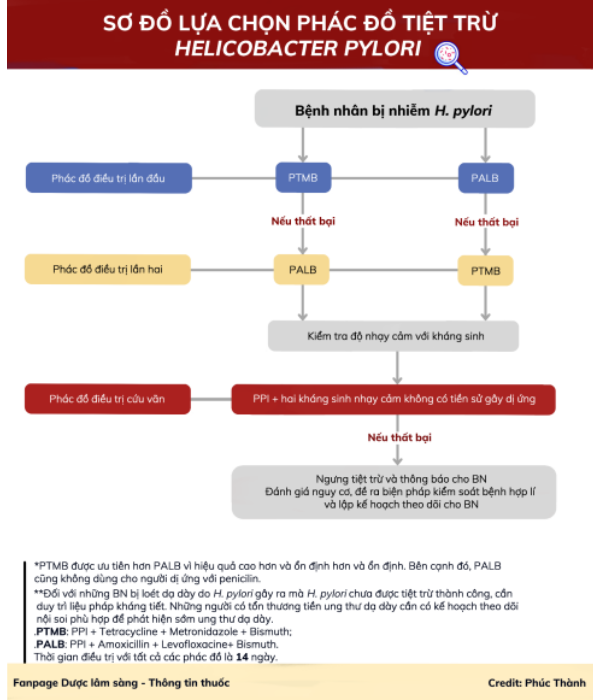
  - Liều thuốc 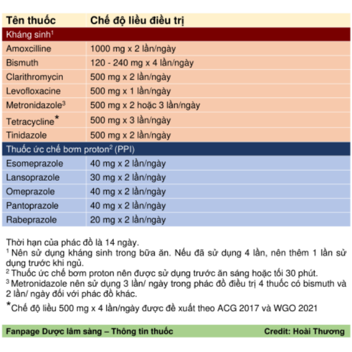
* Hội chứng Brugada
  1. Chẩn đoán
     - Xác định: Spontaneous type 1 ECG change
     - Có thể: type 1 ECG with fever or sodium chanel blocker provocation
     -  Xem thang điểm Shanghai
  2. Điều trị
     - Cho tất cả bệnh nhân được chẩn đoán xác định hoặc những bệnh nhân chẩn đoán có thể
     - Theo dõi hàng năm
     - Tầm soát cho thành viên trong gia đình
     - Thuốc: Quinidine (dùng liều thấp để hạn chế tác dụng phụ <=600mg/d, 200x3) khi không đặt máy ICD được hoặc đã đặt máy nhưng có nhiều cơn Loạn nhịp thất, cần theo dõi CTM thường xuyên. cilostazol có thể thay thế quinidine (ESC)
     - Thuốc: Isoprotenolol (isuprel) khi có cơn loạn nhịp thất cấp. một số liều 1 μg/min, 0.003 mcg/kg/min, Intravenous ISP was administered as a bolus injection (1-2 microg), followed by continuous infusion (0.15 microg/min)
     - ICD: có cardiac arrest (I), spontaneous type 1 with syncope (recommended), provoked type 1 with syncope (consider). BN có spontaneous type 2 khôgn triệu chứng có nguy cơ cao (consider)
     - ICD theo ESC: Brs có  cardiac arrest hoặc documented VT (I). ECG type 1 và có ngất do loạn nhịp (IIa). PES có thể chỉ định cho BN spontaneous type 1 không triệu chứng (IIb). ICD có thể chỉ định ở BN không triệu chứng có VT khi PES using up to 2 extra stimuli. 
     - Ablation: không dung nạp quinidine, loạn nhịp mặc dù có dùng quinidine
* Suy tuyến thượng thận
** Nguồn
   1. https://www.uptodate.com/contents/diagnosis-of-adrenal-insufficiency-in-adults
** General
   - ACTH stimulation test is the best test to diagnose or exclude adrenal insufficency when the baseline cortisol value is indeterminate
   - Hạ natri máu có thể thấy ở bệnh nhân suy thượng thận nguyên phát hoặc thứ phát. 
   - Tăng Kali máu chỉ có trong suy thượng thận nguyên phát vì hệ thống renin-angiotensin-aldesterone không bị ảnh hưởng trong suy thượng thận thứ phát. 
** Chẩn đoán
   1. Basal serum cortisol testing
      - Dùng loại trừ chẩn đoán hoặc lựa chọn bệnh nhân cần ACTH stimulation testing
      - Khi nghi ngờ suy thượng thận cấp thì XN ngay mà không cần chờ buổi sáng, khởi trị ngay không chờ kết quả. 
      - Bệnh cảnh suy thượng thận cấp
        + *Cortisol <18mcg/dl (500nmol/L)*: có thể gợi ý suy thượng thận ở bệnh nhân nghi ngờ suy thượng thận cấp. Cần làm ACTH stimulation test để xác định chẩn đoán vài ngày sau. Nếu glucocorticoids supraphysiologic does (40-200mg hydrocortisone/d) dùng không quá vài ngày, thì vẫn có thể tiến hành ACTH stimulation test. Ngưng liều corticoid buổi sáng làm test và khởi trị lại khi chờ kết quả. 
        + *Cortisol >=18mc/dl (500nmol/L)*: Có thể loại trừ chẩn đoán. Tuy nhiên nên cẩn trọng ở bệnh nhân có tăng CBG (corticosteroid biding globulin) như phụ nữ mang thai, uống thuốc ngừa thai estrogen; ở những bệnh nhân này vẫn có thể suy thượng thận ngay cả khi cortisol máu bình thường. 
      - Bệnh cảnh suy thượng thận mạn
        + Khi nghi ngờ nhiều thì nên làm đồng thời: Serum cortisol máu sáng (trong vòng 3 giờ khi thức dậy 6 - 9 giờ), plasma ACTH, renin, và aldosterone để đẩy nhanh tiến độ (expedite) chẩn đoán và xác định nguyên nhân. 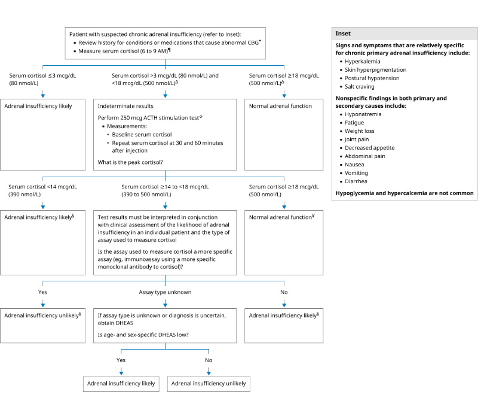
        + ACTH giúp phân biệt primary and cetral. Aldosterone và renin có thể giúp phân biệt khi ACTH không rõ ràng.  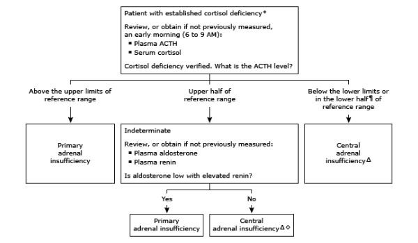
        + Cortisol <=3mcg/dl: nếu không có thiếu CBG (xơ ga, hội chứng thận hư). Chẩn đoán suy thượng thận nếu lâm sàng phù hợp, không cần ACHT stimulation test
        + Cortisol >3 mcg/dL but <18 mcg/dL: ACTH stimulation test
        + Cortisol >=18mcg/dl: nếu không có tăng CBG thì loại trừ chẩn đoán
* Hội chứng Cushing
** General
   - Hội chứng Cushing là tập hợp triệu chứng: ở thể nhẹ có thể nhầm lẫn với hội chứng chuyển hóa (béo phì trung tâm kèm đề kháng insulin, tăng huyết áp). Đặc điểm đặc hiệu hơn: yếu cơ gốc chi, mỡ trên đòn, mặt tròn, rạn da, dễ bầm, loãng xương sớm, hạ kali máu. 
   - Bệnh Cushing thường có nguyên nhân u tuyến yên tăng tiết ACTH 70 - 80%
** Chẩn đoán
   1. Initial test?
      - Cần loại trừ dùng corticoid quá mức kéo dài trước khi XN chẩn đoán
      - Test khởi đầu 1 trong 4 loại: 
        + Free cortisol nước tiểu (ít nhất 2 mẫu)
        + Late-night salivary cortisol (2 mẫu)
        + 1mg overnight dexamethasone suppression test (DST)
        + Longer low-dose DST (2mg/d for 48h)
      - Lưu đồ: 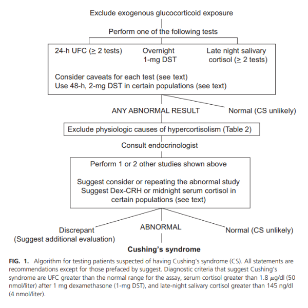
* Viêm gan
** Viêm gan C
*** Điều trị
   - Mục tiêu SVR12 dưới ngưỡng (15 IU/ml) (3 tháng) + dự phòng biến chứng + dự phòng lây nhiễm cộng đồng
   - Chống chỉ định DAAs:
     + Trẻ < 3 tuổi
     + Phụ nữ có thai
     + Có tương tác thuốc (Sofosbuvir|Amiodaron; Ledipasvir|TDF, thuốc giảm axit dạ dày; Velpatasvir|Amiodaron, digoxin, thuốc giảm axit dạ dày, TDF, statin)
   - Chống chỉ định Ribavirin (RBV)
     + Quá mẫn với RBV
     + Hgb < 8.5g/dl
     + Bệnh huyết sắc tố: Bệnh hồng cầu hình liềm hoặc thalassemia
     + Phụ nữ có thai, không dùng biện pháp tránh thai, phụ nữ đang cho con bú, nam giới có bạn tình đang mang thai
   - Chẩn đoán xơ gan (F4) khi APRI >=2 hoặc FibroScan >=12.5 KPa
   - SOF400/VEL100, SOF400/DAC60 12 tuần có thể điều trị cả 6 type ở người lớn không có xơ gan, xơ gan còn bù. Với typ3, SOF/VEL tốt hơn (90% SVR12 âm) SOF/DAC (80%)
   - SOF/VEL, SOF/DAC 24 tuần hoặc SOF/VEL/RBV, SOF/DAC/RBV 12 tuần có thể điều trị cả 6 type ở người lớn xơ gan mất bù. 
*** Ngừng điều trị:
   - Ngừng điều trị khi có tác dụng phụ năng, đe dọa tính mạng (đặc biệt ribavirin - giảm Hgb)
   - ALT tăng >=10 lần ở tuần thứ 4
   - ALT tăng < 10 lần nhưng: suy nhược, buồn nôn, nôn, não gan, ứ mật tăng bilirubin (TP >3mg/dl hoăc TT >1.5mg/dl), tăng ALP có ý nghĩa. 
   - ALT tăng < 10 lần ở tuần 4 nhưng không giảm ở tuần 6 và 8 không do nguyên nhân khác. 
*** Theo dõi
   - XN trước điều trị, tháng thứ 1 và tháng thứ 3
** Viêm gan cấp
*** Linh tinh
   - ALT > AST trong hầu hết các trường hợp ngoại trừ nguyên nhân do rượu hoặc tiến triển đến xơ gan
   - AST: ALT > 2 gợi ý do rượu
   - AST: ALT > 5 gợi ý tăng nguyên nhân ngoài gan (hủy cơ, MI)
*** Đợt cấp viêm gan B mạn
   - Biện luận trên BN Hải
     + Vấn đề 1: Tăng men gan > 5 lần ULN có 2 trường hợp tăng cấp tính trong đợt bùng phát viêm gan B mạn hoặc tăng mãn tính do tình trạng viêm gan b mạn giai đoạn hoạt động, do rượu hoặc xơ hóa gan. Bệnh nhân này gợi ý tình trạng bùng phát vì có dùng kháng virus -> ngưng thuốc -> cả 2 trường hợp đều có chỉ định dùng kháng virus cho BN
     + Vấn đề 2: mức độ xơ hóa gan. Kế hoạch: tiếp tục kháng virús, điều trị hỗ trợ, vitk, theo dõi sát, ngưng thuốc lá + ruọu bia, Fibroscan khi men gan giảm để xác định tình trạng xơ hóa gan
** Viêm gan B mạn
*** Các giai đoạn của viêm gan B mạn
1. Dung nạp miễn dịch (immune tolerant)
2. Viêm gan mạn HBeAg dương (Tên khác: Hoạt động miễn dịch, immune active)
3. Nhiễm trùng không hoạt động (Tên khác: người lành mầm bệnh, chuyển đổi huyết thanh HBe, Inactive carier)
4. Viêm gan mạn HBeAg âm (Tên khác: Tái hoạt): lẩn trốn miễn dịch, đột biến precore/ core promotor
5. Thoái lui (chuyển đổi huyết thanh HBs)
*** Các dấu ấn huyết thanh
1. qHBsAg: phản ánh cccDNA trong tế bào gan và HBVDNA trong máu. Khi qHBsAg giảm tiên lượng tốt cho thoái lui, là một chỉ số giúp ngừng điều trị interferon. điều trị NA làm giảm q HBsAg rất chậm. Khi qHBsAg cao thì khả năng tái phát sau khi ngưng thuốc cao. Nồng độ qHBsAg thấp (< 1.000 IU/mL) kết hợp HBVDNA thấp là chỉ dấu tốt cho giai đoạn inactive carrier). qHBsAg cao > 1000 UI/ml có nguy cơ ung thư cao hơn ngay cả khi HBVDNA thấp. qHBsAg thấp (< 100 IU/mL) có khả năng thoái lui (sạch HBsAg) cao. 
2. HBeAg: có vai trò điều hòa miễn dịch. Người có đột biến HBeAg âm dễ có những đợt bùng phát viêm gan âm thầm ở ngưỡng virus dao động hơn, dễ bỏ sót dẫn đến dễ xơ gan và ung thư gan hơn. 
* Tim mạch
** Ngất
*** Tiếp cận
   1. Có thật sự ngất
      - Phải có loss of consciousness do giảm tưới máu não
      - Phân biệt với các loại mất ý thức thoáng qua khác
        + Động kinh (cắn lưỡi, tiêu tiểu không tự chủ, lú lẫn kéo dài sau mất ý thức >5 phút), tâm lý (nhắm mắt trong cơn), hội chứng cướp máu dưới đòn, TIA động mạch sống nền, xuất huyết màng nhện
      - 5P: Precipitants, Prodomes, Palpitation, Postition, Postevent phenomenon
   2. Nguyên nhân
      - Do tim
      - Reflex syncope 
        + (vasovagal syncope (VVS): (most common), such as from emotional stress or pain
        + carotid sinus syndrome (hypersensitivity): abnormal autonomic response to carotid sinus massage
          - Hiếm gặp ở người trẻ <50 tuổi, các yếu tố kích hoạt thường là: head movements (especially with tight neckwear or neck pathology), ngồi lâu, heavy meals, or nín tiêu tiểu tiện, and coughing.
        + and situational syncope: ho, hắt xì, ...
        + Điều trị: Isometric physical counter pressure maneuvers. Có thể ăn tăng muối và dịch nếu không có chống chỉ định. beta-blocker (acc IIb, ESC III), midodrine, fludrocortisone, SSRI. Pacemaker
      - Hạ huyết áp tư thế 
        + Classical OH: sys giảm >20, dia giảm >10, trong 3 phút (đo 1 phút, 2 phút, 3 phút). nếu xảy ra sau 3 phút Delayed OH. Nếu xảy ra sớm <15s initial OH, thường ngắn <40s.
        + Điều trị: tăng dịch, muối, Compression garments, Physical counter-pressure maneuvers, midodrine, Droxidopa, Fludrocortisone, pyridostigmine, octreotide
** Tăng áp phổi
  1. Phân loại
     - loại 1: nguyên phát, do rối loạn chức năng nội mạc
     - loại 2: do tim trái
     - Loại 3: do phổi
     - Loại 4: do huyết khối DMP mạn tính
     - Loại 5: linh tinh
** Thuyên tắc phổi
  1. Chẩn đoán
     - Khi nghi ngờ PE nguy cơ cao (huyết động không ổn định) thì chỉ định ngay UFH (dùng lovenox ưu tiên hơn trong trường hợp huyết động ổn) và SAT tại giường + CTPA ngay
     - Khi huyết động ổn định thì dùng lưu đồ chẩn đoán,  chỉ định ngay kháng đông trong lúc chờ nếu khả năng mắc PE từ trung bình - cao. 
     - D-Dimer > 500 dùng cho người dưới 50 tuổi, 10xAge cho người > 50 tuổi, không dùng để loại trừ khi khả sác xuất tiền nghiệm cao. 
     - Lưu đồ:
       + BN huyết động không ổn định -> SA tim tại giường có Rối loạn chức năng thất P -> kháng đông + CTPA ngay lập tức -> ly giải huyết khối
       + BN huyết động ổn -> phân tầng khả năng. Nếu khả năng trung bình trở xuống dùng D-Dimmer. Nếu khả năng cao thì chỉ dịnh CTPA. 
     - Kháng đông đường uống dùng sau 5 - 10 ngày dùng đường tĩnh mạch (https://evtoday.com/articles/2019-july-supplement/doacs-oral-anticoagulant-treatment-of-choice-for-pulmonary-embolism)
  2. Đánh giá độ nặng và nguy cơ tử vong 30 ngày
     - Dùng: huyết động, PEPSI, SAT và troponin
     - 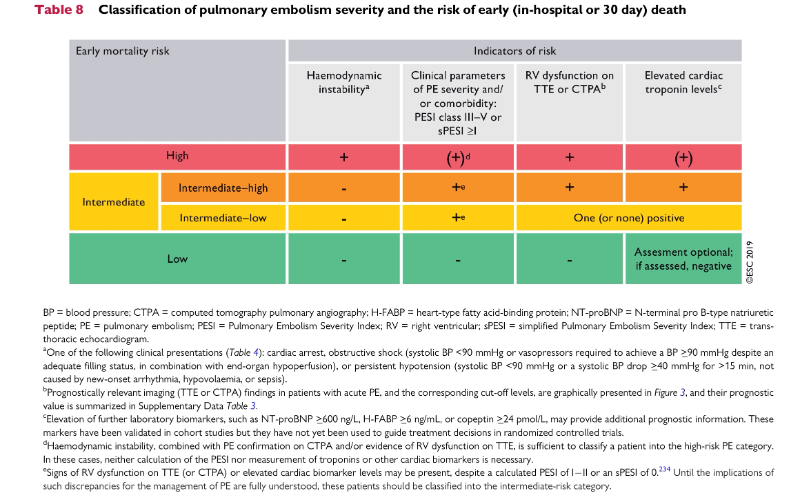
  3. Liệu pháp ly giải huyết khối
     - Hiệu quả tốt nhất trong 48 giờ, vẫn có hiệu quả ở những bệnh nhân muộn 6-14 ngày. 
     - rtPA 100mg over 2h ưu tiên hơn streptokinase. UFH vẫn có thể tiếp tục truyền trong khi truyên rtPA nhưng phải ngưng nếu dùng streptokinase. Medscape: (Activase) 100 mg IV infused over 2 hr; institute parenteral anticoagulation near the end of or immediately following alteplase infusion when the PTT or thrombin time returns to <2x normal. Có nước cất pha đi kèm nồng độ 1mg/ml. Có thể dùng Nacl 0.9% hoặc glucose 5% pha loãng thêm 0.5mg/ml nữa. 
     - 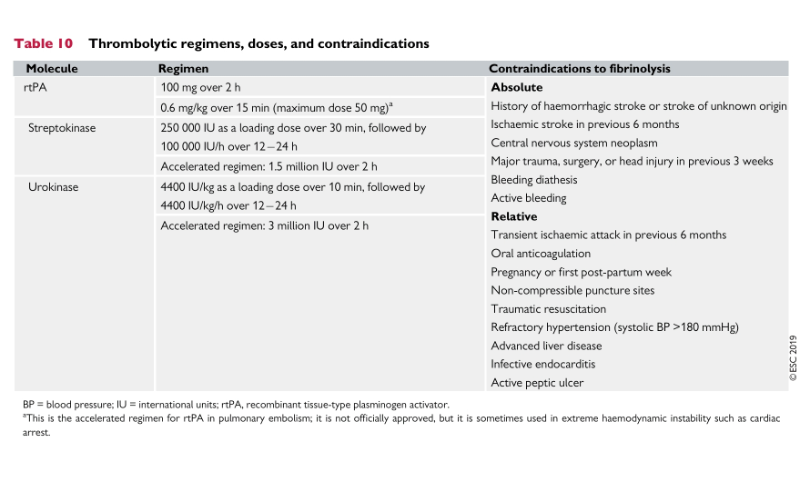
     - Can thiệp huyết khối có thể chỉ định ở BN không dùng được ly giải huyết khối hoặc đã dùng nhưng thất bại
** Cơn tăng huyết áp
*** Chẩn đoán tăng huyết áp
    - Huyết áp tại nhà trung bình >=135/85
    - Holter huyết áp: trung bình 24h 130/80 or daytime 135/85 or night 120/70
    - Tại phòng khám 140/90, ít nhất 2 lần khác nhau
    - 
*** Cơn tăng huyết áp cấp cứu
    - For adults with a compelling condition (ie, aortic dissection, severe preeclampsia or eclampsia, or pheochromocytoma crisis), SBP should be reduced to less than 140 mm Hg during the first hour and to less than 120 mm Hg in aortic dissection.
    - For adults without a compelling condition, SBP should be reduced by no more than 25% within the first hour; then, if stable, to 160/100 mm Hg within the next 2 to 6 hours; and then cautiously to normal during the following 24 to 48 hours.
* Tiếp cận viêm khớp
** Dạng viêm (inflamtory) hoặc không viêm (non inflamtory)
   - Dạng viêm: Biểu hiện sưng nóng đỏ đau.
   - Dạng không viêm: do biến đổi cấu trúc khớp, đau khi vận động, cứng khớp không quá 15-30 phút. DO thoái hóa, chấn thương, cơ học
** Khởi phát
   - Vài giờ tới vài ngày: chấn thương, Crystal arthritis, Septic arthritic
   - vài tuần tới tháng: viêm khớp dạng thấp, thoái hóa, seronegative, spondyloarthropathies, gout mạn
** Kéo dài
  - Cấp: <6ws, chấn thương, Juxta-articular, septic, reactive, gout
  - Mạn: >6ws, Rheumatic fever, reumatoid, SLE, Spondyloarthropathies, haemochromatosis
** Đặc điểm khớp liên quan
  - Di chuyển: Thấp khớp cấp, lậu, viêm khớp virus
  - Thêm vào/đồng thời: RA, SLE, spondyloarthritis
  - Ngắt quãng: gout, virus, lymes disease
* Bệnh thận
** Tổn thương thận cấp
*** Định nghĩa
  - Cre tăng >=0.3mg/dl / 48 giờ
  - Tăng >=50% trong 7 ngày
  - Thiểu niệu <0.5ml/kg/hr trong >= 6 giờ
  - Thực tế không chẩn đoán quá chặt dựa vào định nghĩa này.
*** Nguyên nhân
**** Tại thận
    1. Mạch thận
       - THA cấp cứu
       - Viêm mạch máu nhỏ
       - TTP/HUS (hemolytic uremia syndrome): Nhóm bệnh vi mạch huyết khối, biểu hiện tương tự (TTP - chủ yếu thần kinh sdo thiếu men ADAMTS13 - ngũ chứng giảm tiểu cầu, tan huyết, sốt, RL thần kinh, suy thận), (HUS - tổn thương nổi bật tại thận độc tố vk, tam chứng giảm tiểu cầu, tan huyết, suy thận cấp). 
    2. Cầu thận
       - Viêm cầu thận cấp
    3. Ống thận mô kẽ
       - ATN - hoại tử ống thận cấp: sepsis, meds (aminoglycoside, cisplatin, tenofovir), contrast, rhabdo, prerenal AKI kéo dài. 
       - AIN - viêm thận mô kẽ cấp: nguyên nhân thường nhất là thuốc. AIN thường phát triển thông qua cơ chế phản ứng quá mẫn loại IV (quá mẫn chậm). Beta lactam, vancomycin, bactrim, nsaid. 
       - Crystal nephropathy: acyclovir thường gặp nhất, ganiclovir, cipro, methotrexate
    4. 
**** Sau thận
**** Trước thận
*** Chẩn đoán
    - Phân biệt quan trọng nhất là trước thận và tại thận
    - Trước thận: Bun/Cre >20. Giảm thể tích làm kích hoạt hệ agiotensin-renin-aldosteron, ADH làm tăng tái hấp thu natri, nước, ure. Cast: hyaline
    - ATN:  trụ nâu bùn chỉ trong ca nặng. 
    - AIN: trụ bạch cầu chỉ trong ca nặng. 
    - Hội chứng thận hư: trụ mỡ
    - Hội chứng viêm thận: trụ hồng cầu
* Sốt kéo dài
** Các trường hợp sốt tương tự siêu vi nhưng kéo dài > 5-7 ngày
*** Các tác nhân thường gặp và dấu hiệu gợi ý
    1. Nhóm bệnh do động vật, côn trùng trung gian
        - Rickettsia (sốt mò): Vết loét đen (eschar) không đau ở vùng nếp gấp da, phát ban ngày thứ 4-6, hạch gần vết loét
        - Leptospira (xoắn khuẩn vàng da): Đau cơ bắp chân dữ dội, mắt đỏ ngầu không mủ, vàng da, tiểu ít (muộn)
        - Sốt rét: sốt rét run, gan lách to, thiếu máu
    2. Nhiễm khuẩn:
        - Thương hàn: sốt bậc thang, mạch nhiệt phân ly, bụng chướng, tiêu chảy hoặc táo bón, "lưỡi quay" (đỏ rìa, trắng giữa), vết hồng ban trên ngực bụng, 
        - Whitmore: 
        - Viêm nội tâm mạc
    3. Virus
        - EBV/CMV: viêm họng nặng/ giả mạc (EBV), gan lách to, sưng hạch (cổ sau EBV), mệt mỏi nhiều
        - HIV giai đoạn cấp 2 -4 tuần sau phơi nhiễm
    4. Khác
        - Lao
        - Tự miễn
        - lymphoma
        - Áp xe sâu
* Viêm phổi
** Viêm phổi cộng đồng
*** Chiến lược sử dụng kháng sinh theo độ nặng
    1. CAP nhẹ ngoại trú
       - Thường gặp nhất: Phế cầu, H. Ifluenza thường gặp hút thuốc lá, bệnh phổi mạn; mycoplasma (không điển hình) rất hay gặp ở người trẻ; Chlamydia, virus hô hấp
       - Kháng sinh:
    2. CAP nội trú:
       - Tác nhân thường gặp: phế cầu, vk không điển hình (Mycoplasma, Chlamydia và đặc biệt là Legionella), Haemophilus influenzae, vk đường ruột E. coli, Klebsiella pneumoniae (thường gặp ở người già, người có bệnh nền). Virus: Tần suất gặp cao hơn và thường gây biến chứng bội nhiễm.
       - Kháng sinh: 
    3. CAP ICU:
       - Tác nhân thường gặp: phế cầu, tụ cầu vàng (đặc biệt sau cúm, tổn thương có hang), legionella, gram âm đường ruột (klebsiella, proteus), Pseudomonas aeruginosa (Trực khuẩn mủ xanh): Thường gặp trên nền phổi cũ (giãn phế quản, COPD nặng). Kỵ khí trong hít sặc. 
* Kháng sinh
** Tổng quan - linh tinh
   - Vk gram dương có vách dày peptidoglycan
   - vk khuẩn gram âm vách peptidoglycan mỏng hơn nhưng bên ngoài có outer membrane là Liposacharich (LPS) tích điện âm, có các porin (kênh)
   - Nhóm betalactam tác động bằng gắn kết PBP (penecillin bidiing protein) khiến không tạo được vách. 
   - Kháng sinh vào nội bào tốt: TRèo Qua Màng Bắt Cô Làng (nàng) - Tetracycline, Rifampin, Quinolone, Macrolide, bactrim (cotrim), clindamycin, linezolid. 
   - Vk nội bào bắt buộc: "Stay Inside when it's Really Cold and Chilly" Rickettsia (sốt mò), Coxiella burnetii (sốt Q), Chlamydia
   - Vk nội bào tùy nghi: Some = Salmonella. Nasty = Neisseria (đặc biệt là Neisseria meningitidis - Não mô cầu). Bugs = Brucella. Like = Listeria monocytogenes. Living = Legionella pneumophila. Inside = Intracellular (Từ khóa nhắc bài: Nội bào). Cells = Chlamydia / Coxiella (Lưu ý: Một số tài liệu xếp Chlamydia vào nhóm bắt buộc, nhưng câu này vẫn thường được mượn chữ C để gom nhóm).
** Betalactam
*** Penicillin
    1. Penicillin tự nhiên:
       - G: tiêm
       - V: uống
    2. Penicillin kháng tụ cầu: 
       - Không có hoạt tính với gram âm
       - nafcillin, oxacillin và dicloxacillin.
   3. Aminopenicillin
      - Ampicillin: tiêm, uống
      - Amoxicillin: uống
      - Thêm phổ gram âm: E. coli, P. mirabilis, S. enterica và Shigella spp. không sản xuất beta-lactamase
   4. Penicillin phổ rộng:
      - Piperacillin, ticarcillin
      - Mở phổ trên gram âm, có tác dụng trên P. aeruginosa
   5. penicillin phổ mở rộng/chất ức chế beta-lactamase 
      - Mở phổ trên gram âm
      - Điều trị theo kinh nghiệm: (gemini) - Nhiễm trùng ổ bụng (phúc mạc, thủng tạng rỗng, áp xe gan, đường mật, viêm ruột thừa vỡ) [gram âm và kỵ khí]. Viêm phổi bệnh viện/ thở máy [Gram âm đường ruột, P. aeruginosa]. Nhiễm trung vùng chậu, niệu. /Không hiệu quả MRSA, ESBL, CRE/
   6. Chung
      - Không có tác dụng trên vi khuẩn không điển hình do không có vách. 
      - Có thêm tác dụng trên kỵ khí nếu có betalactamase inhibitor.
*** Cephalosporin
    1. Chung
       - Vi khuẩn khuẩn MRSA kháng betalactamse qua cơ chế gen mecA làm thay đổi cấu trúc PBP thành PBP2a khiến kháng sinh không còn bám vào được, do đó trừ thế hệ 5 Ceftaroline kháng hết. 
       -  ceftazidime được tinh chỉnh để tăng tác dụng trên P. Aeruginosa nhưng lại làm giảm bám dính với PBP nên giảm tác dụng với tụ cầu. Thế hệ 4 khắc phục được nhược điểm này. 
       - Các cephalosporin có hoạt tính kém lên kỵ khí (ái lực trên PBP của vk kỵ khí yếu, tiết beta lactamase), không có tác dụng trên vk không điển hình. 
       - Cephalosporin thế hệ 5 đánh tốt trên gram dương kể cả MRSA và vi khuẩn kỵ khí gram dương. hoạt tính trên gram âm tương tự ceftriaxone, kém hoạt tính trên Pseudomonas. 
*** Carbapenem
    1. Chung
       - Cơ chế đề kháng: Ví dụ, P. aeruginosa đột biến mất porin màng ngoài, tăng sản xuất các bơm đẩy (efflux pumps). Enterococcus faecium và MRSA sinh PBP biến đổi không gắn kết với carbapenem. Carbapenemase.
    2. Imipenem
       - Dễ bị phá hủy bởi men dehydropeptidase I, do đó kết hợp với Cilastatin để ức chế men này. 
       - Không trị được MRSA
       - Hoạt lực tốt trên gram dương, gram âm kể cả P. Aeruginosa, rất tốt trên kỵ khí. 
    3. Meropenem
       - Thay đổi cấu trúc nên không cần kết hợp cilastatin 
       - Phổ tương tự imipenem 
    4. Doripenem
       - Phổ tương tự imipenem, tác dụng tốt hơn với P. aeruginosa
    5. Ertapenem
       - Hoạt lực kém hơn trong nhóm với vi khuẩn Gram dương hiếu khí, P. aeruginosa và Acinetobacter spp.
*** Monobactame
    - Chỉ có tác dụng trên gram âm hiếu khí và tác dụng rất tốt, hoạt tính trung bình trên Pseudomonas. Không có độc tính trên thận như aminoglycosid. 
*** Glycopeptid
**** Vancomycin
     - Phân tử lớn
     - Đánh Listeria monocytogenes (ký sinh nội bào) kém hơn ampicillin do phân tử lớn vào màng kém hơn. 
     - Đánh tốt vi khuẩnn gram dương hiếu khí và kỵ khí, bao gồm cả C. diffi cile. 
     - Tác dụng trên enterococci hiện nay variable do đột biến thay đổi cấu trúc d-alanyl–d-alanine dipeptide (chỗ bám của vancomycin), gen này có thể chuyển giao và đã tìm thấy trên một số tụ cầu -> có thể sẽ gia tăng đề kháng với vancomycin trong tương lai. 
     - /"Although usually given intravenously, it can be given orally to treat bowel infections, such as diarrhea caused by C. diffi cile, but it is not absorbed when administered in this way"/
     - Độc tính: điếc, đặc biệt dùng chung với aminoglycosid. Red man syndrome thường không phải do phản ứng dị ứng, tránh bằng cách truyền chậm. 
*** Daptomycin
    - Cơ chế tạo kênh ion trên màng tb vi khuẩn làm leak ion -> death. Không có tác dụng trên vi khuẩn gram âm do không qua được outer membrane. 
    - Hoạt tính kém ở phổi, do đó không dùng điều trị viêm phổi. 
*** Colistin
    - Thuộc nhóm polymixin, Độc tính trên thận.
    - Hoạt động bằng cơ chế: colistin điện dương hút LPS mang điện âm ở màng ngoài, sau đó đuôi lipid chèn sâu vào màng tb vk gây chết tb. 
    - Không có hoạt lực trên Vk gram dương (không có màng ngoài), Proteus và Serratia spp. (LPS thay đổi ít điện âm và cấu trúc ít phù hợp để chèn chuỗi lipid), vi khuẩn kỵ khí (LPS thay đổi, điện thế màng kém gây khó chèn chuỗi lipid)
    - Proteus họ vi khuẩn đường ruột Enterobacteriaceae, di động do có roi, gây nhiễm khuẩn niệu cơ hội, tiết urease mạn gây kiềm hóa nước tiểu dễ tạo sỏi
    -  Serratia spp. sống trong môi trường ẩm, một số tiết sắc tố đỏ, gây nhiễm trùng cơ hội đặc biệt ICU. có AmpC beta-lactamase tự nhiên.

** Betalactamase
*** Tóm tắt dễ nhớ (GEMINI):
**** 4 CẤP ĐỘ BETA-LACTAMASE
      1. Cấp độ 1: Beta-lactamase cổ điển (Cấp độ cơ bản)
        - Vi khuẩn thường gặp: S. aureus (Tụ cầu vàng), E. coli hoang dã.
        - Thuốc bị vô hiệu hóa: Penicillin G, Ampicillin, Amoxicillin.
        - Cách xử lý (Vũ khí thay thế): Dùng Cephalosporin thế hệ 1 (Cefazolin). Hoặc phối hợp kháng sinh cổ điển với chất ức chế thế hệ cũ: Amoxicillin + Acid Clavulanic (Augmentin), Ampicillin + Sulbactam (Unasyn).
      2. Cấp độ 2: ESBL - Beta-lactamase phổ rộng (Cấp độ trung bình)
        - Vi khuẩn thường gặp: E. coli, Klebsiella pneumoniae, Proteus mirabilis (Nhiễm trùng tiểu, nhiễm trùng ổ bụng bệnh viện).
        - Thuốc bị vô hiệu hóa: TẤT CẢ các Penicillin và Cephalosporin (Thế hệ 1, 2, 3, 4 như Ceftriaxone, Ceftazidime, Cefepime).
        - Cách xử lý (Vũ khí thay thế): Lựa chọn hàng đầu: Carbapenem (Ertapenem cho nhiễm trùng vừa; Imipenem/Meropenem cho nhiễm trùng nặng, sốc nhiễm khuẩn). Nhiễm trùng tiểu nhẹ: Có thể dùng Piperacillin/Tazobactam (Tazocin) hoặc Amikacin, Fosfomycin.
      3. Cấp độ 3: AmpC - Cephalosporinase cảm ứng (Cấp độ "Bẫy lâm sàng")
        - Vi khuẩn thường gặp (Nhóm SPACE/CES): Serratia, Pseudomonas aeruginosa, Acinetobacter, Citrobacter, Enterobacter.
        - Cạm bẫy lâm sàng: Trên kháng sinh đồ ban đầu, vi khuẩn có thể báo "Nhạy cảm" với Cephalosporin thế hệ 3 (Ceftriaxone). Nhưng khi truyền thuốc vào người bệnh, thuốc sẽ "kích hoạt" vi khuẩn tiết ra lượng lớn AmpC phá hủy thuốc, dẫn đến thất bại điều trị.
        - Cách xử lý (Vũ khí thay thế): KHÔNG DÙNG Cephalosporin thế hệ 1, 2, 3 và các thuốc phối hợp cũ (Augmentin, Tazocin). Vũ khí an toàn: Cefepime (Cephalosporin thế hệ 4) hoặc Carbapenem.
      4. Cấp độ 4: Carbapenemase / CRE (Cấp độ "Ác mộng")
        - Vi khuẩn đã tiết ra enzyme cắt được cả Carbapenem (KPC, NDM, OXA-48). Lâm sàng chia làm 2 phân nhóm chính để chọn thuốc:
          + Nhóm Serine-Carbapenemase (KPC, OXA-48): Vũ khí mới: Ceftazidime/Avibactam (Zavicefta) là lựa chọn tối ưu.
          + Nhóm Metallo-Beta-Lactamase (NDM-1): Enzyme phụ thuộc Kẽm, rất độc lực. Vũ khí: Zavicefta không trị được NDM-1. Phải dùng Ceftazidime/Avibactam phối hợp với Aztreonam, hoặc sử dụng các thuốc ngoài nhóm Beta-lactam như Colistin, Tigecycline (cho ổ bụng/da), hoặc kháng sinh mới Cefiderocol.
**** 3 NGUYÊN TẮC VÀNG KHI ĐỌC KHÁNG SINH ĐỒ
    - Nếu kết quả báo ESBL (+): Gạch bỏ ngay lập tức toàn bộ các Cephalosporin từ thế hệ 1 đến thế hệ 4 ra khỏi đầu, bất kể trên giấy có ghi chữ "S" (Nhạy cảm) hay không. Lực chọn ưu tiên lúc này là Carbapenem.
    - Cảnh giác với nhóm vi khuẩn tiết AmpC (Enterobacter, Citrobacter, Serratia): Ngay cả khi kết quả trả về nhạy với Ceftriaxone, hãy ưu tiên chọn Cefepime hoặc Carbapenem để tránh hiện tượng kháng thuốc cảm ứng trong quá trình điều trị.
    - Vai trò của Chất ức chế (Inhibitor):
      + Chất ức chế cũ (Clavulanic acid, Sulbactam, Tazobactam): Chỉ trị được Cấp độ 1 và ESBL (Cấp độ 2).
      + Chất ức chế mới (Avibactam): Trị được cả KPC và AmpC, mở đường cho kháng sinh đi kèm (Ceftazidime) diệt khuẩn.
** Ức chế tổng hợp Protein 
*** Rifamycins
    1. Chung: 
        - Ức chế enzyme RNA polymerase của vi khuẩn
        - Dễ gây kháng (chỉ cần đột biến 1 acid amin) khi dùng đơn độc (trừ điều trị phòng ngừa)
    2. Rifampin (Rifampicin)
        - Gây dịch cơ thể có màu đỏ cam
        - Có đường uống và truyền, các rifamycin khác chỉ uống. 
*** Aminoglycosids
    1. Chung
        - Ức chế vi khuẩn bằng cách gắn vào tiểu đơn vị 30S của ribosome làm dịch mã (gắn acid amin) sai
        - Mang điện dương nên ái lực với màng ngoài của vk gram âm tốt -> hiệu quả tốt trên gram âm hiếu khí. Hay dùng điều trị họ Enterobacteriaceae và Pseudomonas aeruginosa, vì nghiên cứu trên động vật đơn trị kém nên luôn phối hợp ngay cả khi nhạy. 
        - Vì cần vào màng qua cơ chế vận chuyển tích cực phụ thuộc năng lượng, đòi hỏi phải có oxy và lực đẩy proton (proton motive force) -> không có hoạt lực trên vk kỵ khí, ổ abcess có môi trường acid. 
        - Kém hơn với vk gram dương hiếu khí, tốt khi hiệp động với kháng sinh phá vách. 
        - Độc tính trên thận 5 -10%, lên đến 50% ở đối tượng nguy cơ (già, dùng nhiều thuốc độc thận) do tích lũy liều ở tb ống thận gần, thường xảy ra sau ngày 4-5, có hồi phục khi ngưng thuốc. Độc tính trên tai không hồi phục, độc tính trên tiền đình (đặc biệt streptomycin). 
     2. Streptomycin
        - Điều trị hàng hai trong lao. 
     3. Gentamycin: 
        - Dùng phổ biến nhất. có tác dụng trên chi enterococci
     4. Tobramycin: 
        - Phổ tương tự và kháng tương tự gentamycin nhưng không có tác dụng trên chi enterococci
     5. Amikacin: 
        - Các chủng vi khuẩn Gram âm hiếu khí đã đề kháng với gentamicin và tobramycin vẫn có thể duy trì sự nhạy cảm với amikacin. 
        - Không có hoạt tính lâm sàng có ý nghĩa với enterococci
      6. Enterococci (gemini)
        - 2 loài phổ biến nhất gây nhiễm trùng bệnh viện cơ hội, nhiễm trùng tiểu, viêm nội tâm mạch nhiễm trùng, nhiễm trùng ổ bụng
          + Enterococcus faecalis: Gây 80-90% trường hợp, thường nhạy cảm với kháng sinh hơn so với E. faecium.
          + Enterococcus faecium: 10 - 15%. đặc biệt nguy hiểm trong môi trường bệnh viện vì tỷ lệ kháng thuốc rất cao, đặc biệt là các chủng VRE (Vancomycin-Resistant Enterococcus)
*** Macrolides
    - Cơ chế tác động gắn tiểu đơn vị 50S của ribosome
    - Có hoạt tính với một số vk gram dương, gram âm, không điển hình, mycobacteria, xoắn khuẩn. nhưng hiệu quả không ổn định. không có hoạt tính trên vi khuẩn kỵ khí. 
    - Ery thiếu hoạt tính với Heamophilus infuenza, clari có hoạt tính với H influenza tốt hơn, azi tốt nhất. 
*** Tetracyclines và Glycylcyclines
    1. Chung
       - Tiêm: Doxycycline và Tigecycline
       - Uống: Tetra, Doxy, Mino
       - Cơ chế gắn tiểu đơn vị 30S của Ribosome ngăn gắn acid amin
       - 2 cơ chế đề kháng: Bơm tống xuất và thay đổi cấu hình tiểu đơn vị 30S
       - Ưu thế trên vi khuẩn không điển hình (Chlamydia, Rickettsia, Mycoplasma). Có hoạt tính trên một số vk gram dương hiếu khí, gram âm hiếu khí, kỵ khí và xoắn khuẩn. 
    2. 