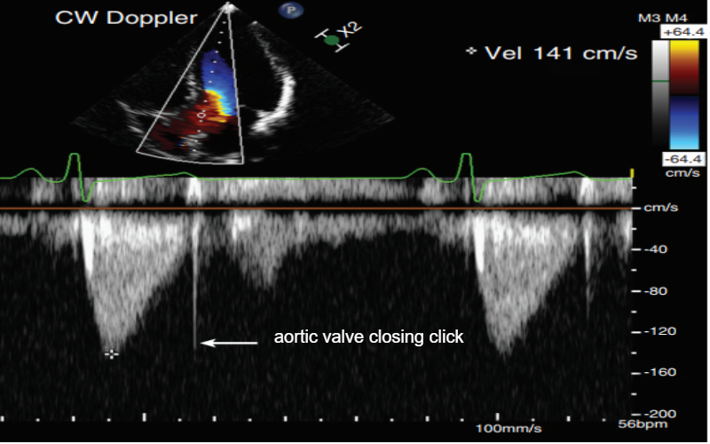
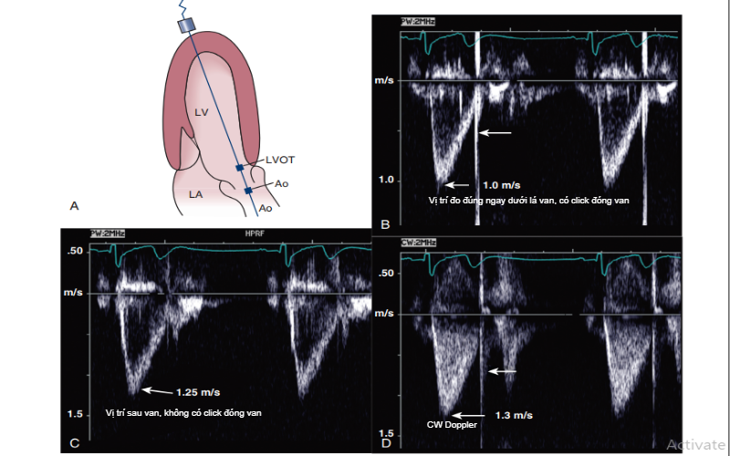
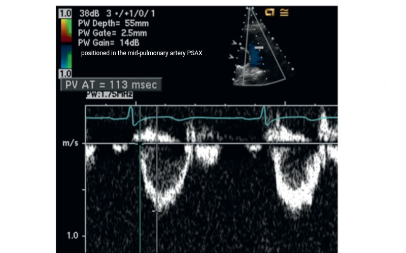
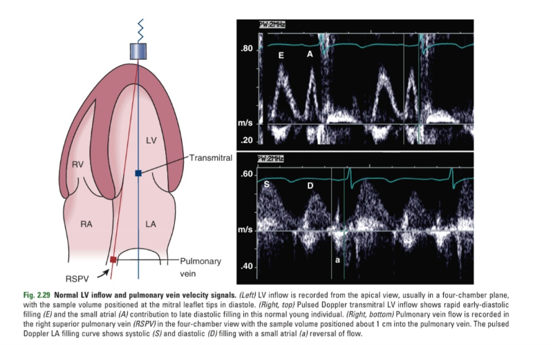
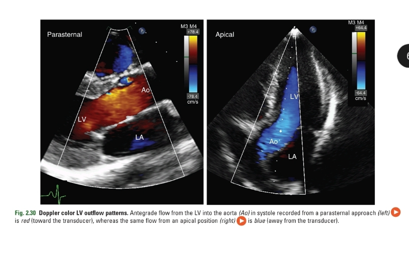
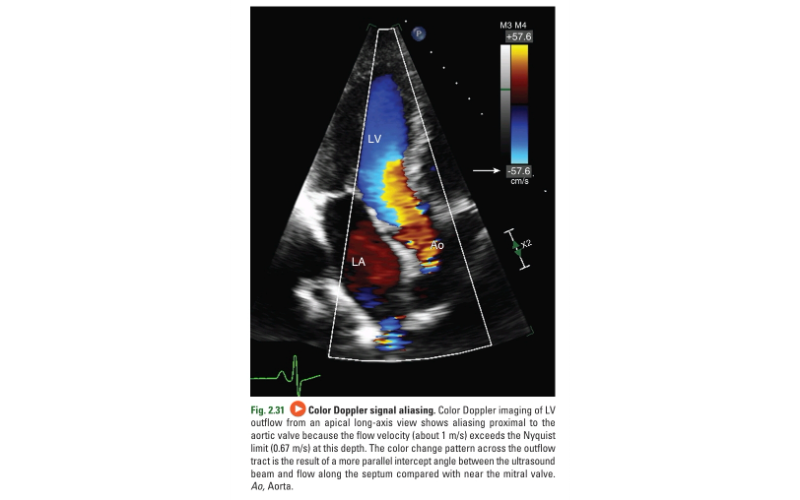

* Nguồn tài liệu
** Website Phamnguyenvinh.org
   - https://phamnguyenvinh.org/vi/sach/atlas-sieu-am-tim/
   - https://phamnguyenvinh.org/vi/sach/tim-mach-hoc-nhung-dieu-can-biet/
** Sách sổ tay siêu âm tim
*** Thiết lập máy siêu âm
    1. Năng lượng âm
      - Năng lượng càng cao, hình ảnh càng tốt, tỉ số nhiễm âm SNR tốt hơn
      - Chỉ tăng năng lượng truyền âm khi chế độ mặc định có SNR thấp
      - Tác động sinh học:
        + Nhiệt: chỉ số nhiệt TI nên duy trì dưới 2
        + Tạo bọt khí: chỉ số cơ học MI nên duy trì dưới 1.9
    2. Gain
    3. Tần số truyền âm
       - Tần số thấp hơn -> độ phân giải thấp hơn nhưng xuyên thấu tốt hơn
       - Harmonic imaging -> tăng SNR, tăng độ phân giải ngang, nhưng giảm độ phân giải không gian dọc (điều này quan trọng khi khảo sát các cấu trúc nhỏ mỏng như lá van)
    4. Focus: Khuyến cáo focus gần cấu trúc sâu nhất
    5. Rate: rate cao -> giảm phân giải ngang
    6. Doppler liên tục và doppler xung
       - Doppler xung
         + Nyquist Frequency = PRF / 2. PRF: pulse repetition frequency
         + Scale: điều chỉnh scale tức là điều chỉnh PRF
         + Baseline: điều chỉnh baseline chỉ là cách "clever" để hiển thị phần aliasing (không thay đổi PRF), nhưng có thể nhầm lẫn giữa vận tốc âm với vận tốc rất cao (vượt ngưỡng Nyquist)
       - Khuyến cáo:
         + Tốc độ quét: khuyến cáo nên để 100 mm/s trừ khi tìm sự khác biệt giữa các nhịp tim
         + Wall fiter: should be as low as possible while avoiding pollution by myocardial velocities
         + Color gain: nên để mức cao nhất có thể, không có tín hiệu nhiễu (color confetti). Cái này đơn giản chỉ khuyến đại tín hiệu, không phải điều chỉnh PRF. 
         + 
** Basic ultrasound
  - Shadowing and coloring
    + Due to attenuation and lack of attenuation
  - Gain, reject, compress
  - Artefacts
    1. Reverberations
      + May also occur in color doppler
    2. Ringdown artefact
      + Present similar to resonance mechanism (eliminate by change of frequency) but different mechanism (multiple reverberations within a short space)
    3. Comet tails: ringdown in lung ultrasound 
    4. Side lobes
  - Source: https://stoylen.folk.ntnu.no/strainrate/Basic_ultrasound.html 
** Bài giảng thầy Vinh
*** Giải phẫu tim
    - Kích thước tim người lớn: 8*12cm
    - Đường kính nhĩ trái # ĐMC # 30mm. Phình nếu > 1.5 lần bình thường. 
    - Tỷ lệ VLT_cuối tâm trương/ thành sau thất trái # 0.9 - 1.3
    - 2 cột cơ nhú van 2 lá hướng 3-4h và 7-8h (không nối vách liên thất)
    - Van 2 lá bám thấp hơn 3 lá (mặt cắt 4 buồng từ mỏm)
    - Mặt cắt dưới sườn là mặt cắt vàng chẩn đoán thông liên nhĩ
    - Mặt cắt trên hõm ức khảo sát còn ống động mạch
    - Doppler: vận tốc dòng máu qua van # 1m/s
      + Chủ: 1.25
      + 2 lá: 1.0
      + Phổi: 0.75
      + 3 lá: 0.5
    - Áp lực:
      + Thất trái: 100mHg
      + Thất phải: 20-25mmHg
* Protocol tại BV Gia Định
** TODO Minimal protocol <- do this firs
   - Mặt cắt từ mỏm
     - 4 buồng - 2 buồng - 5 buồng:
       1. Xem vận động vùng
	   2. Đo EF (simpson biplane)
	   3. Đo thể tích nhĩ trái nếu nghi bất thường
	   4. Tapse
	   5. e' vách, e' bên (nếu e' vách bất thường)
	   6. Doppler xung qua van 2 lá, đo E/A
	   7. Doppler liên tục qua van động mạch chủ, đo???
	   8. Doppler liên tục qua van 3 lá, đo??? tại sao dùng doppler liên tục?
     - Mặt cắt cạnh ức trục dọc:
       1. Đo kích thước các buồng:
          - RVOT
	      - ???
       2. Doppler màu van động mạch chủ
       3. Doppler màu van 2 lá
   - Mặt cắt cạnh ức trục ngang
     1. Dopper màu, liên tục? van 2 lá, van động mạch phổi
     2. Xem hình thể van động mạch chủ
     3. Xem hình thể van 2 lá qua mặt cắt ngang van 2 lá
     4. Xem vận động vùng
   - Mặt cắt dưới sườn
     1. Đo IVC
     2. Xem vách liên nhĩ.
        + Mặt cắt vàng xem thông liên nhĩ
        + Khảo sát ở đối tượng nào??? nữ trẻ???
** More comprehensive protocol
* Protocol chuẩn theo ASE, BSE
** ASE's protocol
*** Điều chỉnh thiết bị
**** Siêu âm tim 2D
    - Tần số đầu dò:
      + SA tim người lớn thường dùng 2 - 5 MHz.
      + Nên bắt đầu với tần số cao (độ phân giải tốt) sau đó giảm dần để đạt xuyên thấu cao hơn. 
**** Siêu âm doppler
    - Thang vận tốc và baseline
    - Tốc độ quét: 
      + Nên để mặc định 100mm/s
      + Nếu đo VTI nên để lớn hơn
**** Siêu âm doppler màu (CDI)
    - Gain màu:
      + Tăng gain màu từ từ cho tới khi xuất hiện các đốm màu ngẫu nhiên ngoài ranh giới cần khảo sát, sau đó giảm từ từ đến khi các đốm màu này biến mất. 
    - Bản đồ màu (color maps)
      + Bình thường, scale được đặt ở mức 50-70cm/s.
      + Màu sẫm thể hiện tốc độ thấp. Màu sáng thể hiện tốc độ cao.
      + Dòng chảy tầng có màu đơn sắc
    - Thang vận tốc (scale/PRF)
      + Khuyến cáo đặt ngưỡng mặc định 50-70cm/s.
      + Cùng một thể tích hở nhưng hình ảnh dòng hở (dòng chảy rối) có thể lớn hơn nếu giảm scale màu. 
      + Khi khảo sát dòng chảy thấp trong tâm nhĩ hoặc các tĩnh mạch phổi nên đặt ngưỡng Nyquist ở mức 30cm/s để tính hiệu dòng chảy rơi vào vùng tối (gần baseline)
**** Siêu âm M-mode
*** Quy trình siêu âm tim 2D
**** Các hình ảnh 2D tĩnh và động trong quy trình siêu âm tim
     - Mặt cắt cạnh ức trục dài với depth sâu
       + Khảo sát màng tim, màng phổi
       + Depth 10-16cm: mức động mạch chủ xuống
       + Depth 20cm: màng phổi
     - Mặt cắt cạnh ức trục dài khu trú vào thất T
       + Nhĩ T
       + Van 2 lá
       + Thất T
       + LVOT
       + Van ĐMC
       + Vách liên thất
       + Thất P
     - Mặt cắt cạnh ức trục dài phóng đại van ĐMC
       + Van ĐMC
     - Mặt cắt cạnh ức trục dài phóng đại van 2 lá
       + Van 2 lá
       + Nhĩ T
     - Mặt cắt cạnh ức trục dài qua đường ra thất P
       + Ngửa và xoay đầu dò về phía đường ra thất P. (ngửa đầu hướng về phía vai T, xoay nhẹ đầu dò theo chiều kim đồng hồ)
       + RVOT
       + Van ĐMP
       + ĐMP
       + Depth 10-16cm để thấy ĐMC xuống
       + Optimize: visualize the RV outflow tract (change one interspace higher)
     - Mặt cắt cạnh ức trục dài qua buồng nhận thất P
       + Ngả đầu dò hướng về phía đùi P của BN
       + Nhĩ P
       + Van 3 lá
       + Thất P
       + Depth 10-16cm để thấy IVC
       + Optimize: visualize the RV apex (change one interspace lower)
     - Mặt cắt cạnh ức trục ngắn khu trú van ĐMC
       + Xoay đầu dò 90 độ từ trục dài và ngửa đầu dò lên trên
       + ĐMC
       + Nhĩ P
       + RVOT
       + Van ĐMP
       + ĐMP
       + Nhánh P và T của ĐMP
       + Depth 10-16cm để thấy ĐMC xuống
       + Optimize: visualize the RV outflow tract (change one interspace higher)
     - Mặt cắt cạnh ức trục ngắn khu trú van ĐMP
       + Van ĐMC
       + Nhĩ T
       + Nhĩ P
       + Van 3 lá
       + RVOT
       + Van ĐMP
       + Vách liên nhĩ
     - Mặt cắt cạnh ức trục ngắn phóng đại van ĐMC
       + Lá vành T
       + Lá vành P
       + Lá không vành
       + Có thể thấy gốc động mạch vành T ở hướng 3-5 giờ, gốc động mạch vành P ở hướng 11 giờ. (ghi hình các động mạch vành không nằm trong SA tim thường quy)
     - Mặt cắt cạnh ức trục ngắn khu trú van 3 lá
       + Nhĩ P
       + Van 3 lá
       + Thất P
     - Mặt cắt cạnh ức trục ngắn khu trú van ĐMP và ĐMP
       + RVOT
       + Van ĐMP
       + ĐMP
       + ĐMC
     - Mặt cắt cạnh ức trục ngắn ngang van 2 lá
       + Lật đầu dò về phía dưới và hơi hướng sang trái vê phía mỏm tim
       + Thất P
       + Vách liên thất
       + Lá trước + lá sau van 2 lá
       + Thất T
       + Depth 10-16cm để thấy toàn bộ thất T
       + Optimize: make the LV appear round in shape and the RV crescent shaped (change interspace). Adjust the image gain to: visualize the endocardium. 
     - Mặt cắt cạnh ức trục ngắn ngang cơ nhú
       + Đây là mặt cắt ngang qua phần giữa thất T, rất quan trọng để đánh giá chức năng thất T toàn bộ và theo vùng.
       + Thất P
       + Vách liên thất
       + Cơ nhú sau giữa + trước bên
       + Thất T
       + Optimize: make the LV appear round in shape and the RV crescent shaped (change one interspace lower). visualize both papillary muscles attached to the LV wall (change one interspace lower). 
     - Mặt cắt cạnh ức trục ngắn ngang mỏm tim
       + Mỏm thất T
       + Optimize: make the LV appear round in shape (change one interspace lower)
     - Mặt cắt 4 buồng từ mỏm
       + Nhĩ T
       + Van 2 lá
       + Thất T
       + Vách liên thất
       + Thất P
       + Van 3 lá
       + Nhĩ P
       + Vách liên nhĩ
       + Depth 14-18cm để khảo sát tâm nhĩ
       + Depth 6-10cm để khảo sát mỏm tim
       + Optimize:
         + if the ventricles are too spherical, move probe down one interspace
         + LV apex is thinner then the other LV walls and does not contract
         + Bình thường thất trái chiếm 2/3, nhĩ T chiếm 1/3. Đây là chi tiết hữu ích giúp phát hiện thất T bị co ngắn. Nếu thất T bị co ngắn vùng mỏm có hình dạng tròn hơn
       + Note: Ở view này có thể thấy TM phổi T - ĐMC xuống - TM phổi P
     - Mặt cắt 4 buồng từ mỏm phóng đại thất T
       + Thất T
     - Mặt cắt 4 buồng từ mỏm phóng đại thất P
       + Xoay nhẹ đầu dò ngược chiều kim đồng hồ để ghi hình thất P với diện tích và các đường kính ngang tối đa
       + Nhĩ P
       + Van 3 lá
       + Thất P
       + Nhĩ T
       + Thất T
       + Optimize: một số trường hợp cần nghiêng đầu dò về phía thất P hoặc đưa đầu dò vào giữa 1 chút và lên trên 1 khoang liên sườn. Giúp định hướng chùm siêu âm thẳng hàng với mặt phẳng vòng van 3 lá để đo TAPSE và các vận tốc
     - Mặt cắt 5 buồng từ mỏm
       + Nhĩ T
       + Van 2 lá
       + Thất T
       + Vách liên thất
       + LVOT
       + Thất P
       + Nhĩ P
       + Depth 14 - 18cm để thấy 2 nhĩ
       + Optimize: LVOT alignment (higher interspace and slide probe lateral)
       + Ngả đầu dò hướng chùm siêu âm ra trước để bộc lộ đường ra thất P, van ĐMP và ĐMP. Mặt cắt đường ra thất P này không nằm trong SA tim thường quy
     - Mặt cắt 4 buông từ mỏm nghiêng ghi hình xoang vành
       + Xoang vành
       + Nhĩ O
       + Thất P
       + Thất T
       + Nhĩ T
     - Mặt cắt 2 buồng từ mỏm
       + Thất T
       + Van 2 lá
       + Nhĩ T
       + Depth 14-18cm để thấy nhĩ T
     - Mặt cắt 2 buồng từ mỏm phóng đại thất T
       + Thất T
     - Mặt cắt trục dài từ mỏm (3 buồng)
       + Nhĩ T
       + Van 2 lá
       + Thất T
       + LVOT
       + Van ĐMC
       + Depth 14-18cm để thấy nhĩ T
     - Mặt cắt trục dài từ mỏm phóng đại thất T
       + Thất T
     - Mặt cắt 4 buồng từ mỏm khu trú các TM phổi
       + Tối ưu hóa hình ảnh để khu trú vào nhĩ T và các tĩnh mạch phổi 
       + Các tĩnh mạch phổi (Pulvns)
       + Nhĩ T
       + Van 2 lá
       + Thất T
       + Nhĩ P
       + Van 3 lá
       + Thất P
     - Mặt cắt 4 buồng dưới sườn
       + Ghi hình khi bệnh nhân nín thở sau khi hít sâu
       + Thất T
       + Van 2 lá
       + Thất P
       + Van 3 lá
       + Vách liên nhĩ
       + Vách liên thất
       + Nhĩ P
       + Nhĩ T
       + Depth 16-24cm để thấy toàn bộ nhĩ và thất
       + Đây là mặt cắt rất quang trọng để khảo sát thông liên nhĩ, thông liên thất, đo bề dày thành tự do thất P
     - Mặt cắt dưới sườn dọc tĩnh mạch chủ dưới
       + IVC
       + Measure 0.5-3.0cm from RA junction
       + Depth 16-24 để thấy toàn bộ IVC
       + Optimize: 
         + View the junction of the IVC and RA (IVC must be shown to enter the RA)
         + make the IVC appear horizontal
         + image an hepatic vein
       + Phân biệt IVC với ĐMC bụng
         + IVC bao 2 phía bởi gan
         + IVC không đập theo nhịp mạch
         + IVC thay đổi theo hô hấp
         + IVC đổ vào nhĩ P
         + IVC có tĩnh mạch gan đổ vào
     - Mặt cắt dưới sườn ghi hình tĩnh mạch gan
       + Từ mặt cắt tĩnh mạch chỉ dưới, nghiêng nhẹ đầu dò sang phải và ngả đầu dò lên trên
       + IVC và Hvn
     - Mặt cắt trên hõm ức ghi hình quai ĐMC
       + Bệnh nhân nằm ngửa, được kê gối dưới vai, mặt hướng sang trái. Từ vị trí 12 giờ xoay đầu dò hướng về vai trái (1 giờ) và nghiêng đầu dò để chùm siêu âm cắt qua núm vú P và đỉnh xương bả vai T
       + ĐMC lên
       + Quai ĐMC
       + ĐMC xuống
       + ĐM vô danh (Innom a) - Right Brachiocephalic Artery (RBCA)?
       + ĐMC cảnh chung trái (LCCA)
       + ĐM dưới đòn T (LSA)
       + Depth 10-12cm để thấy ĐMC xuống
**** Đo đạc các thông số trên siêu âm tim 2D
     - Mặt cắt cạnh ức trục dài
       1. Thất T
          - Đo cuối tâm trương: khung hình trước đóng van 2 lá hoặc đỉnh sóng R. 
          - Vị trí đo dưới đầu mút van 2 lá. Trừ trường hợp vách liên thất phì đại vùng đáy (vách liên thất hình Sigma), vị trí đo dịch về phía mỏm tim, ngay dưới chỗ phì đại. 
          - IVS, LVPWd, LVDd
          - Đo cuối tâm thu: khung hình ngay trước mở van 2 lá
       2. Đoạn gần đường ra thất P
          - Đo cuối tâm trương
          - Đo từ thành trước thất P dến chỗ nối vách liên thất - ĐMC
       3. Đường kính trước sau của nhĩ T
          - Đo cuối tâm thu
          - Đo thành tước ngang mức xoang Valsava - thành sau nhĩ T vuông góc với trục dọc giả định của nhĩ T
       4. Đường ra thất T và vòng van ĐMC
          - Khi van ĐMC mở tối đa, gần thời điểm giữa tâm thu
          - Đường kính vòng van ĐMC: chỗ bám lá vành P - lá chỗ bám lá không vành
          - Đường kính đường ra thất T: cách vòng van 3-10mm. 
       5. ĐMC lên
          - Đo cuối tâm trương
          - Đường kính xoang Valsava
          - Đường kính chỗ nối xoang ống
     - Mặt cắt cạnh ức trục ngắn
       1. Đường ra thất P
          - Đo cuối tâm trương
          - Đường kính đoạn gần RVOT
          - Đường kính đoạn xa RVOT: 2 bờ mép trong ngay dưới van ĐMP
       2. Thân ĐMP
          - Đo cuối tâm trương
          - Đo đường kính thân ĐMP: 2 bờ trong, giữa van ĐMP và chỗ ĐMP chia đôi
     - Mặt cắt từ mỏm
       1. Thể tích thất T
          - Phương pháp Biplane
            + Vẽ viền thất trái được kết thúc bằng vẽ một đường ngang qua vòng van hai lá, từ trung điểm của nó vẽ một trục dọc đến điểm xa nhất của mỏm tim để tính chiều cao của các khối hình đĩa
            + Chênh lệch chiều dài của thất trái trên mặt cắt 4 buồng từ mỏm và 2 buồng từ mỏm nên < 10%
       2. Thể tích nhĩ T
          - Không lấy tiểu nhĩ T và các TM phổi
          - Chiều cao nhĩ T nên được đo trên cả 2 mặt cắt 4 buồng và 2 buồng. Đo từ trung điểm vòng van đến chỗ xa nhất của trần nhĩ T
          - Chênh lệch chiều cao trên 2 mặt cắt <= 5mm
          - Phương pháp (1) tính diện tích x chiều cao
            + Nên lấy *chiều cao nhỏ hơn* đo được trên 1 trong 2 mặt cắt
          - Phương pháp (2) tính tổng thể tích các khối hình đĩa trên 2 bình diện
            + Nên lấy *chiều cao lớn hơn* đo được trên 1 trong 2 mặt cắt
       3. Các đường kính của thất P
          - Mặt cắt 4 buồng từ mỏm
          - Đo cuối tâm trương
          - Đường kính trục dọc
          - Đường kính ngang đáy thất P
          - Đường kính giữa buồng thất P: ngang mức cơ nhú
       4. Diện tích thất P
          - Đo diện tích thất P cuối tâm trương
          - Đo diện tích thất P cuối tâm thi
          - -> Tính phân suất thay đổi diện tích thất P
       5. Thể tích nhĩ P
          - Đo thời điểm cuối tâm thu
          - Trục dọc nhĩ phải được vẽ từ trung điểm của vòng van ba lá đến trung điểm của trần nhĩ phải
     - Mặt cắt dưới sườn
       1. Tĩnh mạch chủ dưới
          - Đo cách chỗ nối TMC dưới và nhĩ P khoảng 1-2cm
          - Nếu TMC dưới không xẹp hoặc xẹp <50%, nên hướng dẫn bệnh nhân "khịt mũi" để làm tăng áp lực trong lồng ngực. 
**** Đo đạc các thông số trên siêu âm tim M-Mode
     - TAPSE
     - IVC đo cách nhĩ P 1.0-2.0cm
     - Van động mạch chủ
       + Hữu ích khi cần đo đạc các thời khoảng và xác định điểm đóng/mở van ĐMC. VD ở BN mang dụng cụ hỗ trợ thất T
**** Siêu âm doppler màu
     1. RVOT, van ĐMP và ĐMP
        - Khảo sát dòng tâm thu qua RVOT, van ĐMP, thân và các nhánh ĐMP
        - Dòng hở van và các dòng shunt
        - Mặt cắt cạnh ức trục dài, trục ngắn, và dưới sườn
     2. Buồng nhận thất P và van 3 lá
        - Mặt cắt cạnh ức trục dài, trục ngắn, 4 buồng từ mỏm, dưới sườn
        - Khảo sát dòng tâm trương và dòng hở van
        - Nên sử dụng doppler màu để hướng dẫn đặt cửa sổ doppler xung và doppler liên tục song song với dòng chảy?
     3. Buồn nhận thất T và van 2 lá
        - Mặt cắt cạnh ức trục dài, trục ngắn, 4 buồng, 2 buồng, 3 buồng, dưới sườn
        - Đặt van 2 lá chính giữa khung hình, hộp màu phủ hết toàn bộ van 2 lá
        - Dòng chảy qua van 2 lá có phần đi chếch về phía thành bên thất T
     4. Đường ra thất T và van ĐMC
        - Mặt cắt cạnh ức trục dài, trục ngắn, 5 buồng, 3 buồng
        - Siêu âm doppler màu với M mode có thể rất có giá trị để xác định thời điểm xuất hiện dòng hở tại đường ra thất T
     5. Quai ĐMC
     6. Các TM Phổi
        - Mặt cắt 4 buồng từ mỏm
          + Mặt cắt này song song nhất với dòng chảy và bộc lộ được 3/4 TMP
        - Mặt cắt 5 buồng từ mỏm
          + Có thể bộc lộ TMP thứ 4, TMP trên P
        - Chỉnh gain màu và giảm ngưỡng Nyquist
     7. TM gan
        - Mặt cắt dưới sườn
        - Khảo sát đoạn giữa của TM gan do đoạn này có góc doppler tốt nhất
     8. IVC
        - Ghi  hình IVC ở góc < 60 độ
     9. Vách liên nhĩ
        - Mặt cắt 4 buồng từ mỏm, cạnh ức trục ngắn, và dưới sườn
        - Mặt cắt dưới sườn là mặt cắt tốt nhất do chùm siêu âm đi vuông góc với cấu trúc và đi song song với dòng shunt
     10. Quy trình ghi hình siêu âm doppler màu
         1. Đường ra thất P
           - Mặt cắt cạnh ức trục dài - đường ra thất P
             + Doppler màu RVOT - PA (hộp màu bao quát tim P)
         2. Đường vào thất P
           - Mặt cắt cạnh ức trục dài - buồng nhận thất P
             + Doppler màu RV - TV (van ba lá) - TR jet (dòng hở ba lá) -  RA
           - Mặt cắt cạnh ức trục ngắn - ngang van ĐMC
             + Doppler màu RA - TV - RV
         3. Đường vào thất T
           - Mặt cắt cạnh ức trục dài - phóng đại van 2 lá
             + Doppler mày MV - LA - LV
           - Mặt cắt cạnh ức trục ngắn - ngang van 2 lá
             + Doppler màu LV - MV
           - Mặt cắt 4 buồng
             + Doppler màu tại LA - MV - LV (hộp màu bao quát toàn bộ tim T)
           - Mặt cắt 2 buồng
             + Doppler màu tại LA - MV - LV (hộp màu bao quát toàn bộ tim T)
         4. Đường ra thất T
           - Mặt cắt trục dài cạnh ức - Phóng đại van ĐMC
             + Doppler màu LVOT - AV - Ao
           - Mặt cắt trục ngắn cạnh ức - ngang van ĐMC
             + Doppler màu tại AV
           - Mặt cắt 5 buồng
             + Doppler màu LVOT - AV - Ao
           - Mặt cắt 3 buồng
             + Doppler màu LVOT - AV - Ao
         5. Quai ĐMC
           - Mặt cắt trên hõm ức
             + Doppler màu Asc Ao, transverse arch - Desc Ao
         6. Các TM Phổi
           - Mặt cắt 4 buồng - ghi hình TMP
             + Doppler màu LA - Pulvn
         7. TM gan và IVC
           - Mặt cắt dưới sườn - xem TM
             + Doppler màu IVC, Hvn
         8. Vách liên nhĩ
           - Mặt cắt dưới sườn - xem 4 buồng
             + Doppler màu RV- RA - IAS - LA - LV
**** Ghi và đo đạc các thông số trên siêu âm doppler
     - Nguyên tắc đo đạc
       + Góc lệch 20 độ -> vận tốc đo được giảm 6%
       + Khảo sát nhiều mặt cắt và chỉ lấy vận tốc cao nhất
     - Đường ra thất P và van ĐMP
       + Mặt cắt trục dài và trục ngắn, chọn mắt cắt chùm siêu âm đi song song với dòng chảy nhất
       + Đo VTI và vận tốc đỉnh qua RVOT. Dùng *doppler xung*, cổng lấy mẫu 4-5mm chính giữa RVOT cách van ĐMP 5-10mm. Có thể thấy spike của click đóng van, gợi ý đúng vị trí. 
       + Đo VTI và vận tốc đỉnh qua van ĐMP. Dùng *doppler liên tục*. 
       + Dùng doppler liên tục để ghi dòng hở phổi nếu có. Đo vận tốc cuối tâm trương của dòng hở phổi. 
     - Van 3 lá
       +  Khảo sát sóng E và A tại đầu mút van 3 lá bằng doppler xung, mặt cắt 4 buồng. Không khuyến cáo đo và báo cáo kết quả trên SA tim thường quy. 
       + Đo vận tốc đỉnh dòng hở van 3 lá dùng doppler liên tục. 
     - Van 2 lá
       + Mặt cắt 4 buồng từ mỏm, doppler xung - hộp mẫu 1-3mm, đầu mút van 2 lá - hơi chếch qua thành bên thất T (do dòng máu thường tạt về hướng này). 
       + Đo vận tốc đỉnh sóng E, A, thời gian giảm tốc sóng E. 
       + Nếu có bất thường van 2 lá, van nhân tạo hay sửa van, hoặc có tăng vận tốc dòng chảy qua van 2 lá, dùng doppler liên tục đo vận tốc trung bình và PHT (pressure half time)
       + Nếu có hở van 2 lá, dùng doppler liên tục để đo VIT, vận tốc đỉnh và chênh áp đỉnh từ mặt cắt 4 buồng, 2 buồng, 3 buồng. 
       + Significant fusion is present if the beginning of the A wave starts on the E deceleration slope line at an E velocity of >20 cm/sec. In this setting of fusion, the deceleration time should not be measured, the E/A ratio is decreased, and the A-wave velocity increased.
     - Đường ra thất T và van ĐMC
       + Mặt cắt 5 buồng và 3 buồng
       + Doppler xung tại đường ra thất T cách van ĐMC # 5mm. Đo vận tốc đỉnh, VTI. Nếu có aliasing thì chuyern sang HPRF, đo đường kính LVOT tại vị trí có vận tốc cao nhất
       + Doppler liên tục đo vận tốc qua van ĐMC. Đo vận tốc đỉnh, chênh áp tối đa, chênh áp trung bình và VTI. Chỉ ve viền theo đường bao rõ nhất, không lấy các tín hiệu doppler yếu
     - Quai ĐMC và ĐMC xuống
       + Doppler liên tục khảo sát ĐMC xuống khi nghi ngờ có tắc nghẽn ĐMC xuống
       + Doppler xung tại động mạch chủ xuống cách ĐM dưới đong 3-5mm. Bình thường là phổ tâm thu và không rối. Phổ doppler dòng phụt ngược kéo dài quá 1/3 thời gian đầu tâm trương là bất thường và thường kèm theo hở chủ
     - TM gan
       + Hộp lấy mẫu kích thường 3-5mm tại TM gan, cách chỗ đỗ vào IVC 1-2cm
       + Phổ doppler gồm 3 sóng:
         1. Sóng S: dòng chảy đổ về IVC trong thì tâm thu
         2. Sóng D: dòng chảy về IVC đầu tâm trương
         3. SÓng A: dòng phụt ngược về TM gan khi nhĩ co
         4. Sóng thứ 4: một số BN có song đảo ngược ngắn sau sóng S do thất P co
     - Các TMP
       + Mặt cắt 4 buồng và 5 buồng từ mỏm
       + Thường TMP trên P, đôi khi TMP dưới P, // nhất với chùm SA
       + Hộp lấy mẫu 3-5mm tại vị trí 10mm cách nhĩ T
       + Có 3 pha:
         1. Sóng S: tâm thất co
         2. Sóng D: đầu tâm trương
         3. Sóng A: nhĩ co
     - SA doppler mô tại vòng van 2 lá và 3 lá
       + Cần đặt cổng lấy mẫu lớn 5-10mm để bắt được chuyển động toàn bộ của vòng van
       + Thang bận tốc <= 25cm/s tùy thuộc vào vận tốc thực tế của vòng van
       + Vận tốc quét 100mm/s
       + Các sóng chuyển động:
         1. Sóng s': tâm thu
         2. Sóng e': đầu tâm trương
         3. Sóng a': nhĩ co
       + Cần đo và tính vận tốc trung bình giữa vách và thành bên của cả 3 sóng. Vận tốc e' trung bình được dùng để tính tỷ lệ E/e'
       + Thông số quan trọng nhất đối với tim P là vận tốc s' của vòng van 3 lá, do có tương quan tốt với chức năng tâm thu thất P
     - Quy trình ghi và đo các thông số doppler
       1. Đường ra thất P và van ĐMP
          - Mặt cắt cạnh ức trục ngắn
          - Doppler xung tại RVOT: Vận tốc đỉnh, VTI
          - Doppler liên tục tại RVOT: VTI qua van ĐMP, vận tốc đỉnh qua van ĐMP. Vận tốc cuối tâm trương của dòng hở phổi
       2. Van 3 lá
          - Mặt cắt 4 buồng
          - Dopler xung: E, A
          - Doppler liên tục: vân tốc đỉnh dòng hở van 3 lá
       3. Van 2 lá
          - Mặt cắt 4 buồng
          - Doppler xung: E, A, thời gian giảm tốc sóng E, dốc giảm tốc sóng E. Khảo sát sự thay đỏi dòng chảy qua van 2 lá khi làm nghiệm pháp Valsava
          - Doppler liên tục trong hẹp 2 lá: đo VTI tính chênh áp trung bình qua van. PHT
          - Doppler liên tục trong hở 2 lá: VTI, vận tốc đỉnh
          - 
       4. Đường ra thất T
          - Mặt cắt 5 buồng
          - Doppler xung LVOT: VTI, Vmax
          - Doppler liên tục LVOT: Vmax
          - Doppler liên tục qua van ĐMC: VTI, Vmax
          - Doppler liên tục của dòng hở chủ: Vmax (để tính PISA), PHT
       5. ĐMC
          - Mặt cắt trên hõm ức
          - Doppler xung tại ĐMC lên: Vmax
          - Doppler xung tại ĐMC xướng: Vmax
       6. TM gan
          - Mặt cắt dưới sườn
          - Doppler xung: S, D, A
       7. Các TMP
          - Doppler xung TMP: S, D, A
       8. Doppler mô
          - Mặt cắt 4 buồng
          - Doppler mô xung của vòng van 2 lá tại thành bên: s', e', a'
**** Quy trình SA tim hoàn chỉnh
     - Ghi chú:  (*) hình ảnh siêu âm có thể không tối ưu
     - PLAX
       1. Hình ảnh thất T tăng độ sâu - Clip
       2. Hình ảnh thất T độ sâu phù hợp - Clip
       3. RVIDd
       4. IVSd
       5. LVIDd
       6. LVPWd
       7. LVIDs
       8. LAds
       9. M-mode van ĐMC
       10. Đường kính ĐMC và nhĩ trái trên M-mode
       11. M-mode qua van 2 lá
       12. M-mode qua thất T
       13. Zoom LVOT, Ao - clip
       14. Doppler Zoomed LVOT, Ao - clip
       15. Zoomed MV -clip
       16. Doppler zoomed MV - clip
       17. LVOTd mid sys
       18. Ao annular diameter mid sys
       19. Zoomed STJ, SoVAo, Asc Ao - clip
       20. Doppler STJ, SoVAo, Asc Ao - clip
       21. STJ Dd
       22. SoVAo Dd
       23. Zoomed Asc Ao - clip
       24. Asc Ao Dd
       25. RVOT (ngửa đầu dò về vai trái) - clip
       26. Doppler RVOT - clip
       27. PW doppler RVOT: VTI, Vmax (*) 
       28. CW doppler PA: Vmax, VTI, (PR nếu có) (*)
       29. Proximal RVOT Dd (từ thành trước - chỗ nối vách liên thất và ĐMC)
       30. RV inflow - clip
       31. Doppler RV inflow - clip
       32. CW dTRVmax nếu có
     - PSAX
       1. Great vessels (AV, PV, PA and branches) - clip
       2. RVOT, proximal and distal RVOT Dd
       3. Main PA Dd (đo khoảng giữa van - chỗ chia đôi)
       4. Large-sector RA, TV, inflow RV, RVOT, AV - clip
       5. Narrow-sector RA, TV, Inflow RV - clip
       6. Doppler narrow-sector RA, TV, Inflow RV - clip
       7. Narrow-sector RA, TV: TR Vmax nếu có
       8. Zoomed AV - clip
       9. Doppler zoomed AV - clip
       10. Narrow-sector RVOT, PV, PA - clip
       11. Doppler narrow-sector RVOT, PV, PA - clip
       12. PW doppler RVOT: VTI, Vmax (*)
       13. CW doppler PA: VTI, Vmax, PR (nếu có) (*)
       14. MV - clip
       15. Doppler MV - clip
       16. LV at MV tips - clip
       17. LV mid papillary muscle level - clip
       18. LV apex level - clip
       19. Doppler sweep from MV to apex - clip
     - Apex
       1. 4 buồng - clip
       2. 4 buồng focused LV - clip
       3. 2 buồng - clip
       4. 2 buồng focused LV - clip
       5. 3 buồng - clip
       6. 3 buồng focused LV - clip
       7. 3 buồng focused AV, doppler - clip
       8. 3 buồng CW through AV nếu có AR: đo dốc giảm tốc
       9. 3 buồng focused MV, doppler - clip
       10. 3 buồng CW VTI, Vmax nếu có MR (*)
       11. 2 buồng focused MV, doppler - clip
       12. 2 buồng focused MV, CW VTI, Vmax nếu có MR (*)
       11. 4 buồng focused MV, doppler - clip
       12. 4 buồng PW: E, A, thời gian giảm tốc sóng E
       13. 4 buồng CW nếu có MS: E, A, dốc giảm tốc sóng E, VTI, chênh áp trung bình
       14. 4 buồng focused MV CW nếu có MR: Vmax, VTI (*)
       15. 4 buồng doppler mô vách liên thất và thành bên: s', e', a'
       16. 4 buồng Pulvn - clip
       17. 4 buồng Pulvn, doppler - clip
       18. 4 buồng PW Pulvn: S, D, A
       19. 4 buồng đo LA volume cuối sys: vẽ viền + trục dọc
       20. 2 buồng đo LA volume cuối sys: vẽ viền + trục dọc
       21. 4 buồng đo LV volume cuối dia: vẽ viền
       22. 4 buồng đo LV volume cuối sys: vẽ viền
       23. 2 buồng đo LV volume cuối dia: vẽ viền
       24. 2 buồng đo LV volume cuối sys: vẽ viền
       25. 5 buồng - clip
       26. 5 buồng focused AV, LVOT, doppler - clip
       27. 5 buồng PW LVOT: VTI, Vmax
       28. 5 buồng CW AV: VTI, Vmax
       29. 5 buồng PW khảo sát từ mỏm đến AV nếu cần - clip
       30. Xoang vành - clip
       31. 4 buồng khu trú thất P - clip
       32. 4 buồng TV, doppler - clip
       33. 4 buồng PW TV (E, A optional)
       34. TR_Vmax nếu có
       35. DTI TV lateral annulus: s', e', a'
       36. TAPSE M-mode
       37. 4 buồng focused RV: length, d basal, d midcavity at end dia
       38. 4 buồng focused RV: area end dia
       39. 4 buồng focused RV: area end sys
       40. 4 buồng RA area: viền + đo chiều cao hay trục dọc (Trục dọc nhĩ phải được vẽ từ trung điểm của vòng van ba lá đến trung điểm của trần nhĩ phải)
     - Apex, optional
       1. Đánh giá sức căng trục dọc thất T - clip
       2. Đánh giá chức năng thất T trên 3D - clip
     - SC
       1. 4 buồng - clip
       2. Doppler 4 buồng - clip
       3. Đánh giá IVC theo hô hấp - clip
       4. Đường kính IVC
       5. Tĩnh mạch gan - clip
       6. Doppler tĩnh mạch gan - clip
       7. PW tĩnh mạch gan: S, D, A
     - SSN (Suprasternal notch)
       1. Aortic arch - clip
       2. Aortic arch narrow-sector Asc Ao, doppler - clip
       3. Aortic arch narrow-sector Asc Ao, PW: Vmax
       4. Aortic arch narrow-sector transverse arch and Desc Ao, doppler - clip
       5. Aortic arch PW Doppler Desc Ao peak velocity (CW nếu cần)
**** Siêu âm tim qua thành ngực có trọng điểm
***** Tràn dịch màng ngoài tim
      - Xác định TDMT??? cần xem lại
        + PLAX
          1. Thất T tăng độ sâu - clip
          2. Thất T tối ưu - clip
        + PSAX
          1. Large-sector RA, TV, inflow RV, RVOT, AV - clip
          2. Ngang van 2 lá - clip
          3. Đầu mút van 2 lá - clip
          4. Cơ nhú - clip
          5. Apex - clip
        + Apex
          1. 4 buồng - clip
          2. 2 buồng - clip
          3. 3 buồng - clip
          4. 5 buồng - clip
        + SC
          1. 4 buồng - clip
** BSE's protocol
   - (*) not required for minimum dataset
   - PLAX
     1. Increased depth
        - Xem màng tim, dịch ngoài màng tim (posterior pericardial effusion and/or left pleural effusion)
     2. LV
        - LV size: LVEDd, LVESd, IVSd, LVPWd
        - Visual assesment of LV wall motion
          + BAS: basal antero-septum
          + MAS: mid antero-septum
          + BIL: basal infero-lateral
          + MIL: mid infero-lateral
     3. LA (*)
        - Đo dk LA vuông góc với gốc ĐMC (ASE - vuông góc với trục giả định của LA) ngang mức xoang valsava
        - Đo bờ trong đến bờ trong cuối tâm thu
     4. RVOT (*)
        - RVOT PLAX
     5. MV
        - Anatomy of MV (A2, P2)
        - Quét để xem A1, P1, A3, P3 (*)
        - Assesment for MR
          + Doppler màu: chỉnh ROI chứa 1cm LV và root of the LA. ROI không nên quá thành trước và thành sau LA, không nên chứa cả AV và MV.
     6. AV
* Learning by subjects
** TODO Basic views <- then do this
** TODO Evaluation of left ventrical <- the third
** TODO Evaluation of right ventrical <- the fourth
** Valvular heart diease
*** Hẹp van 2 lá
1. Giải phẫu
   - Diện tích mở van 2 lá bình thường 4-6 cm2
   - Cơ nhú
     + Cơ nhú trước bên: LAD + LCX
     + Cơ nhú sau giữa: RCA -> thường bị ảnh hưởng trong NMCT cấp
   - Nguyên nhân: 99% hậu thấp, bẩm sinh, vôi hóa vòng van - lá van (thoái hóa)
2. Giải phẫu bệnh
   - Hậu thấp
     + Xơ hóa, dày, đóng vôi (bóng lưng)
     + Mép van dính, bìa van dày
     + Dây thừng gân: dính, co rút
3. Chẩn đoán
  - T1 đanh
  - Rung tâm trương - thổi tiền tâm thu
  - Clac mở van 2 lá
  - Mức độ hẹp
    + nhẹ: >1.5 cm2
    + Vừa: 1.5-1.0 cm2
    + Nặng: <1.0 cm2
4. Siêu âm tim
  - Xác định bệnh, đánh giá độ nặng, biến chứng, nguyên nhân, hướng dẫn điều trị
  - Mục tiêu
    + Tính chất lá van: lá van, vòng van, mép van, dây chằng dưới van
    + Diện tích mở van
    + Kích thước buồng tim
    + Huyết khối buồng tim
    + Áp lực động mạch phổi
    + Chức năng thất trái, thất phải
    + Bệnh phối hợp
  - Thực hành
    1. Mặt cắt cạnh ức trục dọc
      - Phình đầu gối của *lá van trước* thì tâm trương
      - Hình thái học trong hẹp van 2 lá hậu thấp
        + Dày các bìa lá van: >=5mm
        + Dính mép: Đặc trưng bệnh lý
        + Dính và co rút dây chằng: bình thường điểm đóng gần hoặc ngay mặt phẳng vòng van
        + Lắng đọng vôi hóa
      - Mode TM:
        + 2 lá van 2 lá vận động cùng chiều, mất dạng M của lá trước
        + Độ dốc EF giảm: bình thường 70-150mm/s. nặng < 10mm/s
    2. Mặt cắt cạnh ức trục ngang
      - Khảo sát
        + Tính chất van ĐMC
        + Doppler dòng máu qua van ĐMP
        + Đo áp lực trung bình và áp lực ĐMP tâm trương (dòng hở ĐMP)
        + Cục máu đông nhĩ trái, tiểu nhĩ trái
        + Hở van 3 lá
        + ÁP lực ĐMP tâm thu (dòng hở 3 lá)
      - Đo diện tích van 2 lá
        + Phương pháp 2D (planimetry)
          - Tương quan tốt với diện tích giải phẫu
          - Ít phụ thuộc tần số tim, lưu lượng, sức chứa buồng tim
          - Không bị ảnh hưởng bởi hở van 2 lá (hẹp tương đối)
          - PP đáng tin cậy nhất đánh giá sau nong van 2 lá bằng bóng qua da
          - Đo giữa hay cuối tâm trương (mở lớn nhất)
          - Đo trong ít nhất 3ck nếu nhịp xoang, 5ck nếu rung nhĩ
        + Doppler
          - MVA = 220/PHT. Sử dụng dốc thấp nhất
          - Phương pháp dùng DT
          - Phương pháp phương trình liên tục
          - Không chính xác: trong 24-72 giờ sau nong van (phù nề), Hở van ĐMC - 2 lá có ý nghĩa, nhịp nhanh xoang (E và A nhập lại), độ đàn hồi thất giảm, thông liên nhĩ.
      - Khảo sát tiểu nhĩ trái rõ nhất
      - Đi ngược từ thất lên để xác định lỗ mở van 2 lá (chỗ nhỏ nhất)
    3. Mặt cắt từ mỏm
      - Vận tốc dòng máu nhĩ thất
      - Diện tích mở van 2 lá theo PHT
      - Tính chất van 2 lá và bộ máy dưới van
      - Độ nặng hở van 3 lá, PAPs
      - Hở van 2 lá, bệnh ĐMC phối hợp
      - Chuyển động xoáy hoặc cục máu đông nhĩ trái
    4. Bệnh lý phối hợp
      - Lớn nhĩ trái
        + DK nhĩ trái/ gốc DMC = 1-1.1
        + LA (AP): nữ 2.7-3.8. Nam 3-4 cm. AP dimension index 1.5-2.3cm/m2 (theo diện tích da)
        + LA volume: < 34ml/m2 
      - Tăng áp động mạch phổi
        + PAPs với dòng hở van 3 lá
          - Phương trình Bernouli giản lược: delta P = PAPs - RAP = 4(V_TR)^2 -> cần đánh giá vận tốc dòng hở van 3 lá (V_TR) và áp lực nhĩ phải
        + Đánh giá áp lực ĐMP bằng doppler với dòng hở ĐMP
          - Hở van ĐMP sinh lý gặp 50% người bình thường
      - Đánh giá thất (P)
        + Dày thành thất phải: >0.5cm (cạnh ức trục dọc hoặc dưới sườn)
        + TAPSE <16: có rối loạn chức năng thất phải
        + d_base > 42mm và d_mid > 35mm: dãn thất phải
        + d_long > 86: lớn thất (P)
      - Đánh giá lớn nhĩ (P)
        + Theo đường kính ngang > 44mm
        + Đường kính dọc > 53mm
        + Diện tích > 18cm2
      - Đường kính vòng van 3 lá 2D (TAD)
        + Bình thường: 28 +/- 5mm (mặt cắt 4 buồng)
        + Dãn vòng van 3 lá: TAD > 40mm (>21mm/m2)
    5. Wilkin score: dùng để đánh giá trước nong van 2 lá bằng bóng qua da
*** Hở van 2 lá
    1. Nguyên nhân
       - Lá van: thấp tim, dày, đóng vôi
       - Vòng van
       - Dây thừng gân
       - Trụ cơ
       - Cơ tâm thất, tâm nhĩ lân cận
       - Mạn:
         + Thấp tim: chiếm 1/3
         + Bẩm sinh
         + Nhồi máu cơ tim cũ -> liên quan cơ nhú
         + Thiếu máu cơ tim
         + Bệnh cơ tim phì đại
         + Viêm nội tâm mạc nhiễm trùng
         + Sa van 2 lá
         + Vôi hóa (thoái hóa)
         + ...
       - Cấp:
         + Đứt dây thừng gân
         + Đứt cơ nhú
         + Rối loạn hoạt động cơ nhú (thiếu máu)
         + Thủng van
         + Phẫu thuật tim
    2. Siêu âm tim
       - Xác định hở van
         + Dòng phụt aliasing từ thất (T) -> nhĩ (T)
         + Dòng phụt Lệch tâm (chắc chắn có thực thể) hay trung tâm
         + Mặt cắt 4 buồng từ mỏm là tốt nhất
         + Ở người bình thường có thể có hở van 2 lá sinh lý nhẹ
       - Lượng giá độ nặng
         + Lớn thất (T), nhĩ (T), tăng động thất (T) -> tăng phân suất tống máu trong giai đoạn đầu
         + Dùng doppler màu
           1. Độ dài dòng hở
              - 1/4 ngay sau lá van
              - 2/4 < 1/2 nhĩ T
              - 3/4 > 1/2 nhĩ T
              - 4/5 ngang đáy nhĩ T
              - Hệ số tương quan: 0.87 - 0.88 (so với PP chụp buồng tim cản quang)
              - Nếu dòng phụt lệch tâm: nâng lên 1 độ
           2. Tỉ lệ độ rộng dòng hở/bề mặt nhĩ (T)
              - Ít dùng
           3. Lượng máu phụt ngược
              - ít dùng do phải do nhiều thông số
           4. PISA (proximal isovelocity surface area)
              - Zoom 
              - Chỉnh color scale
              - Đo r -> area of PISA = 2pi*r^2
              - EROA (effective regurgitation orifice area) = area of PISA * V_aliasing / V_max MR jet
                + < 20: độ 1
                + 20 - 29: độ 2
                + 30 - 39: độ 3
                + >40: độ 4
              - R_vol = EROA x VTI_reg
                + <30: độ 1
                + 30-44: độ 2
                + 45-59: độ 3
                + >60: độ 4
           5. Vena contracta
              - Trên thực tế SA kết quả trả vê gồm có độ dài dòng hở và vena contracta, nếu có thời gian thì đo thêm PISA
              - Vena contracta < 3mm: nhẹ - độ I
              - Vena contracta > 6mm: năng - độ IV
       - Cơ chế
         1. Phân loại Carpentier
            - Loại 1: vận động lá van bình thường
            - Loại 2: sa van
            - Loại 3: Hoạt động lá van hạn chế
              + 3a: Hạn chế mở
              + 3b: Hạn chế đóng
       - Biến chứng
         + Kích thước buồng tim
         + Chức năng thất T
         + Huyết khối nhĩ T
         + Áp lực động mạch phổi
    3. Tiến trình siêu âm tim
       - Mặt cắt cạnh ức trục dọc
         + Dòng hở: hướng, độ nặng (4 buồng chính xác hơn)
         + Đánh giá sa van 2 lá: (mặt phẳng vòng van đến điểm sa)
           + <2mm: võng, không sa
           + > 2mm: sa. dày <5mm không điển hình. dày >5mm điển hình. đối xứng hay không đối xứng. Non flail hay flail. 
       - Mặt cắt cạnh ức trục ngang
         + Xem lá trước, lá sau, mép, sa?
         + Huyết khối tiểu nhĩ trái
         + Vị trí cột cơ
         + Số cột cơ
       - 4 buồng từ mỏm
         + Dòng hở: hướng, độ nặng
         + Vận tốc dòng máu phụt ngược V_TRmax -> Tính áp lực động mạch phổi tâm thu dùng phương trình Bernouli giản lược: Delta P = PAPs-RAP = 4(V_TRmax)^2
       - 4 buồng dưới sườn
         + Tính chất van 2 lá (khi mặt cắt 4 buồng từ mỏm không rõ)
         + TM trên gan, tĩnh mạch chủ dưới
       - 3 buồng từ mỏm
         + Đường kính trục nhỏ (trước sau) bình thường <= 35mm (cuối tâm thu), hoặc tỉ lệ < 1.3 so với chiều dài *lá trước* van 2 lá giuaex tâm trương
       - 2 buồng từ mỏm
         + Đường kính trục lớn 
*** Hẹp van động mạch chủ
**** Nguyên nhân
     1. Hẹp do vôi hóa van ĐMC 3 mảnh
        - Vôi hóa ở phần trung tâm mỗi lá van (không dính mép van) -> lỗ van ĐMC thì tâm thu hình ngôi sao
     2. Van ĐMC 2 mảnh + vôi hóa
        - Thường do dính lá vành trái và phải
        - Chẩn đoán chắc chắn nhất khi quan sát thấy 2 lá van này trong thì tâm thu
     3. Bệnh van tim hậu thấp
        - Dính mép van -> lỗ van thì tâm thu hình tam giác
        - Dày/vôi hóa chủ yếu dọc theo bờ các lá van
     4. Hẹp van động mạch chủ bẩm sinh, hiếm gặp ở người lớn
**** Nguyên nhân (bài cô Hương)
     1. Bẩm sinh
     2. Thấp tim. Ái lực của thấp tim ở van 2 lá, do đó phải khảo sát van 2 lá, nghi ngờ khi van 2 lá bình thường. 
     3. Thoái hóa (dày, vôi hóa van ở người già): hội chứng Monckerberg
     4. Xơ mỡ động mạch: phụ, ít gặp
**** Sinh lý bệnh
     - Tam chứng: khó thở khi gắng sức, đau ngực, ngất
     - Hiếm khi có rối loạn quan trọng khi hẹp # 0.5cm2/2 (1/3 S lỗ van bình thường)
     - Diện tích van ĐMC bình thường; 3-4cm2
     - Độ chênh áp tâm thu ở van ĐMC bình thường 4-6mmHg
     - Mức độ hẹp
       + Hẹp van ĐMC nhẹ: >1.5 cm2, chênh áp tâm thu <25mmHg
       + Vừa: 1-1.5cm2, chênh áp tâm thu 25-50mmHg
       + Nặng: <1cm2, chênh áp tâm thu > 50mmHg, V_max > 4m/s, chênh áp trung bình >40 mmHg. 
**** Đánh giá mức độ hẹp van động mạch chủ
     1. Đo lường về huyết động
        - Chủ yếu dựa vào 3 thông số (3 thông số này nên đồng nhất về độ nặng)
          + Đo vận tốc đỉnh qua lỗ van
          + Chênh áp trung bình qua van ĐMC
          + Diện tích van ĐMC (AVA)
     2. Cách đo các thông số
        - Đường kính LVOT
          + Cạnh ức trục dọc (zoom)
          + Đo ngay chỗ bám van (hay lùi 0.5-1.0cm)
          + Bờ trong đến bờ trong
          + Vuông góc thành ĐMC
          + Giữa thì tâm thu
          + Average (3-5 cycles)
        - Vận tốc buồng tống thất trái
          + Apical long-axis or 5CV
          + PW doppler, đặt gần lá van nhất có thể, vị trí trung tâm
          + 
**** Siêu âm tim (bài cô Hương)
     1. Mặt cắt cạnh ức trục dọc
        - Tính chất van
        - Biên độ mở van
        - Nhĩ trái
        - Vách liên thất
        - Buồng thất
     2. Mặt cắt cạnh ức trục ngang
        - Tính chất van ĐMC
        - Nhĩ T, buồng tim P, van 3 lá
        - ĐMP: van, thân ĐMP, các nhánh
     3. Mặt cắt từ mỏm
        - Tính PAPs tốt nhất (doppler song song với dòng chảy)
     4. Mặt cắt trên hõm ức
        - Khảo sát quai ĐMC, ĐMP P
        - Còn ống động mạch, hẹp eo ĐMC
*** Hở van động mạch chủ
    - Nguyên nhân
    - Chẩn đoán
    - SA tim
       1. Xác định hở van
          - Đo đạc
            + Vòng van, xoang valsava, khớp xoang ống, động mạch chủ lên
            + Biên độ mở van DMC (M mode qua van, cạnh ức trục dọc)
            + Số lá van ĐMC (cạnh ức trục ngang)
            + Quai ĐMC (hõm ức), ĐMC xuống (2 buồng tại mỏm), ĐMC bụng
          - Xác định hở van
            + Dấu trực tiếp: van sigma đóng không kín
            + Dấu gián tiếp: Xem lá trước van 2 lá
            + Doppler màu, liên tục: độ nhạy > 95%, chuyên # 100%
              + Mặt cắt cạnh ức trục dọc: Doppler màu qua van DMC + M mode
       2. Lượng giá độ nặng
          - 4 phương pháp chính: độ dài dòng hở bằng doppler màu, tỉ lệ độ rộng dòng hở (ít dùng do sai số chủ quan), lượng máu phụt ngược, PISA và VC. 
          - Thông số bán định lượng: 
            + Vena contracta (cm): <0.3 nhẹ, 0.3-0.6 trung bình, >0.6 nặng. Phản ánh đường kính lỗ hở
            + Pressure half time (PHT): >500 nhẹ, 200-500 trung bình, <200 nặng. Mặt cắt 3 buồng hoặc 5 buồng từ mỏm. 
          - Thông số định lượng:
            + Đo diện tích lỗ hở: PISA: 5 buồng từ mỏm. EROA, R vol (thể tích phụt ngược)
            + Xem bảng phân độ ESC
            + lưu ý: dòng phụt ngược lệch tâm là phải có bất thường (không phải do giãn vòng van)
            + Dòng chảy ngược động mạch chủ thì tâm trương
       3. Nguyên nhân/ cơ chế
          - Phân loại theo Mỹ: Iabcd, II, III
          - xem thêm: Recomendations for cardiac chamber quantification by echocardiography in adults
       4. Ảnh hưởng trên tim
          - Thất trái: kích thước, chức năng
          - Nhĩ trái
          - Áp lực ĐMP
       5. Tổn thương phối hợp
       6. Thực hành
          - Mặt cắt cạnh ức trục dọc
            + TÍnh chất lá van
            + Vận động lá van
            + Xác định hở van, cơ chế
            + Độ nặng: độ dài dòng hở, vc, pisa, đường kính dòng phụt/ đường kính buồng thoát
            + Kích thước buồng tim, phân suất tống máu, chuyển động thành thất
            + Huyết khối nhĩ trái, thất trái
            + TDMT
          - Cạnh ức trục ngang
            + Dòng phụt hở van (doppler màu): Frezze thì tâm trương -> đốm màu đỏ ngay chính giữa
            + Tính chất lá van: số lượng lá van, đóng vôi, dày, mép đóng vôi
            + Huyết khối tiểu nhĩ trái
          - Mặt cắt 4-5 buồng từ mỏm
            + Tính chất lá van
            + Cơ chế hở van
            + Huyết khối
            + Dòng hở: hướng (trung tâm, lêch tâm), độ nặng
            + Vận tốc dòng máu phụt ngược
            + Hở 2 lá: độ nặng, cơ chế
            + Hở van 3 lá: độ nặng, cơ chế
            + Áp lực DMP tâm thu
          - 4 buồng dưới sườn
            + TÍnh chất van 2 lá (khi mặt cắt 4 buồng từ mỏm không rõ)
            + TM trên gan
            + Tràn dịch màng tim (TDMT)
          - Mặt cắt trên hỡm ức
            + Quai ĐMC
            + Bệnh lý phối hợp (Còn ống ĐM, Hẹp eo ĐMC)
       7. Step by step
* Chu chuyển tim và điện tâm đồ
** Định nghĩa tâm thu và tâm trương
   - Chưa có định nghĩa thống nhất
     + Mechanical systole: bắt đầu từ co đồng thể tích đến đỉnh pha tống máu. Tâm trương bắt đầu khi áp lực thất T bắt đầu giảm
     + Cardiologic systole: Giữa tiếng T1 và T2
     + Electrocardiographical systole: Đỉnh sóng R đến cuối sóng T. Một số tác giả tính từ bắt đầu sóng Q. 
     + Guyton: tâm thu bắt đầu van 2 lá đóng - van động mạch chủ đóng. 
     + Hội siêu âm tim Mỹ ASE: Cuối tâm trương - frame đầu tiên sau khi van 2 lá đóng. Cuối tâm thu - frame ngay trước khi khởi đầu tâm trương (mở van 2 lá)
** Chu chuyển tim và ECG
  1. P
     - Khử cực nhĩ.
     - Cuối sóng P nhĩ co đến Q
  2. R
     - Co đồng thể tích <- *bắt đầu tâm thu*
     - *Van 2 lá bắt đầu đóng*
     - Van ĐMC còn đóng
  3. S 
     - Van ĐMC bắt đầu mở (theo hình trong guyton)
  4. T
     - Cuối sóng T: *Van động mạch chủ bắt đầu đóng*
     - Van 2 lá còn đóng.
     - Pha dãn đồng thể tích <- *bắt đầu tâm trương*
  5. sau T
     - Van 2 lá bắt đầu mở
* Ultrasond physics
* Board review
* Linh tinh
** Bài giảng chuẩn hóa SAT - BS Khôi
   - Cửa sổ doppler xung van 2 lá 2.5-3mm (1-3mm ASE)
   - Cửa sổ doppler mô 5-7.5mm (5-10mm ASE)
** Bài giảng thông liên nhĩ - BS Khôi
   - Nên khảo sát mặt cắt 2 tĩnh mạch chủ (Bicaval)
   - Thể thường gặp nhất: lỗ thứ phát, nằm gần với hố bầu dục
   - TLN lỗ nguyên phát: năm trong bệnh cảnh kênh nhĩ thất
   - TLN thể xoang tĩnh mạch: chủ trên hoặc chủ dưới
   - TLN thể xoang vành
** Bài giải thông liên thất - BS Khôi
   - 
** Sách Echo made easy
   1. Normal variants
      - Normal structure
        + Moderator band in RV
        + False tendon in the LV
        + Mitral annular ring calcification
        + Subaortic bulge of IV septum
        + Left atrial ridge (Coumadin ridge): hình ảnh đầu tăm bông
      - Normal flow patterns
        + Trival TR in many subjects
        + Minimal MR in some subjects
        + Ar in only diseased valves
      - Normal findings in elderly
        + Dày nhẹ lá van ĐMC (chẩn đoán nhầm thành hẹp van ĐMC)
        + Vôi hóa vòng van 2 lá với dòng hở (chẩn đoán nhầm thành sùi hoặc huyết khối)
        + Giảm compliance thất T, A/E > 1 (chẩn đoán nhầm thành rối loạn chức năng tâm trương)
        + Khối phồng khu trú vách liên thất dưới van ĐMC (chẩn đoán nhầm thành phì đại vách hoặc HOCM)
** Catherine_M._Otto_Textbook_of_Clinical_Echocardiography
   1. Valve closing click on doppler
      - Thể hiện như 1 pike 
   2. Normal flow patterns
      - LVOT: 
        + 
        + A normal LVOT velocity is about 0.7 to 1.1 m/s
        + Vmax qua van DMC # 1.0 - 1.7 m/s
        + The relationship between velocity and pressure gradients across *nonstenotic* valves is somewhat complex and is not fully described by the Bernoulli equation /(which applies to areas of narrowing)/
      - RVOT
        + Peak velocity 0.5 - 1.3 m/s
        + 
      - LV inflow
        + Normal E in healthy young individuals # 1m/s
        + A # 0.2 - 0.4m/s
        + E/A > 1 in < 50 tuổi, # 1 in 50-60 tuổi, < 1 in >60 tuổi
        + 
      - RV inflow
        + E # 0.3-0.7m/s
      - LA filling
        + S, D: sys and dia # 0.5m/s
        + a (atrial contraction): #0.3 m/s
        + Right superior pulvns (RSPV) 
      - RA filling
        + TM chủ trên (SNN) or tĩnh mạch gan chung (SC)
      - Des Ao
        +  a peak velocity of about 1 m/s, and brief early-diastolic flow reversal 
   3. Normal color doppler flow pattern
      - LVOT
        + Đồng nhất xanh hoặc đỏ trên PLAX và A4C: 
        + Có thể có alising ở ĐMC và cạnh vách do song song với tia siêu âm trên A3C: 
        + variance, thường thể hiện màu xanh lá. Thể hiện dòng chảy rối, có thể xảy ra ở dòng chảy tầng ngay tại ngưỡng Nyquist (aliasing)