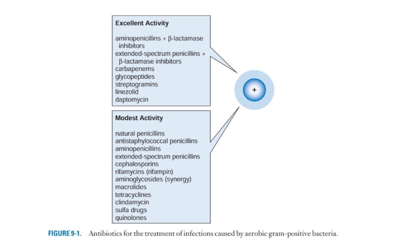
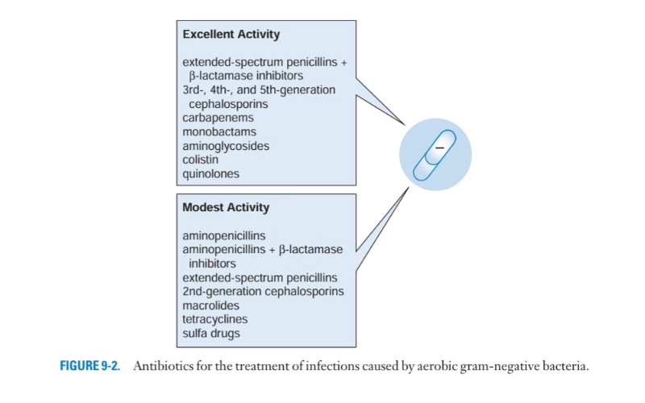
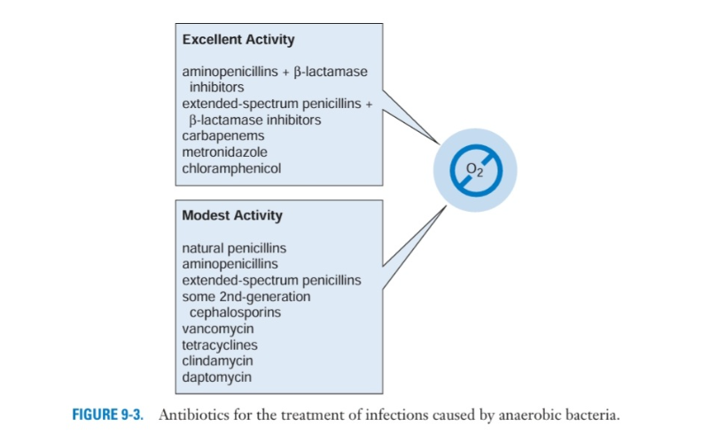
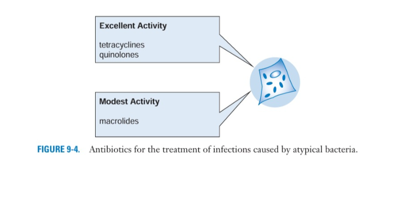

* Kháng sinh
** Tổng quan - linh tinh
   - Vk gram dương có vách dày peptidoglycan
   - vk khuẩn gram âm vách peptidoglycan mỏng hơn nhưng bên ngoài có outer membrane là Liposacharich (LPS) tích điện âm, có các porin (kênh)
   - Nhóm betalactam tác động bằng gắn kết PBP (penecillin bidiing protein) khiến không tạo được vách. 
   - Kháng sinh vào nội bào tốt: TRèo Qua Màng Bắt Cô Làng (nàng) - Tetracycline, Rifampin, Quinolone, Macrolide, bactrim (cotrim), clindamycin, linezolid. 
   - Vk nội bào bắt buộc: "Stay Inside when it's Really Cold and Chilly" Rickettsia (sốt mò), Coxiella burnetii (sốt Q), Chlamydia
   - Vk nội bào tùy nghi: Some = Salmonella. Nasty = Neisseria (đặc biệt là Neisseria meningitidis - Não mô cầu). Bugs = Brucella. Like = Listeria monocytogenes. Living = Legionella pneumophila. Inside = Intracellular (Từ khóa nhắc bài: Nội bào). Cells = Chlamydia / Coxiella (Lưu ý: Một số tài liệu xếp Chlamydia vào nhóm bắt buộc, nhưng câu này vẫn thường được mượn chữ C để gom nhóm).
   - MRSA
     + CA-MRSA: kháng thuốc ít hơn loại nhiễm khuẩn bệnh viện HA-MRSA. với nhiễm trùng nhẹ như mô mềm có thể sử dụng các kháng sinh còn nhạy như Cotrim, Doxy, mino, Clinda (có thể cảm ứng - nên cần D test), không dùng Quinolone vì rất dễ xuất hiện kháng (đột biến nhỏ). Macrolide không được dùng vì tỷ lệ kháng rất cao và có thể làm tăng kháng cảm ứng clinda.
   - Nhiễm trùng da
     + Có mủ: Staphylococcus aerius do tiết coagulase biến fibrinogen -> fibrin tạo ổ mủ... VD nhọt - cụm nhọt (nang lông), abcess
     + Không có mủ: Liên cầu tan huyết nhóm A (Streptococcus Pyrogen) tiết Streptokinase + Hyaluronidase phá hàng rào mô, lan rộng. VD viêm quầng (nông), viêm mô tế bào (sâu hơn), viêm họng. Còn rất nhạy với kháng sinh họ peni, cephalexin. Cotrim, doxy, mino không phủ, clinda có thể có tác dụng. macrolide có thể thay thế peni nếu dị ứng nhưng kháng đang tăng. Cipro chủ yếu tác dụng trên gram âm, dương yếu không dùng, levo có thể dùng nhưng hạn chế do áp lực chọn lọc vi khuẩn cao - dùng cho ca nặng, viêm phổi.
** Betalactam
*** Penicillin
    1. Penicillin tự nhiên:
       - G: tiêm
       - V: uống
    2. Penicillin kháng tụ cầu: 
       - Không có hoạt tính với gram âm
       - nafcillin, oxacillin và dicloxacillin.
   3. Aminopenicillin
      - Ampicillin: tiêm, uống
      - Amoxicillin: uống
      - Thêm phổ gram âm: E. coli, P. mirabilis, S. enterica và Shigella spp. không sản xuất beta-lactamase
   4. Penicillin phổ rộng:
      - Piperacillin, ticarcillin
      - Mở phổ trên gram âm, có tác dụng trên P. aeruginosa
   5. penicillin phổ mở rộng/chất ức chế beta-lactamase 
      - Mở phổ trên gram âm
      - Điều trị theo kinh nghiệm: (gemini) - Nhiễm trùng ổ bụng (phúc mạc, thủng tạng rỗng, áp xe gan, đường mật, viêm ruột thừa vỡ) [gram âm và kỵ khí]. Viêm phổi bệnh viện/ thở máy [Gram âm đường ruột, P. aeruginosa]. Nhiễm trung vùng chậu, niệu. /Không hiệu quả MRSA, ESBL, CRE/
   6. Chung
      - Không có tác dụng trên vi khuẩn không điển hình do không có vách. 
      - Có thêm tác dụng trên kỵ khí nếu có betalactamase inhibitor.
*** Cephalosporin
    1. Chung
       - Vi khuẩn khuẩn MRSA kháng betalactamse qua cơ chế gen mecA làm thay đổi cấu trúc PBP thành PBP2a khiến kháng sinh không còn bám vào được, do đó trừ thế hệ 5 Ceftaroline kháng hết. 
       -  ceftazidime được tinh chỉnh để tăng tác dụng trên P. Aeruginosa nhưng lại làm giảm bám dính với PBP nên giảm tác dụng với tụ cầu. Thế hệ 4 khắc phục được nhược điểm này. 
       - Các cephalosporin có hoạt tính kém lên kỵ khí (ái lực trên PBP của vk kỵ khí yếu, tiết beta lactamase), không có tác dụng trên vk không điển hình. 
       - Cephalosporin thế hệ 5 đánh tốt trên gram dương kể cả MRSA và vi khuẩn kỵ khí gram dương. hoạt tính trên gram âm tương tự ceftriaxone, kém hoạt tính trên Pseudomonas. 
*** Carbapenem
    1. Chung
       - Cơ chế đề kháng: Ví dụ, P. aeruginosa đột biến mất porin màng ngoài, tăng sản xuất các bơm đẩy (efflux pumps). Enterococcus faecium và MRSA sinh PBP biến đổi không gắn kết với carbapenem. Carbapenemase.
    2. Imipenem
       - Dễ bị phá hủy bởi men dehydropeptidase I, do đó kết hợp với Cilastatin để ức chế men này. 
       - Không trị được MRSA
       - Hoạt lực tốt trên gram dương, gram âm kể cả P. Aeruginosa, rất tốt trên kỵ khí. 
    3. Meropenem
       - Thay đổi cấu trúc nên không cần kết hợp cilastatin 
       - Phổ tương tự imipenem 
    4. Doripenem
       - Phổ tương tự imipenem, tác dụng tốt hơn với P. aeruginosa
    5. Ertapenem
       - Hoạt lực kém hơn trong nhóm với vi khuẩn Gram dương hiếu khí, P. aeruginosa và Acinetobacter spp.
*** Monobactame
    - Chỉ có tác dụng trên gram âm hiếu khí và tác dụng rất tốt, hoạt tính trung bình trên Pseudomonas. Không có độc tính trên thận như aminoglycosid. 
*** Glycopeptid
**** Vancomycin
     - Phân tử lớn
     - Đánh Listeria monocytogenes (ký sinh nội bào) kém hơn ampicillin do phân tử lớn vào màng kém hơn. 
     - Đánh tốt vi khuẩnn gram dương hiếu khí và kỵ khí, bao gồm cả C. diffi cile. 
     - Tác dụng trên enterococci hiện nay variable do đột biến thay đổi cấu trúc d-alanyl–d-alanine dipeptide (chỗ bám của vancomycin), gen này có thể chuyển giao và đã tìm thấy trên một số tụ cầu -> có thể sẽ gia tăng đề kháng với vancomycin trong tương lai. 
     - /"Although usually given intravenously, it can be given orally to treat bowel infections, such as diarrhea caused by C. diffi cile, but it is not absorbed when administered in this way"/
     - Độc tính: điếc, đặc biệt dùng chung với aminoglycosid. Red man syndrome thường không phải do phản ứng dị ứng, tránh bằng cách truyền chậm. 
*** Daptomycin
    - Cơ chế tạo kênh ion trên màng tb vi khuẩn làm leak ion -> death. Không có tác dụng trên vi khuẩn gram âm do không qua được outer membrane. 
    - Hoạt tính kém ở phổi, do đó không dùng điều trị viêm phổi. 
*** Colistin
    - Thuộc nhóm polymixin, Độc tính trên thận.
    - Hoạt động bằng cơ chế: colistin điện dương hút LPS mang điện âm ở màng ngoài, sau đó đuôi lipid chèn sâu vào màng tb vk gây chết tb. 
    - Không có hoạt lực trên Vk gram dương (không có màng ngoài), Proteus và Serratia spp. (LPS thay đổi ít điện âm và cấu trúc ít phù hợp để chèn chuỗi lipid), vi khuẩn kỵ khí (LPS thay đổi, điện thế màng kém gây khó chèn chuỗi lipid)
    - Proteus họ vi khuẩn đường ruột Enterobacteriaceae, di động do có roi, gây nhiễm khuẩn niệu cơ hội, tiết urease mạn gây kiềm hóa nước tiểu dễ tạo sỏi
    -  Serratia spp. sống trong môi trường ẩm, một số tiết sắc tố đỏ, gây nhiễm trùng cơ hội đặc biệt ICU. có AmpC beta-lactamase tự nhiên.
** Betalactamase
*** Tóm tắt dễ nhớ (GEMINI):
**** 4 CẤP ĐỘ BETA-LACTAMASE
      1. Cấp độ 1: Beta-lactamase cổ điển (Cấp độ cơ bản)
        - Vi khuẩn thường gặp: S. aureus (Tụ cầu vàng), E. coli hoang dã.
        - Thuốc bị vô hiệu hóa: Penicillin G, Ampicillin, Amoxicillin.
        - Cách xử lý (Vũ khí thay thế): Dùng Cephalosporin thế hệ 1 (Cefazolin). Hoặc phối hợp kháng sinh cổ điển với chất ức chế thế hệ cũ: Amoxicillin + Acid Clavulanic (Augmentin), Ampicillin + Sulbactam (Unasyn).
      2. Cấp độ 2: ESBL - Beta-lactamase phổ rộng (Cấp độ trung bình)
        - Vi khuẩn thường gặp: E. coli, Klebsiella pneumoniae, Proteus mirabilis (Nhiễm trùng tiểu, nhiễm trùng ổ bụng bệnh viện).
        - Thuốc bị vô hiệu hóa: TẤT CẢ các Penicillin và Cephalosporin (Thế hệ 1, 2, 3, 4 như Ceftriaxone, Ceftazidime, Cefepime).
        - Cách xử lý (Vũ khí thay thế): Lựa chọn hàng đầu: Carbapenem (Ertapenem cho nhiễm trùng vừa; Imipenem/Meropenem cho nhiễm trùng nặng, sốc nhiễm khuẩn). Nhiễm trùng tiểu nhẹ: Có thể dùng Piperacillin/Tazobactam (Tazocin) hoặc Amikacin, Fosfomycin.
      3. Cấp độ 3: AmpC - Cephalosporinase cảm ứng (Cấp độ "Bẫy lâm sàng")
        - Vi khuẩn thường gặp (Nhóm SPACE/CES): Serratia, Pseudomonas aeruginosa, Acinetobacter, Citrobacter, Enterobacter.
        - Cạm bẫy lâm sàng: Trên kháng sinh đồ ban đầu, vi khuẩn có thể báo "Nhạy cảm" với Cephalosporin thế hệ 3 (Ceftriaxone). Nhưng khi truyền thuốc vào người bệnh, thuốc sẽ "kích hoạt" vi khuẩn tiết ra lượng lớn AmpC phá hủy thuốc, dẫn đến thất bại điều trị.
        - Cách xử lý (Vũ khí thay thế): KHÔNG DÙNG Cephalosporin thế hệ 1, 2, 3 và các thuốc phối hợp cũ (Augmentin, Tazocin). Vũ khí an toàn: Cefepime (Cephalosporin thế hệ 4) hoặc Carbapenem.
      4. Cấp độ 4: Carbapenemase / CRE (Cấp độ "Ác mộng")
        - Vi khuẩn đã tiết ra enzyme cắt được cả Carbapenem (KPC, NDM, OXA-48). Lâm sàng chia làm 2 phân nhóm chính để chọn thuốc:
          + Nhóm Serine-Carbapenemase (KPC, OXA-48): Vũ khí mới: Ceftazidime/Avibactam (Zavicefta) là lựa chọn tối ưu.
          + Nhóm Metallo-Beta-Lactamase (NDM-1): Enzyme phụ thuộc Kẽm, rất độc lực. Vũ khí: Zavicefta không trị được NDM-1. Phải dùng Ceftazidime/Avibactam phối hợp với Aztreonam, hoặc sử dụng các thuốc ngoài nhóm Beta-lactam như Colistin, Tigecycline (cho ổ bụng/da), hoặc kháng sinh mới Cefiderocol.
**** 3 NGUYÊN TẮC VÀNG KHI ĐỌC KHÁNG SINH ĐỒ
    - Nếu kết quả báo ESBL (+): Gạch bỏ ngay lập tức toàn bộ các Cephalosporin từ thế hệ 1 đến thế hệ 4 ra khỏi đầu, bất kể trên giấy có ghi chữ "S" (Nhạy cảm) hay không. Lực chọn ưu tiên lúc này là Carbapenem.
    - Cảnh giác với nhóm vi khuẩn tiết AmpC (Enterobacter, Citrobacter, Serratia): Ngay cả khi kết quả trả về nhạy với Ceftriaxone, hãy ưu tiên chọn Cefepime hoặc Carbapenem để tránh hiện tượng kháng thuốc cảm ứng trong quá trình điều trị.
    - Vai trò của Chất ức chế (Inhibitor):
      + Chất ức chế cũ (Clavulanic acid, Sulbactam, Tazobactam): Chỉ trị được Cấp độ 1 và ESBL (Cấp độ 2).
      + Chất ức chế mới (Avibactam): Trị được cả KPC và AmpC, mở đường cho kháng sinh đi kèm (Ceftazidime) diệt khuẩn.
** Ức chế tổng hợp Protein 
*** Rifamycins
    1. Chung: 
        - Ức chế enzyme RNA polymerase của vi khuẩn
        - Dễ gây kháng (chỉ cần đột biến 1 acid amin) khi dùng đơn độc (trừ điều trị phòng ngừa)
    2. Rifampin (Rifampicin)
        - Gây dịch cơ thể có màu đỏ cam
        - Có đường uống và truyền, các rifamycin khác chỉ uống. 
*** Aminoglycosids
    1. Chung
        - Ức chế vi khuẩn bằng cách gắn vào tiểu đơn vị 30S của ribosome làm dịch mã (gắn acid amin) sai
        - Mang điện dương nên ái lực với màng ngoài của vk gram âm tốt -> hiệu quả tốt trên gram âm hiếu khí. Hay dùng điều trị họ Enterobacteriaceae và Pseudomonas aeruginosa, vì nghiên cứu trên động vật đơn trị kém nên luôn phối hợp ngay cả khi nhạy. 
        - Vì cần vào màng qua cơ chế vận chuyển tích cực phụ thuộc năng lượng, đòi hỏi phải có oxy và lực đẩy proton (proton motive force) -> không có hoạt lực trên vk kỵ khí, ổ abcess có môi trường acid. 
        - Kém hơn với vk gram dương hiếu khí, tốt khi hiệp động với kháng sinh phá vách. 
        - Độc tính trên thận 5 -10%, lên đến 50% ở đối tượng nguy cơ (già, dùng nhiều thuốc độc thận) do tích lũy liều ở tb ống thận gần, thường xảy ra sau ngày 4-5, có hồi phục khi ngưng thuốc. Độc tính trên tai không hồi phục, độc tính trên tiền đình (đặc biệt streptomycin). 
     2. Streptomycin
        - Điều trị hàng hai trong lao. 
     3. Gentamycin: 
        - Dùng phổ biến nhất. có tác dụng trên chi enterococci
     4. Tobramycin: 
        - Phổ tương tự và kháng tương tự gentamycin nhưng không có tác dụng trên chi enterococci
     5. Amikacin: 
        - Các chủng vi khuẩn Gram âm hiếu khí đã đề kháng với gentamicin và tobramycin vẫn có thể duy trì sự nhạy cảm với amikacin. 
        - Không có hoạt tính lâm sàng có ý nghĩa với enterococci
      6. Enterococci (gemini)
        - 2 loài phổ biến nhất gây nhiễm trùng bệnh viện cơ hội, nhiễm trùng tiểu, viêm nội tâm mạch nhiễm trùng, nhiễm trùng ổ bụng
          + Enterococcus faecalis: Gây 80-90% trường hợp, thường nhạy cảm với kháng sinh hơn so với E. faecium.
          + Enterococcus faecium: 10 - 15%. đặc biệt nguy hiểm trong môi trường bệnh viện vì tỷ lệ kháng thuốc rất cao, đặc biệt là các chủng VRE (Vancomycin-Resistant Enterococcus)
*** Macrolides
    - Cơ chế tác động gắn tiểu đơn vị 50S của ribosome
    - Có hoạt tính với một số vk gram dương, gram âm, không điển hình, mycobacteria, xoắn khuẩn. nhưng hiệu quả không ổn định. không có hoạt tính trên vi khuẩn kỵ khí. 
    - Ery thiếu hoạt tính với Heamophilus infuenza, clari có hoạt tính với H influenza tốt hơn, azi tốt nhất. 
*** Tetracyclines và Glycylcyclines
    1. Chung
       - Tiêm: Doxycycline và Tigecycline
       - Uống: Tetra, Doxy, Mino
       - Cơ chế gắn tiểu đơn vị 30S của Ribosome ngăn gắn acid amin
       - 2 cơ chế đề kháng: Bơm tống xuất và thay đổi cấu hình tiểu đơn vị 30S
       - Ưu thế trên vi khuẩn không điển hình (Chlamydia, Rickettsia, Mycoplasma). Có hoạt tính trên một số vk gram dương hiếu khí, gram âm hiếu khí, kỵ khí và xoắn khuẩn. 
       - Đổi màu răng và lắng đọng trên xương do đó không dùng cho phụ nữ có thai và trẻ nhỏ hơn 8 tuổi. 
    2. Phổ: Tetra # Doxy, Doxy bán thải dài hơn, Mino tốt hơn trên MRSA
    3. Tigecycline
       - Tác dụng rất tốt trên gram dương hiếu khí cả: Enterococcus kháng vanco, MRSA, S. Peumo kháng peni. 
       - Tác dụng rất tốt trên không điển hình
       - Tác dụng rất tốt trên kỵ khí nhưng kém carbapenem và pipe/tazo
       - Tác dụng tốt trên gram âm hiếu khí kể các acinetobacter đa kháng, nhưng kém trên Pseudomonas aeruginosa và Proteus do có efflux pump
*** Chloramphenicol
    - Cơ chế gắn tiểu đơn vị 50S
    - Rất tốt trên kỵ khí và không điển hình
    - Có tác dụng trên một số gram âm và gram dương hiếu khí
    - Tuy nhiên rất độc, đặc biệt gây ức chế tủy có phồi phục phụ thuộc liều, nguy hiểm hơn là thiếu máu bất sản không hồi phục aplastic anemia
*** Clindamycin
    - Tác dụng tốt trên kỵ khí và gram dương hiếu khí, có thể còn tác dụng trên CA-MRSA (lưu ý kháng cảm ứng, cần làm D test)
    - Vi khuẩn gram âm kháng tự nhiên vì kháng sinh khó đi qua lớp màng ngoài
    - tác dụng phụ đáng lo ngại là viêm đại tràng C. difficile do clinda diệt các vi khuẩn đường ruột (chủ yếu kỵ khí)
*** Linezolid
    - Gắn 50S, ức chế kết hợp 50S và 30S
    - Tác dụng mạnh trên gram dương hiếu khí: MRSA, S.pneumonia kháng peni, enterococci kháng vanco. 
    - Không dùng điều trị gram âm, kỵ khí và không điển hình dù trên vitro có tác dụng. Ecoli kháng tự nhên do có efflux pump. 
*** Nitrofurantonin
    - Chỉ có dạng uống. Nồng độ máu thấp nhưng trong nước tiểu cao
    - Chỉ dùng điều trị viêm bàng quang, không điều trị viêm tủy thận vì thường kết hợp bacteremia. 
    - Điều trị các vi khuẩn thường gặp trong nhiễm trùng tiểu dưới (trừ Proteus, Pseudomonas)
** Target DNA and Replication
*** Sulfa Drugs
    - Trimethoprim-sulfamethoxazole ức chế tổng hợp dạng hoạt động của acid folic là chất liệu tạo deoxynucleotid
    - Tác dụng lên gram âm và gram dương hiếu khí nhưng giờ kháng nhiều.
    - Không điều trị được enterococci mặc dù có thể ức chế trong phòng thí nghiệm do nó có thể lấy folic từ cơ thể người. 
*** Quinolones
    1. Chung
       - Cơ chế: Ức chế DNA Gyrase và topôismerase IV. 
       - Đề kháng: dễ do chỉ cần đột biến đơn (single mutation) và bơm
       - Không dùng cho trẻ nhỏ hơn 18 tuổi do ảnh hương sụn xương
    2. Cipro
       - Mạnh trên gram âm, cả Psedomonas, yếu hơn trên gram dương
       - Tốt trên vk không điển hình
    3. Levo
       - Mở phổ trên gram dương, cả S.Pneumonia kháng peni
       - Đánh Pseudomonas tốt nhưng kém cipro
    4. Moxi và gemi
       - Tăng tác dụng trên S.Pneumonia cả loại kháng peni
       - Tăng tác dụng trên vk không điển hình
       - Kém trên gram âm hiếu khí, đặc biệt là pseudomonas
*** Metronidazole
    - VK kỵ khí có hệ thống enzyme vận chuyển electron đặc biệt trao e cho nhóm nitro của metronidazole tạo gốc tự do độc phá hủy DNA
    - Tác dụng rất tốt trên kỵ khí, cả C. Difficile
** Tóm tắt kháng sinh
   - Gram dương hiếu khí 
   - Gram âm hiếu khí 
   - Kỵ khí 
   - Không điển hình 
** Tổng quan vi khuẩn
*** Vi khuẩn gram dương
**** Staphylococci
     - 3 loài quan trọng: S. aureus,  Staphylococcus epidermidis, and Staphylococcus saprophyticus.
     - S. aureus: bacteremia, endocarditis, skin and soft tissue infections, osteomyelitis, pneumonia, and toxic shock  syndrome
     - S. epidermidis quan trọng nhất trong nhóm lớn "coagulase-negative staphylococci": thường gây nhiễm trùng liên quan dị vật intravenous catheters, prosthetic heart valves, and prosthetic joints. 
     - S. saprophyticus cũng thuộc nhóm "coagulase-negative staphylococci": gây community-acquired urinary tract infections
     - Kháng sinh
       + Những kháng sinh đánh gram dương đều có thể dùng được nếu nhạy, con kháng thì phải xài hàng nặng đô. MRSA thì phải vanco mới tin cậy, nếu kháng vanco thì còn linezolid, Quinupristin-dalfopristin, Daptomycin (không dùng cho viêm phổi), tigecycline, Ceftaroline. 
**** Streptococci
     - S. Pneumonia: Gây viêm màng não, viêm tai giữa, viêm xoang, viêm phổi. Đánh kháng sinh tương tự tụ cầu vàng nhưng thường ít kháng hơn. 
     - S. pyogenes (liên cầu tan huyết nhóm A - GAS): pharyngitis (“strep throat”), skin and soft tissue infections, and streptococcal toxic shock syndrome. Ít đề kháng, còn nhạy với peni, cepha 1. Macrolide có thể dùng trị thay thế nhưng đang kháng tăng.  trong viêm cân hoại tử, clinda thêm vào với peni liều cao để ức chế toxin. Không dùng TMP-SMX do kháng tự nhiên (dùng folate người), doxy do kháng cao
     - S. agalactiae (also called group B streptococci - GBS): colonize the female genital tract and cause sepsis and meningitis in neonates and infants less than 3 months of age.
     - Viridans group: colonize đường tiêu hóa và tiết niệu sinh dục gây viêm nội tâm mạc nhiễm trùng, abcess. 
**** Enterococci
     - 2 loài gây bệnh trên người: Faecalis thường gặp ít kháng, Faecium ít gặp nhưng kháng kinh khủng. VRE must be treated with linezolid, daptomycin, tigecycline, or quinupristin/ dalfopristin.  only gentamicin and streptomycin có thể dùng kết hợp để tăng hiệp đồng. 
     - Nhiễm trùng vết thương, ổ bụng, tiết niệu, viêm nội tâm mạc nhiễm trùng, nhiễm trùng huyết. 
**** LISTERIA MONOCYTOGENES
     - Thường thấy trong đất, phân động vật. Thường gây viêm dạ dày ruột ở ngươi khỏe mạnh. Trẻ nhỏ, người già, người suy giảm miễn dịch có thể viêm màng não. 
     - Ampicillin là lựa chọn điều trị (dù listeria nội bào, ampi nội bào kém nhưng listeria lại ngoại bào ở thần kinh trung ương). Gentamicin có tác dụng hiệp đồng (vào dịch não tủy ít nhưng đủ). 
     - KHáng tự nhiên với cepha, phải nhớ kết hợp ampi điều trị viêm màng não ở đối tượng nguy cơ. Nếu dị ứng ampi có thể dùng TMP-SMX. 
**** BACILLUS ANTHRACIS
     - Gây bệnh than. 3 dạng: hít, da, tiêu hóa. 
*** Vi khuẩn gram âm
**** Enterobacteriaceae
     1. ESCHERICHIA COLI, KLEBSIELLA SPP., AND PROTEUS SPP.
        - Viêm phổi, nhiễm trùng tiểu, ổ bụng, vết thương, nhiễm khuẩn huyết
     2. Beta lactamase 
        - TEM-1: plasmid, biểu hiện liên tục. kháng ampi, amox
        - AmpC: NST, cảm ứng. Kháng ampi, amox, cepha 1. khi biểu hiện liên tục, sản xuất nhiều kháng hầu hết beta lactam (kể cả kết hợp với betalactamase inhibitor như piper/tazo) trừ carbapenem. 
        - ESBL: plasmid, liên tục. Lưu ý trên kháng sinh đồ có thể nhay với cepha 3 nhưng thực tế kháng. kháng hết betalactam trừ carbapenem. kể cả piper/tazo không đáng tin cậy. Thường kháng nhiều kháng sinh nhóm khác luôn. 
        - KPC: plasmid, kháng hết betalactam cả carbapenem. 
     3. ENTEROBACTER, SERRATIA, CITROBACTER, PROVIDENCIA, AND MORGANELLA SPP.
        - Viêm phổi, nhiễm trùng tiểu, ổ bụng, vết thương, nhiễm khuẩn huyết
        - Tiết AmpC cảm ứng kháng ampi/amox/cepha1, thường đột biến biểu hiện liên tục tiết lượng lớn khi điều trị với betalactam - kháng tất cả betalactam, betalactam/inhibitor trừ carbapenem - thường là các loài Citrobacter, Morganella, Providencia, Serratia, Enterobacter (Cephalosporins May Prove Sub-Efficacious)
     4. SALMONELLA ENTERICA, SHIGELLA SPP., AND YERSINIA ENTEROCOLITICA
        - Thường gây viêm dạ dày ruột.
        - Salmonella enterica gồm loại không gây thường hàn (có ổ chứa ở động vật, người là ký chỉ ngẫu nhiên gây viêm dạ dày ruột khu trú nhẹ) và loại gây thương hàn (chỉ có ở người, gây bệnh thương hàn, vi khuẩn lan rộng vào máu, bệnh nặng)
        - Salmonella, Shigella điều trị bằng quinolone (cipro), C3, Azi. Một số còn nhạy ampi, Cotrim.
        - Y. Enterocolitica: aminoglycoside, doxy, cipro, cotrim
     5. YERSINIA PESTIS
        - Gây bệnh dịch hạch. Diều trị bằng streptomyci, gentamycin, Doxy. 
**** Pseudomonas
     - Gây viêm phổi, nhiễm trùng tiểu, nhiễm trùng vết thương
     - Có nhiều cơ chế kháng thuốc. 
     - Kháng sinh: Piperacillin liều cao > ticar. Cipro > levo, ceftazidime, cefepim, monobactam (aztreonam), carba (trừ ertapenem), tobra > genta, amikacin, colistin. 
     - Nếu đã kháng pipera thì kháng luôn cả pipe/tazo, vì tazo không ức chế được betalactamase của pseudomonas
     - Thường kết hợp 2 kháng sinh, không dùng đơn độc do không đáng tin cậy, dễ xuất hiện kháng trong quá trình điều trị. 
**** Neisseria
     - 2 loài thường gặp: Neisseria meningitidis và Neisseria gonorrhoeae
     - N. meningitidis gây viêm màng não, nhiễm khuẩn huyết. Peni thường còn nhạy tuy nhiên đã có hiện tượng kháng. Cepha 3 vào dịch não tủy tốt, điều trị tốt.
     - N. gonorrhoeae gây lậu sinh dục, nhiễm lan tỏa (da và khớp). Peni không còn hiệu quả, điều trị bằng cepha 3 (ceftri, cefixime). Thường nhiễm kết hợp với chlamydia
*** Curved Gram-Negative Bacteria
    - CAMPYLOBACTER JEJUNI: gây viêm dạ dày ruột. Điều trị macrolid (erythromycin, azithromycin, clarithromycin), quinolon (ciprofloxacin), tỷ lệ kháng ciprofloxacin đang gia tăng. lựa chọn khác tetracyclin (tetracycline, doxycycline), nhóm aminoglycosid (gentamicin, tobramycin, amikacin), amoxicillin/clavulanic, hoặc chloramphenicol. 
    - HELICOBACTER PYLORI
    - VIBRIO CHOLERAE: gây bệnh tả. tetracycline và doxycycline kháng thuốc đang tăng. quinolone (ciprofloxacin), macrolide (erythromycin, azithromycin), hoặc trimethoprim-sulfamethoxazole, kháng trimethoprim-sulfamethoxazole cũng đang trở nên phổ biến hơn.
*** Các loại vk gram âm khác
**** H. Influenza
     - Gram âm, hình dạng biến đổi
     - Viêm tai giữa, viêm xoang, viêm kết mạc, CAP, viêm màng não, viêm nắp thanh quản và viêm khớp nhiễm khuẩn
     - Type b độc lực cao, một số trường hợp tiếp xúc gần cần được phòng ngừa bằng rifampin. 
     - Kháng ampi, amox cao. Cotrim đang tăng kháng. Amox/ampi + inhibitor điều trị tốt, cepha 2-3 điều trị tốt. Quinolone, tetra, macrolide, carbapenem, 
**** BORDETELLA PERTUSSIS
     - Trực-cầu khuẩn gram âm. Gây bệnh ho gà. 
     - KHáng sinh ưu tiên là macrolide, hàng 2 là quinolone, tetra, cotrim. 
**** MORAXELLA CATARRHALIS
     - Sau cầu gram âm.
     - Viêm xoang, viêm tai giữa. viêm phổi. 
     - Kháng tự nhiên amox, ampi. Peni phổ rộng như piper còn nhạy, amox/ampi+inhibotor, Cepha 2-3, Cotrim, macrolide, tetra, quinolone, aminoglycoside
**** ACINETOBACTER
     - Gram âm, đa dạng hình thái. KHáng nhiều
     - Viêm phổi, vết thương, nhiễm trùng huyết
     - Sulbactam có hoạt tính nội tại diệt khuẩn. Điều trị Ampi/sulbactam, carbapenem, amikacin, rifampin, colistin, tigercyclin. 
*** Vi khuẩn kỵ khí
**** Chi Clostridium
     - Trực khuẩn gram dương kỵ khí tạo nha bào 
     - C. tetani gây uốn ván. Điều trị peni G, metro
     - C. botulinum gây liệt cơ, nhiễm từ thức ăn hoặc vết thương. Điều trị Peni G, metro
     - C. Difficile gây viêm đại tràng. Thường do clindamycin (nguy cơ cao, chọn lọc chủng kháng clinda), ampicillin, and cephalosporins (do tỷ lệ dùng nhiều). 
     - C. perfringens gây hoại thư sinh hơi. Penicillin + clindamycin/tetracycline/metronidazole, cắt lọc. 
**** Trực khuẩn gram âm kỵ khí
     - Bacteroides (quan trọng nhất là nhóm Bacteroides fragilis), Prevotella, và Porphyromonas spp.
     - Cư trú khoang miệng, đường tiêu hóa, âm đạo. Gây viêm nha chu, viêm phổi - màng phổi, nhiễm trùng ổ bụng, vùng chậu. 
     - Thường tiết batalactamase phá hủy peni và cephalosporin, đặc biệt B. fragilis. Điều trị: Beta-lactam/beta-lactamase (ampicillin-sulbactam, piperacillin-tazobactam, ticarcillin-clavulanate), carbapenem, và metronidazole tốt. Clindamycin, piperacillin, tigecycline, một số Cepha (cefotetan, cefoxitin), quinolone (moxifloxacin) tương đối tốt với trực khuẩn gram âm kỵ khí. 
*** Vi khuẩn không điển hình
**** Chlamydia spp.
     - Vi khuẩn nội bào bắt buộc. Có 2 giai đoạn thể ngoại bào (sơ nhiễm) có thể lây, thể nội bào (thể lưới) có thể nhân lên.
     - 3 loài quan trọng Chlamydia trachomatis (lây qua đường tình dục), Chlamydia pneumoniae (viêm phổi), và Chlamydia psittaci (sốt vẹt, viêm phổi do loài chim ngoại lai)
     - Kháng sinh thấm tốt vào tế bào Macrolide (azithromycin, erythromycin), tetracycline (doxycycline, tetracycline) và một số quinolone.
     - Trong thai kỳ amox được sử dụng do tính an toàn, chưa rõ lý do tại sao một số nhạy. 
**** Mycoplasma spp.
     - Mycoplasma pneumonia thường gặp nhất, gây viêm phổi. 
     - macrolide (azithromycin, clarithromycin, erythromycin), tetracycline (doxycycline, tetracycline), quinolone (levofloxacin, moxifloxacin, gemifloxacin) and telithromycin.
**** Legionella pneumophila
     - L. pneumophila phổ biến nhất cư trú trong hệ thống nước, gây viêm phổi (Legionnaires thể nặng). Nhẹ hơn gây sốt Pontiac nhẹ hơn - giống cúm, tự giới hạn. 
     - Cư trú nội nào đại thực bào ở phổi. Điều trị macrolide, tetracycline và quinolone. Ưu tiên azithromycin, levofloxacin, và moxifloxacin. khác Ciprofloxacin, gemifloxacin, clarithromycin, telithromycin, erythromycin, và doxycycline.
**** Brucella spp.
     - Brucella melitensis, Brucella abortus, Brucella suis, và Brucella canis. Tiếp xúc gần gũi với động vật và uống sữa hoặc phô mai chưa tiệt trùng là các yếu tố nguy cơ dẫn đến nhiễm bệnh.
     - Ưu tiên doxycycline phối hợp với rifampin/streptomycin/gentamicin. Điều trị phải kéo dài, tái phát có thể xảy ra.
**** Francisella tularensis
     - Chủ yếu gây bệnh ở động vật, gây bệnh Tularemia (bệnh sốt thỏ). 
     - Nhiễm qua tiếp xúc trực tiếp với động vật hoặc các sản phẩm từ động vật, hoặc gián tiếp qua côn trùng cắn, nước hoặc bùn bị ô nhiễm, hoặc hít qua khí dung. Do F. tularensis dạng khí dung có khả năng lây truyền rất cao và có thể dẫn đến bệnh cảnh nghiêm trọng, vi sinh vật này hiện được xếp vào nhóm tác nhân khủng bố sinh học.
     - Streptomycin tốt nhất. Gentamicin, Tetracycline, doxycycline, và chloramphenicol.
**** Rickettsia spp.
     - Nhiều thể Rickettsia gây bệnh, điều trị tốt bằng Doxy
*** Xoắn khuẩn
**** Treponema pallidum
     - Gây giang mai. Điều trị bằng Benzathine penicillin tiêm bắp. Lựa chọn thay thế tetracycline, doxycycline, hoặc ceftriaxone
**** Borrelia burgdorferi
     - Gây bệnh Lyme, lây truyền qua vết cắn bọ ve. 
     - Điều trị hàng đầu Doxy. Thay thế Amox, cefuroĩm, ceftriaxone, erythromycin
**** Leptospira interrogans
     - Lây qua nước tiểu động vật
     - Bệnh có thể nhẹ tới nặng. Điều trị bằng Doxy, amox, ampi, ceftri
*** Mycobacteria
**** Mycobacterium tuberculosis
     - Gây lao
**** Phức hợp Mycobacterium avium
     - gồm hai loài mycobacteria có mối quan hệ họ hàng gần gũi: M. avium và Mycobacterium intracellulare
     - tỷ lệ mắc bệnh cao ở những cá thể nhiễm AIDS có số lượng tế bào CD4 dưới 50 tế bào/µL
**** Mycobacterium leprae
     - Gây bệnh phong 
** Điều trị theo kinh nghiệm
*** Viêm phổi cộng đồng
    - Tác nhân thường gặp: S. Pneumonia (42%), Mycoplasma pneumonia (19%), Chlamydia pneumonia (10%), vk gram âm hiếu khí (7%), Legionella (4%)
    - S.Pneumonia thường gặp nhất, tỷ lệ dao động tùy tài liệu
    - H. Influenza: người già, xơ nang phổi, COPD
    - M. Pneumonia: tác nhân không điển hình phổ biến nhất
    - Legionella: nguồn nước (vòi hoa sen, khí dung, phun sương...)
    - Trực khuẩn gram âm: hiếm gặp trừ viêm phổi nặng cần ICU. 
    - Klebsiella chỉ nên nghĩ khi có bệnh nền như COPD, đái tháo đường và nghiện rượu
    - Pseudomonas giãn phế quản, kháng sinh nhiều lần, corticoid kéo dài, suy giảm nhiễn dịch. 
    - Tụ cầu vàng: người già, sau nhiễm cúm, thường có biểu hiện viêm phổi hoại tử nặng
    - Vi khuẩn kỵ khí: hít sặc, đàm thối. 
    - Burkholderia pseudomallei: vùng dịch tễ Đông Nam Á, Bắc Úc. Có trong đất, nước. 