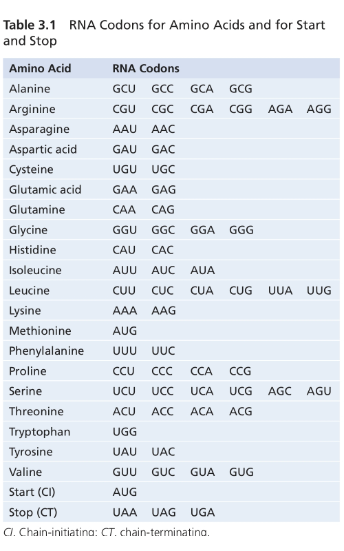
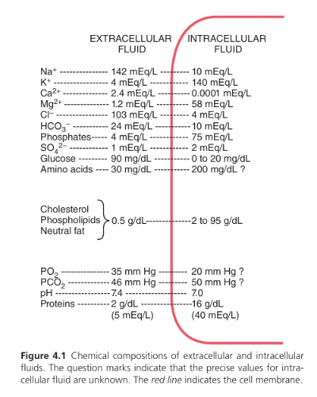

* Sinh lý YDS 2024
** 
* Guyton 15e
** Chap 1 - Functional Organization of the Human Body and Control of the “Internal Environment”
  - TB Hồng cầu: # 25 ngìn tỷ  (trillion). Là tế bào nhiều nhất trong cơ thể
  - Toàn bộ cơ thể: 35-40 ngìn tỷ TB. 
  - Vi sinh vật trong cơ thể (microbiota) nhiều hơn toàn bộ TB trong cơ thể
  - 50-70% cơ thể là nước. 2/3 nội bào, 1/3 ngoại bào
  - Ngoại bào: Na, HCO3-, Nutrients (oxy, glucose, fatty acíd?, amino acids?), CO2?, waste products
  - Nội bào: K, Mg, Phosphate
  - Khi nghỉ: máu di chuyển toàn bộ hệ tuần hoàn khoảng 1 phút. Khi hoạt động rất mạnh: máu di chuyển 6 lần hệ tuần hoàn trong 1 phút. 
  - Ít tế bào nào nằm cách mao mạch quá 50 micromet, đảm bảo sự khuếch tán của hầu hết mọi chất từ mao mạch đến tế bào trong vòng vài giây.
  - Màng phế nang: 0.4 - 20 micromet
  - Điều hòa huyết áp: HA cao -> baroreceptors ở chỗ chia ĐMC và cung động mạch chủ -> hành não -> trung khu vận mạch (vasomotor center) -> giảm xung truyền từ trung khu vận mạch đến hệ giao cảm -> giãn mạch, giảm bơm -> hạ huyết áp
  - Ngưỡng bình thường và ngưỡng chết (Approximate Short- Term Nonlethal Limit) dịch ngoại bào [[./img/constituentDeathThreshold.jpg]]
  - Kali hạ -> giảm dãn truyền thần kinh -> liệt
  - Calci hạ 1/2 bình thường (1.0 -> 0.5) -> tetanic contraction do xung thần kinh tự phát từ dây thần kinh ngoại vi.
  - PH giảm hoặc tăng 0.5 có thể gây tử vong (6.9-7.4-8.0)
  - Negative feedback
    1. Gain = correction/error. 
  - Possitive feedback: còn gọi là "vicious cycle", càng làm nặng hơn tình trạng ban đầu. Một số có lợi như:
    1. Đông máu: hoạt hóa yếu tố đông máu -> tiếp tục hoạt hóa yếu tố đông máu bên cạnh cho đến khi cục máu đông bít chỗ chảy máu. 
    2. Phản ứng co thắt tử cung khi sanh: đầu em bé nong cổ tử cung -> co thắt càng mạnh hơn -> sanh. 
    3. Phản ứng dẫn truyền thần kinh: kích thích màng tế bào -> rò Na vào bên trong tế bào sợi tk -> thay đổi điện thết màng -> mở thêm kênh -> dẫn truyền điện là thay đổi điện thế màng bên cạnh -> cho đến đầu tận
    4. Possitive feedback là một phần trong vòng negative feedback lớn hơn: ví dụ đông máu -> negative feedback của ổn định huyết áp. 
  - Feed-forward and adaptive control (xem thêm hệ thần kinh)
** Chap 2 - The Cell and Its Functions
  1. *TỔ CHỨC TẾ BÀO*
      - Tế bào gồm: nhân và bào tương (cytoplasm)
      - Nguyên sinh chất (protoplasm) là các chất cấu tạo nên tế bào gồm 5 chất: (nước, điện giải), (protein, lipid, carbohydrate)
      - *Nước*: Nhiều nhất 70-85%, ngoại trừ tế bào mỡ
      - *Điện giải*: Nhiều: Kali, phosphate, sulfate, bicarbonate | ít: natri, clo, canxi
      - *Protein*: Nhiều thứ nhì 10-20% khối lượng TB. 2 loại: cấu trúc và chức năng
        + /Cấu trúc/: nhiều phân tử -> sợi dài polymer. Tạo vi ống (microtubules) -> khung xương tế bào cho các bào quan (lông mao, sợi trục tk, thoi phân bào), cố định các thành phần trong nguyên sinh chất. protein sợi (fibrillar proteins) bên ngoài tế bào (collagen và elastin)
        + /Chức năng/: Vài phân tử -> ống cầu (tubular-globular). Enzym, di động trong dịch nội bào (khác protein sợi)
      - *Lipid*: 2% khối lượng TB. Quan trọng nhất là phospholipid và cholesterol, tạo màng tb và màng nội bào. Triglycerid còn gọi là mỡ trung tính (neutral fats) trong tb chiếm 95% khối lượng TB, là kho năng lượng chính của cơ thể. 
      - *Carbohydrate*: dinh dưỡng tế bào và cấu trúc (tp của phân tử glycoprotein). hầu hết TB người không dự trữ nhiều carbohdrate (thườg khoảng 1% tổng khối lượng, vs 3% ở tb cơ, 6% ở tb gan). Glucose hòa toan ở dịch ngoại bào; glycogen là một polymer không tan của glucose dự trữ trong tb. 
  2. *CẤU TRÚC TẾ BÀO*
     - Nếu thiếu ty thể (mitochondria) 95% năng lượng tb sẽ ngừng ngay lập tức
     1. *CÁC CẤU TRÚC MÀNG:* màng tb, nhân, lưới nội sinh chất, ty thể, lysosome, peroxisome, bộ Golgi. /Màng tế bào/: lớp kép lipid (mỗi lớp dày 1 phân tử) + protein. 7,5-10 nanomet. TP chủ yếu protein và lipid: 55% protein, 25% phospholipid, 13% cholesterol, 4% lipid khác, 3% carbohydrate.
       - *Lớp kép lipid:* 3 loại chính - phospholipid, sphingolipid, cholesterol. Nhiều nhất là /phospholipid:/ đầu phosphate ưa nước (hướng ra ngoài), đầu acid béo kỵ nước (hút lẫn nhau, hướng vào trong).Đầu kỵ nước không thấm với chất tan trong nước (ion, glucose, ure), thấm chất tan trong mỡ (oxy, CO2, alcohol). /Sphingolipid/ chiếm lượng nhỏ, đặc biệt trong tb thần kinh; chức năng bảo vệ yếu tố độc hại, truyền tín hiệu, vị trí bám của protein ngoại bào. /Cholesterol/ kiểm soát độ lỏng của màng, giúp xác định độ thấm hoặc không thấm của màng với các chát tan trong nước. 
       - *Protein nội tại và ngoại vi* của màng tb: chủ yếu là glycoprotein. Có 2 lại protein màng: nội tại (integral) xuyên qua toàn bộ màng và ngoai vi (peripheral) gắn với protein nội tại hoặc không xuyên màng. 
         + Protein nội tại tạo kênh (hay lỗ - pores) cho các chất tan trong nước, đặc biệt là ion, khuếch tán, cũng có đặc tính chọn lọc. Một số hoạt động như protein mang (carrier) để vận chuyển chủ động. Một số hoạt động như enzyme. Một số hoạt động như receptor: tương tác với phối tử (ligands) -> hoạt hóa enzym hoặc tương tác với protein trong bào tương (chất truyền tín hiệu thứ 2). _Như vậy có 4 chức năng: kênh (lỗ), protein mang vận chuyển chủ động, enzym, receptor._ 
         + Protein ngoại vi: thường gắn với protein nội tại. 2 chức năng: enzym hoặc bộ điều khiển (controller) quá trình vận chuyển qua lỗ màng (pores)
       - *Carbohydrate màng* - "Glycocalyx" của tb: hầu như luôn gắn với protein (glycoprotein) hoặc lipid (glycolipid). Hầu hết các protein nội tại là gycoprotein, 1/10 lipid là glycolipd. Hướng ra ngoài tb.  Proteoglycan - carbohydrate gắn với lõi protein nhỏ. Như vậy toàn bộ mặt ngoài phủ 1 lớp carbohydrate lỏng lẻo gọi là /glycocalyx/, 4 chức năng:
         + Tạo điện tích âm
         + Liên kết tb: một số tb gắn với glycocalyx của nhau.
         + Thụ thể gắn kết hormon, như insulin. 
         + Tham gia vào phản ứng miễn dịch
         + __Tóm lại: Điện âm màng, liên kết tb, thụ thể, miễn dịch.__
     2. *TB CHẤT VÀ BÀO QUAN:*
        - TB chất chứa hạt mỡ trung tính (neutral fat - triglycerid), hạt glycogen (ploymer của glucose), ribosome, túi tiết (serectory vesicles), và 5 bào quan đặc biệt quan trọng: Lưới nội sinh chất, bộ Golgi, Ty thể, Lysosome, Peroxisome. 
        - *Lưới nội sinh chất:* mạng lưới cấu trúc hình túi và ống thông với nhau. Chức năng: xử lý các phân tử do tb tổng hợp và vận chuyển chúng đến vị trí sử dung bên trong hoặc ngoài tb. Thành cấu tạo bới màng kép lipid - tổng diện tích có thể 30 - 40 lần diện tích màng tb (như ở tb gan). Không gan bên trong ống và túi (khoang cisternal), chứa chất nền (matrix) khác với dịch cytosol (dịch bào) bên ngoài. Không gian bên trong ER thông với không gian giữa 2 màng nhân. Các chất được tổng hợp trong tb đi vào khoang ER và vân chuyển đến các phần khác của tb. Cung cấp cơ chế cho phần lớn chức năng chuyển hóa tb. 
        - *Ribosome và lưới nội sinh chất hạt/thô (rough ER):* Bám bên ngoài rough ER là nhiều hạt nhỏ ribosome. Ribosome cấu tạo từ hỗn hợp RNA và protein, /chức năng tổng hợp protein mới/. ER hạt liên tục trực tiếp với màng nhân cho phép liên lạc hiệu quả
        - *Lưới nội sinh chất trơn (smooth ER):* không có ribosome, ít hơn ER hạt. Chức năng: /tổng hợp lipid/, khử độc, và các chức năng khác nhờ enzym nội lưới. 
        - *Bộ Golgi:* Có màng tương tựu ER trơn. Cấu tạo từ 4 hoặc nhiều hơn lớp túi phẳng mỏng chồng lên nhau, ở một phía của nhân, đặc biệt ở tb tiết - nó nằm phía các chất được tiết ra. Bộ Golgi hoạt động kết hợp với ER. Các túi vận chuyển nhỏ (túi ER) -> hợp nhất với golgi -> xuất ra ngoài hoặc chuyển đến vị trí khác trong tb. Một số chất dùng tạo lysosome, túi tiết và các thành phần tb khác. 
        - *Lysosome:* _Tóm tắt: tạo từ golgi. 250-750nm. 40 enzym thủy phân 5-8nm.  PH 4.8. Tay-Sachs, hexosaminidase A, lipdi ganlioside, tb thần kinh._ 
          + Tạo từ golgi, phân tán khắp tb chất. Chức năng tiêu hóa nội bào: cấu trúc tb hư hỏng, hạt thức ăn được tb thu nhận, virus/vi khuẩn. Có trong all tb, nhiều trong bạch cầu. Đường kính 250-750 nanomet. Chứa tập hợp 40 enzym thủy phân (hydrolase) đường kính 5-8 nanomet. Thủy phân bằng cách gắn Hydro (H) vào 1 phần hợp chất, phần còn lại gắn Hydroxyl (OH). Protein -> Amino acid, glycogen-> glucose, lipid-> acid béo và glycerol. Môi trường trong lysosome là môi trường acid # 4.8 cho enzym hoạt động, PH trung tính của Cytosol khiến enzym tiêu hóa bất hoạt. Bệnh Tay-Sachs rối loạn di truyền do độ biến gen mã hóa enzym lysosome (hexosaminidase A) phân hủy các lipid phức tạp ganglioside trong não và tb thần kinh -> tích tụ -> tổn thương hệ thần kinh, suy giảm nhận thức, suy giảm vận động, tử vong sớm. 
        - *Peroxisome:* /Tóm tắt: tương tự lysosome. 2 khác: tự nhân đôi hoặc từ ER trơn vs golgi - và oxidase vs hydrolase. Oxy hóa độc chất và dị hóa acid béo chuỗi dài. Hội chứng Zellweger./
          + Hình thái tương tự Lysosome. Khác: thứ 1 - chủ yếu hình thành bằng tự nhân đôi hoặc tử ER trơn thay vì Golgi (không có DNA, nhận protein từ cytosol để nhân đôi); thứ 2 - Chứa Oxidase thay vì Hydrolase. Chức năng: Oxy hóa chất gây độc cho tb (1/2 cồn bị khử thành acetaldehyde bởi peroxisome gan), dị hóa hóa acid béo chuỗi dài. Hội chứng Zellweger - giảm perixosome tế bào -> rối loạn hệ thần kinh và chuyển hóa, xuất hiện ngay sau sanh, tử vong sớm trong những năm đầu đời. 
        - *Túi tiết:* tạo thành từ hệ thống ER-Golgi -> bào tương.
        - *Ty thể:* /Tóm tắt: tạo năng lượng (ATP). Kích thước và hình dạng nay đổi vài trăm nm -> 10mcm. 2 lớp màng kép. Tự nhân đôi (mtDNA có 37 gen từ mẹ). Bệnh do đột biến mtDNA hoặc 1300 gen từ DNA nhân. /
          + Là nguồn năng lượng của tb. Số lượng 100 - vài nghìn tùy nhu cầu năng lượng của tb. Thay đổi kích thước và hình dạng: hình cầu vài trăm nanomet - thuôn dài 1x10 micromet. 
          + Cấu trúc: 2 lớp mang kép lipid-protein. Màng ngoài: protein kênh (porin). Màng trong: nhiều nếp gấp (cristae), enzyme oxy hóa. Khoang bên trong chứa chất nền chứa enzym, kết hợp enzym oxy hóa trên màng trong để oxy hóa dinh dưỡng -> Co2, H2O, năng lượng -> ATP -> vận chuyển khỏi ty thể và khuếch tán. 
          + Tự nhân đôi: tùy nhu cầu tăng thêm ATP của tb. Ty thể chứa DNA (mtDNA) trong chất nền, chứa enzym và ribosome để tạo protein. mtDNA có 37 gen chủ yếu di truyền từ mẹ, hiếm gặp di truyền từ cha (ty thể tinh trùng ở đuôi -rụng khi thụ tinh). 
          + Bệnh ty thể có thể do đột biến mtDNA hoặc đột biến của khoảng 1300 gen nhân mã hóa các protein điều tiết chức năng ty thể. 
        - *Khung tb - sợi và ống:* /Tóm tắt: Sợi nhỏ 7nm actin đàn hồi. Sợi trung gian 8-12nm cứng, nhỏ hơn myosin, lớn hơn actin. Vi ống 25nm từ tubulin, khung xương, đường ray./
          + Mạng lưới protein sợi: sợi (filaments) hoặc ống (tubules). 
          + Tổng hợp: ribosome trong tb chất -> protein -> trùng hợp thành sợi. 
          + Microfilament (7nm): actin, giá đỡ đàn hồi cho màng tb. 
          + Intermediate filament (8-12 nm): cứng, lớn hơn actin, nhỏ hơn myosin. chức năng cơ học (desmin ở cơ, neruofilaments ở thần kinh, keratin ở tb biểu mô. 
          + Microtubule (25 nm): tạo từ các phân tử tubulin (alpha và beta) trùng hợp. Hoạt động như khung xương cứng, tham gia quá trình phân chia tb, di chuyển tb, đường ray di chuyển cho các bào quan trong tb. 
        - *Nhân tế bào:* /Tóm tắt: Kiểm soát các đặc điểm tế bào thông qua DNA./
          + Trung tâm điều khiển: phát triển, trưởng thành, nhân đôi, hoặc chết. 
          + Chứa DNA -> Gen -> đặc điểm protein của tb; Kiểm soát và thúc đẩy nhân đôi của tb. 
        - *Màng nhân:* /Tóm tắt: 2 màng kép, vài nghìn lỗi nhân 9nm, phân tử <44000 đi qua dễ, >44000 chọn lọc qua thụ thể./
          + 2 màng lớp kép lipid, màng ngoài liên tục với ER. 
          + Vài nghìn lỗ nhân (nulear pores), dk 9nm, cho phép phân tử 44.000 đi qua dễ dàng, phân tử lớn hơn vận chuyển chọn lọc qua thụ thể. 
        - *Hạch nhân và sự hình thành Ribosome:* /Tóm tắt: 1 hoặc nhiều hạch/nhân. RNA + protein ribosome. to ra khi tổng hợp protein. phần lớn RNA ra tb chất + protein ->ribosome./
          + Một nhân có một hoặc nhiều hạch nhân, bắt màu đậm, không có màng. 
          + Tích lũy lượng lớn RNA và các loại protein tìm thấy trong ribosome. 
          + To ra đáng kể khi tế bào tích cực tổng hợp protein. 
          + Gen DNA đặc hiệu trên nhiễm sát thể trong nhân -> tổng hợp RNA -> phần nhỏ lưu trong hạch nhân, phần lớn qua lỗ nhân -> tế bào chất, kết hợp protein đặc hiệu -> ribosome "trưởng thành", đóng vai trò thiết yếu tạo thành các protein tế bào chất. 
  3. *CHỨC NĂNG TẾ BÀO*
     1. *NỘI THỰC BÀO*
        - Hầu hết các chất đi qua màng bằng khuếch tán và vận chuyển chủ động.
        - Các hạt lớn -> nội thực bào (ẩm bào - pinocytosis, thực bào - phagocytosis)
        1. *Ẩm bào:* /Tóm tắt: 100 - 200nm. Bên trong clathrin, các protein sợi co rút, ATP. Bên ngoài Ca+./
           - Túi ẩm bào rất nhỏ 100 - 200nm
           - Quá trình: mặt trong (protein sợi clathrin, actin, myosin, ATP), bên ngoài (Ca2+ trong dịch ngoại bào)
        2. *Thực bào:* /Tóm tắt: Chỉ một số tb có (đại thực bào mô, bạch cầu). Thụ thể gắn vào kiểu khóa kéo -> thắt cuống./
           - Tương tự ẩm bào nhưng các hạt lớn hơn
           - Chỉ một số tế bào có khả năng thực bào: đặc biệt là đại thực bào mô, bạch cầu. 
           - Quá trình: gắn thụ thể -> rìa quanh điểm gắn phồng ra bao quanh, thêm nhiều thụ thể gắn vào kiểu khóa kéo -> actin và các sợi co rút -> thắt cuống. 
     2. *LYSOSOME TIÊU HÓA:* /Tóm tắt: ngay sau khi ẩm thực bào. sản phẩm amino acid, glucose, phosphate, thể cặn. Tác nhân diệt khuẩn: lysozyme hủy thành, lysoferrin gắn sắt, PH 4.8 hoạt hóa thủy phân và bất hoạt./
        - Gần như ngay sau khi ẩm/ thực bào
        - Thủy phân -> amino acid, glucose, phosphate khuếch tán qua màng túi; phần còn lại không tiêu hóa được (thể cặn - residual body) -> xuất bào. 
        - Chứa tác nhân diệt khuẩn gồm: (1) lysozyme phân hủy thành tb vk, (2) lysoferrin gắn kết sắt và các chất khác trước khi chúng có thể thúc đẩy sự phát triển của vk, (3) PH 4.8 hoạt hóa các hydrolase và bất hoạt hệ chuyển hóa của vk. 
        - Tự thực bào: dọn dẹp bào quan lỗi thời, tái chế protein lớn. Cung cấp cơ chế cho /sự phát triển mô, thiếu chất dinh dưỡng, cân bằng nội mô./
        - Ty thể ở tb gan chỉ sống khoảng 10 ngày -> lysosome phá hủy. 
     3. *TỔNG HỢP CÁC CẤU TRÚC TB - ER VÀ GOLGI*
        - *Chức năng của ER:* /Tóm tắt: ER hạt -> protein, ER trơn -> mỡ. Còn cung cấp ezym kiểm soát phân hủy glycogen, khử độc./
          + Hầu hết quá trình tổng hợp bắt đầu từ ER -> Golgi xử lý thêm -> tb chất
          + ER hạt tổng hợp protein. Ribosome đùn một ít trực tiếp vào tb chất, phần lớn vào chất nền ER.
          + ER trơn tổng hợp lipid (đặc biệt phospholipd và chol). 
          + Chức năng khác, đặc biệt ER trơn: (1) cung cấp enzym kiểm soát phân hủy glycogen, (2) cung cấp enzyme khử độc (đông tụ, oxy hóa, thủy phân, liên hợp với acid glucoronic)
        - *Chức năng của Golgi:* /Tóm tắt: thêm carbohydrate, cô đặc từ ER. 2 vd quan trọng là acid hyaluronic và chondroitin sulfate. Ca2+ xâm nhập tb kích thích xuất bào./
          + Chức năng chính là xử lý thêm các chất tạo thành từ ER. 
          + Tổng hợp một số carbohydrate không thể tạo từ ER. Vd: Acid hyaluronic và chondroitin sulfate (1) thành phần chính của proteoglycan trong chất nhầy, chất tiết, (2) thành phần chính của các khoảng gian bào, (3) thành phần chính của chất nền hữu cơ trong sụn và xương, (4) quan trọng trong hoạt động di cư và tăng sinh của tế bào. 
          + Chất tạo thành từ ER -> ER trơn -> Golgi, thêm vào các nhóm Carbohydrate, cô đặc -> tách ra và phát tán. 
          + Thời gian: tế bào tuyến tắm trong amino acid -> protein trong ER 3-5 phút -> 20 phút có trong Golgi -> 1-2 giờ tiết ra từ tb. 
          + Quá trình xuất bào được kích thích bởi sự xâm nhập của Ca2+ vào tb. 
     4. *TY THỂ TRÍCH XUẤT NĂNG LƯỢNG*
        - Thức ăn -> (glucose), (amino acid, acid béo) -> ty thể (pyruvic acid), (acetoacetic acid) -> ATP
        - *Chức năng của APT:* /Tóm tắt: ./
          + Là một nucleotide cấu tạo từ: (1) base nitơ adenine, (2) đường pentose ribose, (3) ba gốc phosphate - 2 gốc cuối kết nối bằng liên kết phosphate năng lượng cao (ký hiệu ~). Mỗi liên kết năng lượng cao chứa 12.000 calo/1mol ATP. 
          + Khi ATP giải phóng năng lượng: 1 gốc acid phosphoric bị tách tạo ra ADP. 
        - *Ty thể tạo ATP:* /Tóm tắt: Glucose -> acid pyruvic + 2ATP trong tb chất (glycosis) 5%. Ty thể 95% (pyruvic acid), (acetoacetic acid) -> Acetyl-coenzyme A (CoA), qua chu kình acid citric (Krebs) 36ATP./
          + Glucose vào tb -> acid pyruvic (quá trình glycolysis giải phóng 2 ATP) chiếm 5% tổng chuyển hóa năng lượng của tb. 
          + 95% sự hình thành ATP trong ty thể. (pyruvic acid), (acetoacetic acid) -> Acetyl-coenzyme A (CoA), qua chu kình acid citric (Krebs) phân hủy CO2 và H -> H kết hợp Oxy tạo năng lượng cho enzyme ATP synthetase tạo 36 ATP -> vận chuyển vào tb chất và dịch nhân. 
          + Toàn bộ quá trình tạo ATP gọi là cơ thế hóa thẩm thấu - chemiosmotic mechanism. 
        - *Ứng dụng của ATP:* /Tóm tắt: năng lượng cho (1) vận chuyển qua màng (tb ống thận dùng 80% ATP cho vận chuyển qua màng. (2) tổng hợp chất. (3) công cơ học./
  4. *SỰ DI CHUYỂN TẾ BÀO:*
     - Chuyển động của cơ vân, cơ trơn, cơ tim, chuyển động amip và chuyển động lông mao. 
     1. *Chuyển động amip:* 
        - Chân giả: tạo thành liên tục màng tb mới ở rìa trước chân giả, hấp thu liên tục màng ở phần giữa và sau. 
        - 2 điều kiện khác: (1) Chân giả gắn kết mô chung quanh bằng thụ thể. (2) sợi actin co
        - Kiểm soát chuyển động amip bắng hóa hướng động: hóa hướng động dương đi đến nơi có nồng độ cao và ngược lại
     2. *Lông mao và chuyển động lông mao:*
        - Có 2 loại: lông mao vận động (motile) và lông mao không vận động (nonmotile) hay lông mao nguyên phát. 
        - Lông mao vận động chuyển động roi gặp chủ yếu 2 nơi đường dẫn khí (di chuyển dịch nhầy 1cm/phút) và vòi tử cung. 
        - Cấu tạo: dài 2-4 micromet. 11 vi ống (9 ống đôi + 2 ống đơn trung tâm) nhô ra từ thể nền (basal body) ngay bên dưới màng tb. 
        - Roi của tinh trùng tương tự nhưng dài hơn nhiều và di chuỷen theo dạng sóng hình sin gần đúng thay vì chuyển động roi. 
        - Di chuyển bằng đánh nhanh (10-20 lần/s). sau đó di chuyển chậm ngược lại. 
        - Cơ chế: phức hợp ống và liên kết chéo gọi là axoneme. cần 2 điều kiện: (1) ATP, (2) ion thích hợp đặc biêt là canxi và magie. 
        - Lông mao nguyên phát: không vận động và thường chỉ có một lông mao/tb. hoạt động như sensor. VD tb biểu mô ống thận hoạt động như cảm biến dòng chảy -> thay đổi tín hiệu canxi nội nào -> khởi phát tín hiệu. Bệnh thận đa nang do khiếm khuyết trong tín hiệu của lông mao. 
** Chap 3 - Kiểm soát di truyền đối với tổng hợp Protein, chức năng tế bào và tái bản tế bào
*** *GENERAL:* /Tóm tắt: người có 20.000-25.000 gen. >100.000 protein. Proteome là toàn bộ hệ thống protein của tb. 1 gen có thể có nhiều phiên bản protein./
    - Gen kiểm soát chức năng tb bằng: quyết định cấu trúc, enzyme, các chất hóa học nào được tổng hợp. 
    - DNA -> RNA -> khuếch tán khắp tb -> protein.
    - Người có 20.000 - 25.000 gen. 
    - RNA được phiên mã từ cùng 1 gen có thể dược tb xử lý theo nhiều cách, tạo ra các phiên bản protein thay thế. 
    - Ước tính có khảng > 100.000 protein ở người.
    - Các loại tb khác nhau có *proteome* khác nhau (toàn bộ hệ thống protein được tạo ra bởi 1 tb). 
    - Hầu hết protein tế bào là enzyme, một số là cấu trúc. 
*** *NHÂN TẾ BÀO: GEN KIỂM SOÁT TỔNG HỢP PROTEIN*
    1. *Các đơn vị cấu tạo của DNA:* /Tóm tắt: 4 nucleotide có tính acid P-D-(purine A/G, pyrimidine T/C)./
       - (1) Acid phosphoric (P)
       - (2) Đường Deoxyribose (D)
       - (3) 4 base nitơ: 2 Purine - Adenine (A) và Guanine (G); 2 Pyrimidine - Thymine (T) và Cytosine (C). 
       - P-D tạo 2 khung xoắn, A--T, G---C kết nối 2 chuỗi xoắn. 
    2. *Nucleotide:* /Tóm tắt: ./
       - P-D-A: acid deoxyandenylic
       - P-D-T: acid deoxythymidylic
       - P-D-G: acid deoxyguanylic
       - P-D-C: acid deoxycytidylic
       - 4 nucleotide này có tính acid
    3. *Sắp xếp Nucleotides -> DNA:* /Tóm tắt: A--T, G----C bằng liên kết hydro lỏng lẻo. 1 vòng xoắn có 10 cặp./
       - Purine liên kết với pyrimidine bằng liên kết hydro lỏng lẻo: A--T 2 liên kết hydro, G---C 3 liên kết hydro. 
       - Một vòng xoắn hoàn chỉnh của chuỗi kép DNA có 10 cặp nucleotides
    4. *Mã di truyền:* /Tóm tắt: Một bộ ba base tạo 1 mã di truyền./ 
*** *PHIÊN MÃ - DNA NHÂN SANG RNA BÀO TƯƠNG*
    1. *Tổng hợp RNA trong nhân từ DNA:*
       - *Các đơn vị cấu tạo RNA:* /Tóm tắt: bộ 3 mã RNA gọi là codon. Đường Deoxyribose -> Ribose có thêm 1 nhóm HO. T -> U./
         + Bộ 3 DNA -> bộ 3 mã bổ sung RNA (codon).
         + Deoxyribose của DNA thay bằng ribose chứa thêm 1 nhóm hydroxyl. 
         + Thymine của DNA thay bằng Uracil
       - *Sự hoạt hóa Nu của RNA:* /Tóm tắt: RNA Polymerase gắn 2 gốc phosphate vào Nu tạo triphosphate dùng ATP. Nu hoạt hóa dùng năng lượng gắn thêm vào cuối chuỗi RNA đang hình thành./
       - *Lắp ráp RNA:* /Tóm tắt: RNA polymera nhận diện promoter -> tháo xoắn -> gắn base RNA -> tách khỏi DNA khi gặp mã kết thúc./
         + Đặc tính enzyme RNA Polymerase: (1) Nhận diện vùng khởi động (promoter) của DNA, (2) Tháo xoán DNA, (3) a- tạo liên kết hydro Nu DNA với Nu RNA trong dịch nhân, b- bẻ 2 gốc P của Nu RNA hoạt hóa tạo năng lượng gắn liên kết hóa trị với cuối RNA đang hình thành, c- tách khỏi DNA khi gặp trình tự kết thúc, RNA Polymerase được dùng lại tiếp tục, d- RNA mới tách ra khỏi DNA vào dịch nhân do ái lực yếu hơn so với chuỗi DNA bổ sung. 
         + Base DNA - Base RNA: G-C, C-G, A-U, T-A
       - *Nhiều loại RNA:* /Tóm tắt: Nhiều chức năng còn bí ẩn. 6 loại: pre-mRNA, snRNA, mRNA, tRNA, rRNA, miRNA./
         + Chức năng của nhiều loại RNA vẫn chưa hiểu rõ. 
         + 6 loại có vai trò độc lập khác nhau: (1) pre-mRNA lớn, chưa trưởng thành, được xử lý trong nhân -> mRNA trưởng thành (intron bị bỏ, exon giữ lại). (2) RNA nhân nhỏ snRNA điều khiển cắt nối pre-mRNA. (3) mRNA ra bào tương tạo protein. (4) RNA vận chuyển tRNA vận chuyển acid amin đã hoạt hóa đến ribosome lắp ráp protein. (5) RNA ribosome rRNA cùng 75 loại protein khác tạo ribosome. (6) MicroRNA miRNA dài 21 - 23 Nu điều hòa phiên mã và dịch mã gene. 
    2. *RNA thông tin - các Codon:* /Tóm tắt: vài trăm - vài ngìn Nu. 1 acid amin có thể nhiều codon. Khởi đầu AUG. Kết thúc UAA, UAG, UGA./
       - Chứa vài trăm - vài ngìn Nu.
       - Codon -> acid amin.
       - Hầu hết một acid amin được đại diện bởi nhiều hơn một codon. 
       - Một codon khởi đầu (CI): AUG
       - 3 codon kết thúc (CT): UAA, UAG, UGA
       - Codon cho 20 acid amin thường gặp 
    3. *RNA vận chuyển - các AntiCodon:* /Tóm tắt: 80 Nu, hình cỏ 3 lá. 1 đầu AMP (acid adenylic) gắn acid amin. Lá giữa Anticodon - đối mã đặc hiệu cho một acid amin./
       - tRNA vận chuyển acid amin đến ribosome để tổng hợp protein. 
       - Mỗi loại tRNA kết hợp đặc hiệu với 1 acid amin (anticodon - đối mã), nhận diện một codon cụ thể trên mRNA.
       - Chứa khoảng 80 Nu. Hình dạng như cỏ 3 lá.
       - Một đầu tRNA luôn có một Acid adenylic, hay còn gọi là Adenosine monophosphate (AMP) gồm một nhóm phosphate, đường ribose và base adenine. Acid amin sẽ gắn vào nhóm OH của đường ribose của AMP. 
    4. *RNA Ribosome:* /Tóm tắt: Ribosome chứa 60% rRNA, còn lại 75 loại protein cấu trúc và enzym. rRNA ở hạch nhân kết hợp protein ribosome để tạo tiểu đơn vị chưa trưởng thành, ra bào tương lắp ráp trưởng thành. Do đó trong nhân không có ribosome trưởng thành -> không tạo protein trong nhân. Gen tạo rRNA có nhiều bản sao ở 5 cặp NST trong nhân./
       - rRNA chiếm 60% cấu trúc Ribosome. Còn lại là khoảng 75 loại protein cả cấu trúc lẫn enzyme.
       - Gen DNA tạo rRNA nằm ở 5 cặp nhiễm sắc thể trong nhân. Mỗi NST chứa nhiều bản sao của gen này vì nhu cầu ribosome lớn.
       - rRNA hình thành tập trung ở hạch nhân, liên kết với protein ribosome để tạo các tiểu đơn vị sơ khai của ribosome. Tiểu đơn vị này qua lỗ lớn của màng nhân đến bào tương, sau đó được lắp ráp để tạo ribosome trưởng thành. Vì vậy protein được hình thành trong bào tương vì nhân không có ribosome trưởng thành. 
    5. *miRNA và RNA can thiệp nhỏ:* /Tóm tắt: miRNA 21-23 Nu, ức chế hoặc phân hủy RNA, ít đặc hiệu hơn siRNA (220-25 Nu được tổng hợp nhân tạo hoặc virus. DNA -> Pri-miRNA, microprocessor cắt thô trong nhân -> pre-miRNA kẹp tóc 70 Nu, Dicer cắt gọn trong tb chất -> miRNA mạch kép + RISC chọn 1 mạch -> gắn mRNA./
       - 21 - 23 Nu điều hòa biểu hiện gen. 
       - DNA -> Pri-miRNA -> Phức hợp vi xử lý (Microprocessor complex) cắt tỉa sợi thô trong nhân -> pre-miRNA (cấu trúc kẹp tóc 70 Nu). Dicer: Cắt gọn trong tế bào chất -> tạo miRNA mạch kép. RISC: Chọn một mạch làm "la bàn" -> Khóa biểu hiện gene (ức chế dịch mã hoặc phân hủy mRNA). Rối loạn chức năng gây ra ung thư, bệnh tim. 
       - RNA can thiệp nhỏ (siRNA), còn được gọi là RNA gây im lặng hoặc RNA can thiệp ngắn, 20 - 25 Nu. Được tổng hợp (virus hoặc nhân tạo), rất đặc hiệu, thường chỉ tấn công chính xác một mRNA mục tiêu. Khác với miRNA có thể ức chế nhiều mRNA khác nhau. 
*** *DỊCH MÃ*
    1. *Polyribosome - Một cụm ribosome:* /Tóm tắt: 3-10 ribosome có thể cùng lúc gắn vào 1 mRNA, gọi là polyribosome. Ribosome có thể gắn với mọi mRNA./
       - 3 - 10 ribosome có thể gắn vào một mRNA cùng lúc, gọi là polyribosome. 
       - Ribosome có thể gắn với bất kỳ mRNA nào, không có tính đặc hiệu. 
    2. *Nhiều ribosome gắn vào ER:* /Tóm tắt: Do protein đang hình thành có đoạn tín hiệu, gắn với bộ nhận dạng SRP, đem đến gắn thụ thể trên ER, chuyển protein vào ER -> ribosome đính vào giống như hạt./
       - Nếu protein đang hình thành có đoạn tín hiệu (Signal Peptide), sẽ được SRP (Signal Recognition Particle) nhận diện và tạm dừng ribosome (tránh xuất protein lung tung vào tb - nếu là enzyme phá hủy có thể gây hại), ccụm này di chuyển đến receptor trên ER, luồn protein vào trong ER tiếp tục dịch mã đẩy protein vào matrix của ER. 
       - Ở tb tuyến, các túi tiết được hình thành số lượng lớn, các protein cần được đóng gói trong lưới nội sinh chất trước khi xuất bào. Ngược lại trong các tb bình thường, hầu hết protein được ribosome giải phóng trực tiếp vào tb chất, đó là các enzym và protein cấu trúc nội bào của tb. 
    3. *Các bước hóa học trong tổng hợp protein:* /Tóm tắt: Tốn 4 liên kết cao năng lượng từ 1 ATP - sạc acid amin -tRNA và 1 GTP - điều phối tRNA gắn đúng (tốn nhất trogn tb)./
       - ATP kết hợp với acid amin -> AMP-acid amin được "sạc", giải phóng 2 liên kết phosphate cao năng lượng. 
       - AMP-acid amin + tRNA -> Acid amin - tRNA có năng lượng, giải phóng AMP.
       - Anticodon trên tRNA gắn với mRNA trong ribosome, tốn năng lương từ 2 liên kết phosphate cao năng lượng từ GTP, enzym peptidyl transferase trong ribosome gắn các liên kết peptide không tốn thêm năng lượng do các acidamin đã được sạc. 
       - Tổng cộng 4 liên kết cao năng lượng cần cho gắn vào 1 acid amin -> quá trình tốn năng lượng nhất của tb. 
    4. *Liên kết Peptide - sự kết hợp của các acid amin:* /Tóm tắt: OH- bị tách khỏi COOH của AA1, H+ bị tách khỏi NH2 của AA2 -> liên kết peptide (O=C-N-H) + H2O./
*** *ĐIỀU HÒA CHỨC NĂNG GENE VÀ HOẠT ĐỘNG SINH HÓA TRONG TB*
    1. *General:* /Tóm tắt: 2 phương pháp cơ bản kiểm soát hoạt động sinh hóa của tb: điều hòa di truyền và điều hòa enzyme./
       - Mỗi gen trong tổng số 20.000 - 25.000 gen, có ít nhất một cơ chế feedback giúp điều hòa hoạt động.
       - Về cơ bản có 2 phuong pháp kiểm soát hoạt động sinh hóa của tb: (1) Điều hòa di truyền: kiểm soát hoạt hóa gen và sự hình thành các sản phẩm của gen. (2) Điều hòa Enzyme: kiểm soát mức độ hoạt động của các enzyme đã được hình thành. 
    2. *Điều hòa di truyền:* /Tóm tắt: Basal promoter - bộ máy (TATA box, TFIID đánh dấu, TFIIB cầu nối). Upstream promoter - bộ điều khiển tại chỗ bật tắt. Enhancer - bộ khuếch đại từ xa, >100.000 enhancer. Insulator - tường cách âm - VD IGF-2 từ mẹ enhancer|insulator gắn protein ức chế|promoter; cha enhancer|insulator bị methy hóa không gắn ức chế|promoter -> biểu hiện. Cơ chế khác: Gen điều hòa -> protein điều hòa, DNA xoắn nén trên NST và tháo xoắn từng phần, hormone từ bên ngoài./
       - Điều hòa di truyền, hay điều hòa biểu hiện gen: toàn bộ quá trình từ phiên mã trong nhân dến hình thành các protein trong bào tương. 
       - Thước đo cuối cùng của biểu hiện gen là sản phẩm của gen (protein) có được tạo ra hay không và số lượng là bao nhiêu. 
       - *Vùng khởi động kiểm soát biểu hiện gene:* /Tóm tắt: ./
         + *Vùng khởi động cơ bản (basal promoter) - như bộ máy:* Protein liên kết TATA và nhiều yếu tố phiên mã, gọi chung là phức hợp phiên mã IID (TFIID) gắn vùng khởi động TATA box (TATAAA) (đánh dấu gene). Sau đó yếu tố phiên mã IIB (TFIIB) gắn vào cả DNA và RNA polymerase (cầu nối và thước đo). Vùng khởi động cơ bản có trong tất cả các gen mã hóa protein. 
         + *Vùng khởi động thượng nguồn (upstream promoter) - như bộ điều khiển tại chỗ:* nằm xa hơn về phía thượng nguồn, chứa một số vị trí liên kết cho các yêu tố phiên mã dương tính hoặc âm tính (tăng cường hoặc ức chế) tương tác với các protein liên kết với basal promoter. Cấu trúc và vị trí liên kết yếu tố phiên mã của upstream promoter thay đổi theo từng gen -> biểu hiện khác nhau của gen ở mô khác nhau. 
         + *Trình tự tăng cường (Enhancer sequence) - Như bộ khuếch đại từ xa:* là các vùng DNA có thể liên kết với các yếu tố phiên mã, có thể nằm cách rất xa - thậm chí trên NST khác. Mặc dù nằm xa gen đích nhưng do DNA cuộn xoắn - chúng có thể nằm rất gần. Ước tính > 100.000 enhancer trong bộ gen người. 
         + *Trình tự cách ly nhiễm sắc thể (chromosal insulator) - như tường cách âm:* Phân tách các gen đang hoạt động và gen bị ức chế, làm rào cản để một gen cô lập khỏi các ảnh hường phiên mã từ các gen xung quanh. VD gen yếu tố tăng trưởng giống insulin 2 (IGF-2): allele từ mẹ có một trình tự cách ly nằm giữa enhancer và promoter, liên kết với protein ức chế phiên mã, tuy nhiên trình tự DNA từ cha được *Methyl hóa* khiến protein ức chế phiên mã không liên kết được với trình tự cách ly do đó gen IGF-2 từ cha được hoạt động. 
         + *Cơ chế khác:* (1) gen điều hòa -> protein điều hòa. (2) Cùng 1 protein điều hòa có thể ức chế gen này nhưng hoạt hóa gen khác. (3) Một số không kiểm soát lúc khởi đầu phiên mã nhưng ở giai đoạn sau. (4) Trong NST DNA quấn quanh các protein histone nhỏ, DNA bị giữ ở trạng thái nén chặt, không hoạt hóa. Nhiều cơ chế kiểm soát giãn xoắn từng phần để hoạt hóa. Các tín hiệu ngoài tế bào như hormone có thẻ kích hoạt các vùng NST cụ thể. 
    3. *Điều hòa Enzyme:* /Tóm tắt: Ức chế enzyme đầu tiên trong chuỗi -> thay đổi hình dạng không gian, hoặc hoạt hóa (cAMP)./
       - *Ức chế enzyme:*  Hầu như luôn luôn, sản phẩm được tổng hợp sẽ tác động lên enzyme điều tiên trong chuỗi phản ứng thay vì các enzyme tiếp theo. Liên kết trực tiếp lên enzyme -> thay đổi cấu hình không gian dị lập thể (allosteric conformational change) -> enzyme bất hoạt. 
       - *Hoạt hóa Enzyme:* enzyme bình thường ở trạng thái bất hoạt -> hoạt hóa. VD: ATP cạn kiệt -> cAMP hình thành -> hoạt hóa enzyme phân giải glycogen là *phosphorylase* ->  glucose -> năng lượng ATP. 
       - VD: purine/pyrimidine ức chế enzyme tạo ra chúng nhưng hoạt hóa enzyme ngược lại pyrimidine/purine -> cân bằng lượng purine và pyrimidine cho DNA và RNA. 
*** *HỆ THỐNG DI TRUYỀN - DNA KIỂM SOÁT TÁI BẢN TB*
    1. *Chu kỳ sống của tb:* /Tóm tắt: Nguyên phân # 30 phút 5%, kỳ trung gian 95%. Tb có chu kỳ nhanh nhất # 10 giờ (tủy xương) đến cả đời (thần kinh)./
       - Chu kỳ sống của tb: là thời gian từ khi tb sinh ra đến lần tái bản tiếp theo (kết thúc bằng nguyên phân mitosis). Tb động vật khi không bị ức chế, tái bản nhanh nhất có thể chỉ kéo dài 10 giờ (tb tủy xương bị kích thích mạnh) - 30 giờ. Tb thần kinh có thể có chu kỳ kéo dài cả cuộc đời. Nguyên phân chỉ kéo dài khoảng 30 phút, 95% chu kỳ sống là giữa 2 lần nguyên phân gọi là kỳ trung gian (interphase). 
    2. *Tái bản tb bắt đầu bằng nhân đôi DNA:* /Tóm tắt: DNA polymerase nhân đôi chiều 5'-3' (3-5 ở chuỗi mẹ), ở chuỗi dẫn đầu khe hở RNA mồi sau khi exonuclease thay bằng Nu DNA sẽ được nối bằng DNA ligase, ở chuỗi chậm nối các đoạn mồi, và Okzaki. Tháo xoắn DNA bằng topoisomerase./
       - Trước nguyên phân 5-10 giờ, DNA bắt đầu nhân đôi kéo dài 4-8 giờ. Sau nhân đôi 1-2 sẽ bắt đầu nguyên phân đột ngột. 
       -  DNA được nhân đôi gần giống phiên mã RNA ngoại trừ: (1) Cả 2 chuỗi đều được nhân đôi. (2) Nhân đôi toàn bộ chuỗi vs đoạn nhỏ. (3) DNA polymerase thêm Nu theo chiều 5' -> 3'; DNA ligase liên kết các Nu với nhau. (4) Chạc tái bản (replication fork) DNA tháo xoắn và tách liên kết hydro bởi enzyme DNA Helicase tạo hình chữ Y. DNA có tính định hướng chỉ nhân đôi chiều 5'->3'; tại chạc tái bản chuỗi dẫn đầu (leading strand) hướng chiều 3'-5' về phía chạc tái bane, chuỗi chậm (lagging strand) hướng chiều 5'-3' ra xa chạc tái bản. Do hướng khác nhau, 2 chuỗi nhân đôi cách khác nhau. (5) Gắn đoạn mồi (primer biding): một đoạn RNA ngắn gọi là RNA mồi (RNA primer) sẽ gắn vào đầu 3' của chuỗi dẫn đầu. Các đoạn mồi được tạo ra bởi enzyme DNA primase. (6) Kéo dài: Chuỗi dẫn đầu được kéo dài liên tục; chuỗi chậm bắt đầu nhân đôi bằng cách liên kết với nhiều đoạn mồi cách nhau vài base, sau đó DNA polymerase thêm các đoạn DNA gọi là đoạn Okazaki vào giữa các đoạn mồi. DNA ligase nối các đoạn Okzaki lại tạo thành chuỗi thống nhất. (8) kết thúc: Enzyme exonuclease loại bỏ các đoạn mồi RNA, thay thế bằng các base thích hợp, đọc sửa DNA mới hình thành. Enzyme topoisomerase có thể tạm thời làm đứt liên kết phosphodiesterase trong khung xương DNA phía trước chạc tái bản để ngăn DNA không xoắn quá mức, phản ứng này tạm thời, sau khi hoàn thành DNA mẹ và bổ sung sẽ xoắn lại. 
    3. *Sửa chữa DNA:* /Tóm tắt: Đọc và Sửa chữa bằng chính DNA polymerase và ligase./
       - Trong khoảng 1 giờ sau khi DNA nhân đôi và nguyên phân DNA sẽ được sửa chữa. Quá trình sửa chữa bởi chính DNA polymerase và ligase. Có khoảng 10 đột biến trong quá trình truyền bộ gen từ cha mẹ sang con cái, nhưng bù lại có 2 bộ nhiễm sắc thể bù trừ. 
    4. *Nhân đôi NST:* 46 cái, 23 cặp.
       - *Tổ chức và đóng gói DNA trong NST:* /Tóm tắt: DNA tháo xoắn khoảng 6 feet (2m), quấn quanh histone gọi là nucleosome. heterochromatin - chất nhiễm sắc dị hóa bị nén không phiên mã được, euchromatin - chất nhiễm sắc thực lỏng lẻo, phiên mã được. Tâm động cetrome./
         + DNA người tháo xoắn dài khoảng 6 feet (2m).
         + DNA quấn quanh lõi Histone (nucleosome) -> chromatin fiber -> chromosome. 
         + NST nén đặc (heterochromatin - chất nhiễm sắc dị hóa), không thể phiên mã DNA. Chất nhiễm sắc mở (euchromatin - chất nhiễm sắc thực) lỏng lẻo và phiên mã có thể diễn ra.
         + 2 NST sau nhân đôi dính với nhau tại tại tâm động (centromere) gọi là chromatid (nhiễm sắc tử). 
    5. *Nguyên phân:*
       - *Bộ máy nguyên phân:* /Tóm tắt: Vi ống cộng với 2 cặp trung tử. Kỳ đầu - thoi phân bào NST cô đặc. Tiền kỳ giữa - phân mảnh màng nhân, gắn tâm động kéo về 2 cực. Kỳ giữa - mặt phẳng xích đạo. Kỳ sau - chrômatid tác nhau khỏi tâm động. Kỳ cuối - màng nhân thành, tb thắt lại ở giữa./
         + Kỳ đầu (prophase): Thoi phân bào đang hình thành, NST cô đặc. 
         + Tiền kỳ giữa (Prometaphase): Gai vi ống phân mảnh màng nhân. Gắn chromatid tại tâm động kéo về 2 cực. 
         + Kỳ giữa (metaphase): Tạo mặt phẳng xích đạo. 
         + Kỳ sau (Anaphase): Hai chromatid bị tách rời khỏi tâm động kéo về 2 cực. 
         + Kỳ cuối (Telophase):Màng nhân mới hình thành, tb thắt lại ở giữa. 
    6. *Kiểm soát tăng trưởng và tái bản tế bào:* /Tóm tắt: 3 cơ chế (1) yếu tố tăng trưởng, (2) ức chế tiếp xúc, (3) phản hồi âm. Telomere ngăn chặn thoái hóa NST (mất gen), mất dần khi phân chia, bệnh, stress oxy hóa, viêm; telomerase thêm Nu vào telomere, hoạt động bất thường có thể gây K./
       - Có thể cắt bỏ 7/8 gan và các tb còn lại sẽ phân chia cho đến khi khối lượng tb gan trở lại gần như bình thường. Tương tự cho tb tuyền, tb tủy xương, mô dưới da, biểu mô ruột, và tb khác trừ tb biệt hóa cao như thần kinh và cơ. 
       - Có ít nhất 3 cách kiểm soát tăng trưởng: (1) Yếu tố tăng trưởng (growth factors) từ các bộ phận khác của cơ thể, trong máu hoặc mô lân cận. Vd yếu tố tăng trường mô liên kết bên dưới -> tb tuyến tụy. (2) Ức chế tiếp xúc: ngừng tăng trưởng do hết không gian. (3) Phản hồi âm tính. 
       -  *Telomere ngăn chặn thoái hóa NST:* 
         + Telomere là một vùng của các trình tự Nu lặp lại ở mỗi đầu của NST. 
         + Khi nhân đôi, đoạn mồi không gắn ở đầu tận DNA nên bản sao mất một đoạn nhỏ DNA từ telomere -> ngăn chặn mất gen ở đoạn mút. Mỗi lần mất 30-200 cặp base (ở tb máu người mới sinh 8.000 cặp Nu trên telomere-> 1.500 ở người lớn tuổi). Khi telomere ngắn đến một giới hạn NST không ổn định -> chết tb. Xói mòn telomere có thể do bệnh tât, stress oxy hóa và viêm. 
         + Ở tb phải được bổ sung suốt cuộc đời (tb gốc tủy xương, da, tb mầm ở buồng trứng tinh hoàn) Enzyme telomerase sẽ thêm các Nu và telomere để tạo ra nhiều thế hệ tb hơn. Telomerase bị kích hoạt bất thường có thể gây ung thư.
*** *BIỆT HÓA TB:* /Tóm tắt: Do ức chế chọn lọc gen. TB sản xuất tối đa 8.000-10.000 protein/tiềm năng 20.000-25.000./
    - Biệt hóa tb là những thay đổi về đặc tính vật lý và chức năng của tb khi chứng tăng sinh trong phôi để hình thành các cấu trúc cơ thể và cơ quan khác nhau. 
    - Do ức chế chọn lọc các vùng khởi động gen khác nhau. 
    - Mỗi tb người trường thành chỉ sản xuất tối đa 8.000 - 10.000 protein/ tiềm năng 20.000 - 25.000. 
    - Các tb trong phôi kiểm soát sự biệt hóa của các tb lân cận. VD: Trung bì dây sống nguyên thủy được gọi là trung tâm tổ chức sơ cấp của phôi do nó tạo ra trung tâm xung các phần còn lại của phôi phát triển. -> biệt hóa thành trụng trung bì chứa các đốt phôi -> cảm ứng các mô xung quanh -> cơ quan. VD2: sự hình thành thấu kính của mắt. 
*** *APOTOSIS - CHẾT TB THEO CHƯƠNG TRÌNH:* /Tóm tắt: ProCaspase - > Caspase -> dòng thách hủy protein -> thực bào. VD Alzheimer, ung thư, tự miễn./
    - Apotosis khởi phát bằng kích hoạt nhiều loại ProCaspases -> Caspase (một loai protease) -> dòng thác tiêu protein -> thực bào tiêu hóa, khác với Cell necrosis thường sưng lên vỡ ra tràn các enzyme làm tổn thương tb lân cận gây viêm. 
    - Vd apotosis bất thường -> Alzheimer, ung thư, tự miễn. 
*** *UNG THƯ:* /Tóm tắt: Do đột biến hoặt kích hoạt gen tiền ung, bất hoạt gen kháng ung thư (gen ức chế khối u). đặc điểm: không giới hạn tăng trưởng, kém kết dính, tiết yếu tố tạo mạch./
    - Ung thư có thể do đột biến hoặc kích hoạt bất thường các gen kiểm soát tăng trường và nguyên phân của tb. 
    - Proto-Oncogenes, tiền gen ung thư, là các gen bình thường mã hóa cho các protein kiểm soát sự kết dính, tăng trường và phân chia tb. Nếu bị đột biến hoặc kích hoạt quá mức -> ung thư. Có khoảng 100 gen ung thư đã biết. 
    - AntiOncogenes, gen kháng ung thư, còn gọi là gen ức chế khối u, có chức năng ức chế kích hoạt gen ung thư cụ thể. Bất hoạt các gen này có thể gây ung thư. 
    - Chỉ một phần rất nhỏ tb đột biến dẫn đến ung thư: (1) sinh tồn kém (2) tb đột biến còn cơ chế phản hồi ức chế (3) tb miễn dịch triệt tiêu (4) Thường cần nhiều gen ung thư được kích hoạt. 
    - Yêu tố tăng đột biến: (1) Bức xạ ion hóa (2) hóa chất vd dẫn xuất thuốc nhuôn aniline (3) vật lý -> tổn thương liên tục -> thay tb nhanh -> dễ đột biến (4) Di truyền, có sẵn đột biến, cần ít đột biến bổ sung hơn (5) Virus: chèn trực tiếp của virus DNA, phiên mã ngược của virus RNA
    - *Đặc tính xâm lấn:* (1) không giới hạn tăng trường do không cần yếu tố tăng trưởng (2) kết dính kém dễ di căn (3) một số tb ung thư sản xuất yếu tố tạo mạch cung cấp dinh dưỡng. 
** Chap 4 - Vận chuyển qua màng tế bào
*** *MÀNG LIPID KÉP VÀ PROTEIN VẬN CHUYỂN*
    - Transport protein = tất cả
    - Channel = tạo kênh, có thể có cổng đóng mở, chọn lọc
    - Carrier = gắn + đổi hình, rất chọn lọc. Có Vmax. Cả chủ động + khuyếch tán.
    - Pore = kênh đơn giản, ít chọn lọc, luôn mở
    - /Ngoại bào: Natri, Clo, Ca, glucose, HCO3-, Po2./
    - /Nội bào: KMP (Kali, Magne, Phosphate), sulfat, protein, acid amin, cholesterol, phospholipid, neutral fat./ 
*** *Khuếch tán: Đơn thuần và được hỗ trợ*
    - *Đơn thuần:* Cho các chất tan trong lipid đi qua (càng hòa tan, càng qua dễ): /oxy, Nitơ, Co2, Rượu (dễ nhớ: khí hít thở)/
    - *Lỗ:* kênh đơn giản, ít chọn lọc (đường kính và điện tích), luôn mở. Nhiều loại aquaporins cho nước đi qua dễ dàng (một số kênh cho ure đi qua chậm hơn - ít chọn lọc - ure lớn hơn nước 20% nhưng thấm kém 1000 lần), tốc độ khuếch tán qua HC = 100 x V_HC/s
    - *Protein kênh:* gắn với phân tử, chọn lọc, nhiều loại có kênh đóng mở (điện thế - kênh Natri, kênh Kali dẫn theo kiểu all or none - không kiểu mở một nửa; ligand - Acetylcholine). 
      + VD1: Kênh Kali có 4 tiểu đơn vị protein, có khe chọn lọc (selective filter) lót oxycarbonyl tách nước khỏi Kali ngậm nước, mặc dù natri nhỏ hơn nhưng natri ngậm nước nhỏ hơn nên không tuong tác tác được tốt với oxycarbonyl -> bị chặn (100 lần so kali)
      + VD kênh Natri: gần như chỉ cho Natri đi qua, khe lọc chọn lọc (selective filter) nhỏ 0.3-0.5nm, chứa các acid ammin mang điện tích âm mạnh, giúp natri tháo nước, vừa khít năng lượng -> vào tb, ngăn kali do tháo nước năng lượng không phù hợp; có thể cho Lithium đi qua tương đối tốt do đặc tính gần giống Na. 
    - *Protein mang:* rất chọn lọc, có vị trí gắn phân tử, thay đổi cấu hình, có hiện tượng bão hòa vận tốc. /Khuếch tán cho glucose và hầu hết các acid amin./ Nổi tiếng là protein mang GLUT khuếch tán glucose vào màng (và các monosaccharide khác như fructose, galactose), insulin làm tb đưa GLUT4 từ bào tường ra màng -> tăng mật độ GLUT4 -> tăng thấm glucose 10-20 lần. 
    - Các yếu tố ảnh hường tốc độ khuếch tán ròng (net rate of diffusion): (1) chênh nồng độ. (2) Điện thế Nerst, EMF (mV) = ±61 log (C1/C2). (3) Áp suất qua màng. 
    - Độ thẩm thấu: phụ thuộc vào số lượng phân tử (mol), không phụ thuộc vào khối lượng của hạt do càng lớn thì di chuyển càng chậm suy ra động năng trung bình bằng nhau, chất phân tán thành ion Như NaCL thì có thể x 2 do phân tán ra 2 ion (thực tế thấp hơn do phân tán không hoàn toàn). 
    - Osmolality (độ thẩm thấu): Osmol (nồng độ theo số lượng hạt)/ 1 kg nước. /Độ thẩm thấu bình thường của dịch ngoại bào và nội bào là khoảng 300 milliosmole/kg nước./
    - Osmolarity: Osmol/ 1 lít dung dịch, khác biệt ít # 1% dễ dùng trên thực hành hơn.
*** *Vận chuyển tích cực: Ngược với Gradient năng lượng*
    - Vận chuyển: Natri, kali, Ca, clo, H, Fe, urat, iot, một vài loại đường, hầu hết acid amin. 
    - Vận chuyển chủ động nguyên phát: dùng ATP. /Natri, kali, canxi, H, CL (ghi nhớ, các ion hay XN)./ Năng lượng cần tăng theo log: Năng lượng (calo/osmol) = 1400 × log(C1/C2).
      + Kênh 3Na-2K: 2 phân tử protein (được nghiên cứu nhiều nhất, nhỏ Beta - chưa biết hết chức năng ngoài neo vô màng lipid, lớn alpha có chỗ gắn cho 3Na trong - gần đó có ATPase, 2 kali ngoài). Kênh này 2 chiều, nếu đi ngược lại thì tạo năng lượng. Rất quan trọng trong điện thế màng tb, dẫn truyền thần kinh. Tạo cân bằng áp suất thẩm thấu khiến tb không bị phình to do nồng độ protein và chất hữu cơ trong màng tb cao. 
      + Kênh Ca2+: duy trì nồng độ ngoài màng cao 10.000 lần so với trong màng. 2 vị trí: Nằm trên màng tb bơm ra ngoài và nằm trên các màng lưới nội chất cơ (sarcoplasmic reticulum), ty thể bơm vào trong bào quan. 
      + Kênh H+: rất quan trọng trong dạ dày (tb thành, nồng độ tăng 1 triệu lần); trong phần sau ống lượn xa, ống góp vỏ và ống góp tủy ngoài (tb xen kẽ -intercalated cells, chống bậc thang nồng độ 900 lần). 
    - Vận chuyển chủ động thứ phát: Dùng năng lượng có sẵn do kênh vận chuyển chủ động nguyên phát tạo ra ngược gradient năng lượng. 
      + Đồng vận chuyển: Na-axitamin. Na-glucose: quan trọng trong biểu mô thận và ruột. Phải gắn cả 2 mới vận chuyển được. Các kênh đồng vận chuyển khác (kali, clo, urat, phosphate, HCO3-, iót, sắt)
      + Đối vận chuyển: Đối vận Na-Ca ở hầu hết các màng tb, phụ trợ cho kênh chủ động Ca2+. Còn có đối vận chuyển Na-H rất quan trọng trong ống gần (chìa khóa cân bằng kiềm toan?) vì xuất H+ lượng rất lớn để trung hòa HCO3- thành CO2 và nước -> CO2 khuếch tán vào tb -> tái hấp thu HCO3-.
*** Vận chuyển qua các lớp tế bào: 
    - Natri, nước thụ động từ lòng ruột, ống thận (có các liên kết nối chặt Junction và bờ bàn chải ở mặt lòng) -> tb. Chủ động Natri từ tb vào mô kẽ -> tạo áp suất thẩm thấu ->kéo nước vào mô kẽ.
** Chap 5 - Điện thế màng tế bào
*** *Vật lý điện thế màng*
    1. *Phương trình Nernst:* Cho một ion
       - Điện thế màng (trong) EMF = (61/z)log(C_out/C_in) 
       - Trong đó: z là điện tích của ion. Log là độ chênh nồng độ ngoài và trong 
       - EMF của Na+ +61mV: z=1, nghĩa là nồng độ ngoài nhiều hơn trong, điện thế màng trong 61 tạo lực đẩy từ trong ra cân bằng với lực khuếch tán từ ngoài vô.
       - EMF của Cl- khoảng -71mV: z = -1, do đó nồng độ ngoài nhiều hơn trong, điện thế màng trong -71 giúp đẩy ion âm ra cân bằng với lực khuếch tán vào.
       - EMF của K+ là -94mV: z=1, nghĩa là nồng độ ngoài ít hơn trong, điện thế màng âm giúp kéo ion dương vào cân bằng với lực khuếch tán từ trong ra.
    2. *Phương trình Goldman:* Cho nhiều ion
       - Vm = 61log[(C_Na_out x P_Na + C_K_out x P_K + C_Cl_in x P_Cl)/(C_Na_in x P_Na + C_K_in x P_K + C_Cl_out x P_Cl)]
       - Vì có nhiều ion cạnh tranh nên điện thế màng sẽ cân bằng ở một điện thế trung gian, phụ thuộc vào tính thấm của màng với các ion khác nhau (Kali thấm mạnh hơn Na # 100 lần, do kênh K leak chọn lọc với K)
       - Lúc này các dòng ion vẫn di chuyển (nhưng điện thế màng vẫn ổn định) do điện thế màng chưa cân bằng với điện thế của phường trình Nernst nhưng nhờ các bơm chủ động sẽ duy nồng độ ion ổn định => điện thế màng ổn định mà không bị suy sụp cho các ion này di chuyển đến hết -> cân bằng nồng độ 2 bên màng. 
       - Điện thế màng của một số tb: Thần kinh # -70mV, HC -10mV, Tim -85mV, Cơ vân -90mV.
    3. Lực điện thế (driving force)
       - Vdf = Vm - Ve
       - Lực điện thế quyết định ion có lực di chuyển qua màng không, và theo hướng nào. 
       - VD ion Natri: Vdf = Vm - Ve = -70 - 61 = -131. Như vậy sẽ có một lực âm trong màng kéo Natri đi vào, còn cộng thêm vào lực khuếch tán, do đó Natri sẽ tràn vào rất nhanh nếu tính thấm tăng mạnh (cổng Natri điện thế mở ra)
    4. Đo điện thế màng dùng phương pháp Patch clamp. điện thế động bằng Voltage Clamp.  
*** *Điện thế động của sợi thần kinh*
    1. Điện thế nghỉ: 
       - Điện thế nghỉ của sợi thần kinh # -70mV, có kênh K leak thấm K gấp 100 Na, cân bằng lại bằng kênh 3Na-2K. 
    2. Kênh Natri điện thế: 
       - Kênh Natri điện thế mở khi điện thế màng tăng từ 70 -> # 50mV khi đó cổng ngoài (cổng hoạt hóa đang đóng) mở nhanh để Natri ồ ạt vào tế bào, khiến điện thế màng tăng vọt đến 0mV, thậm chí overshoot lên # 10mV (ở tb thần kinh trung ương ít khi nào vượt 0mV). Sau đó rất nhanh cổng bất hoạt đang mở bên trong sẽ đóng lại ngăn Na vào tb. Kênh Natri trở về bình thường chỉ khi màng tb phục hồi điện thế về bình thường. 
    3. Kênh Kali điện thế: 
       - Cổng bên trong của kênh K điện thế mở ra, K ra ngoài lập lại điện thế màng tế bào, Kênh này mở ra chậm hơn nên chỉ mở ra hoàn toàn khi kênh natri gần như đã đóng hoàn toàn. Có hiện tượng quá tái cực (HyperRepolarization) undershoot. 
       - Cuối cùng Kênh 3Na-2K hoạt động cân bằng lại Ion từ từ. Nếu không có bù trừ, tb có thể kích thích lặp lai 1000 lần trước khi nồng độ ion bị xáo trộn đến không thể kích thích được nữa.
*** *Nghiên cứu hoạt động điện thế tb thần kinh bằng phương pháp Voltage clamp*
    - Một điện cực đặt dung môi ngoại bào.
    - 2 điện cực đặt dọc trục thần kinh.
    - Có thể chủ động thay đổi điện thế màng tb.
    - Đo hoặt động của kênh bằng cạch thay đổi ion 2 bên màng hoặc block kênh Na bằng độc tố ...? và kali bằng độc tố ...? 
    - Được giải nobel y sinh năm ...? bởi ....?
*** *Các kênh khác tham gia vào điện thế động*
    - Kênh Na-Ca chậm (cụ thể là kênh Ca2+ cổng điện thế type L): Kênh này cho phép thấm Ca gấp 1000 Na. Nồng độ Ca ngoại bào gấp 10.000 nội bào. Ở một số tb sự di chuyển vào tb của Ca2+ cũng có thể gây ngưỡng kích thích điện thế động. Kênh này có tốc độ chậm, đóng vai trò bình nguyên trong quá trình tái cực của một số tb như tb cơ tim. 
    - Nồng độ cao Ca2+ ngoại bào có thể ức chế kênh Na cổng điện thế + tăng phân cự màng -> giảm tính kích thích màng tb. 
    - Hạ Ca2+ ngoại bào làm màng tế bào bớt âm -> tb dễ kích thích do giảm ức chế kênh natri cổng điện thế và nâng điện thế màng tb gần ngưỡng kích thích. => Cơn tetanus. 
*** *Tính tạo nhịp lặp lại*
    - Ở một số tb sự rò rỉ của Natri vào tb làm tăng dần điện thế màng đến ngưỡng -> kích thích. 
    - Giai đoạn trơ tuyệt đối: do cổng bất hoạt (màng trong) của kênh Natri cổng điện thế đang đóng, bất kỳ cường độ kích thích nào cũng không làm mở cổng này. Cổng này chỉ mở ra khi màng tb tái cực trở về điện thế nghỉ. 
    - Giai đoạn trơ tương đối: ở giai đoạn sau khi dòng Kali đang đi ra ngoài tb gây tái cực, điện thế màng tb đang giảm, lúc này một số cổng bất hoạt của kênh Na cổng điện thế đã mở, một kích thích mạnh có thể gây nên một điện thế động (do kali ra ngoài gây ưu phân cực hyperRepolarization => cần kích thích mạnh để đạt ngưỡng???)
*** *Dẫn truyền điện thế trên sợi thần kinh*
    - Trong một sợi thần kinh cắt ngang có 1/3 là sợi thần kinh có bao myelin, 2/3 không có bao myelin. 
    - Bao myelin là các tb Swan bao quanh sợi trục nhiều tạo thành màng cách điện làm giảm điện dung của màng tb sợi trục (cách điện trong bào tương sợi trục và dịch ngoại bào - làm cảm ứng ion 2 bên màng giảm đi), chỉ có chỗ khớp nối gọi là eo Ravier chỗ nối 2 tb Swan màng tb dẫn điện tốt => điện thế động tại một eo Ravier sẽ lan truyền trong bào tương mà không phải theo màng tb (do bao myelin cách điện  -> điện không bị rò rỉ - tương tự như ống nước bị lủng đã bị myelin bít lỗ - ion không rò rỉ) => nhảy cóc đến eo Ravier kế tiếp, làm tiết kiệm năng lượng và tốc độ dẫn dẫn truyền tăng 5 - 50 lần (đến 100m/s - độ dài sân bóng đá). 

*** *Một số liên hệ lâm sàng thú vị - không có trong textbook*
**** Kỷ lục tb
    - Tb dài nhất trong cơ thể là tb thần kinh có sợi trục thậm chí đến 1m ở tk ngồi. 
    - Tb to nhất trong cơ thể là tb trứng.
    - Tb nặng nhất trong cơ thể là tb cơ. 
**** Các kênh Kali chỉnh lưu:
     - IKr cho dòng K ra ngoài trong cuối pha 2, và pha 3; mở nhanh đóng nhanh. Thuốc gây QT dài thường hay ức chế IKr. LQTS2 bị lỗi kênh này. Kali ngoại bào tăng làm tăng tính thấm kênh này (Hơi ngược đời). 
     - IKs cho dòng K ra ngoài trong pha 3, mở chậm hơn IKr, có vai trò dự phòng, hoạt động tăng mạnh khi có kích thích beta giao cảm. LQTS1 do lỗi kênh này. Kali ngoại bào tăng làm tăng tính thấm kênh này. 
     - IK1 (cuối pha 3, pha 4) mở ổn định điện thế nghỉ màng vì dẫn K mạnh quanh điện thế màng (Nếu màng ít âm hơn (khử cực nhẹ) → K⁺ thoát ra ngoài mạnh hơn. Nếu màng âm hơn bình thường → K⁺ đi vào trong) , ức chế khi điện thế màng dương mạnh (nút Mg2+ và polyamine) giúp có giai đoạn bình nguyên. 
**** QT dài
    - Phần lớn các cơn xoắn đỉnh (Torsades de Pointes - TdP) do thuốc xảy ra theo trình tự "Ngắn-Dài-Ngắn":Một nhịp ngoại LQTS thu (Ngắn).Một khoảng nghỉ bù dài sau đó (Dài).Nhịp tiếp theo rơi đúng vào pha tái cực bị kéo dài, khởi phát cơn xoắn đỉnh (Ngắn). Nhịp tim nhanh làm rút ngắn khoảng QT (nhờ huy động kênh IKs), từ đó làm giảm nguy cơ xuất hiện các khoảng nghỉ dài và triệt tiêu cơ chế khởi phát của thuốc.
    - LQTS2 (Di truyền): Cơn loạn nhịp thường được kích hoạt bởi sự tăng vọt đột ngột của giao cảm (Adrenaline). Ví dụ: Tiếng chuông điện thoại reo lúc đang ngủ, tiếng còi xe, hoặc một cú sốc tâm lý.Lúc này, Adrenaline làm tăng dòng Canxi ICa-L) đi vào tế bào. Trong khi đó, "hệ thống phanh" IKr đã bị hỏng sẵn, không thể đối trọng lại dòng dương này, dẫn đến hậu khử cực sớm (EADs) và xoắn đỉnh.Chẹn Beta: Đóng vai trò là "áo giáp" ngăn không cho Adrenaline kích hoạt quá trình này.
    - LQTS1 bị lỗi kênh IKs, khi tăng giao cảm kênh này không bù được -> QT dài, dùng ức chế beta làm giảm giao cảm -> giảm QT dài. 
**** Tăng Kali máu
    - Tăng nồng độ K+ ngoại bào nhẹ => điện thế màng tb bớt âm hơn => dễ kích thích hơn. IKr, và IKs tăng tính thấm K -> K ra ngoại bào ồ ạt giai đoạn tái cực -> T cao nhọn. 
    - K tăng cao tăng tính thấm nhiều của kênh IK1 -> làm màng tb bớt âm quá nhiều -> cổng bất hoạt của kênh Natri điện thế không thể mở ra lại (màng cần tái cực về mức âm hơn mới mở được) => tim không phát nhịp hay dẫn truyền được => giảm sóng P, PR dài, QRS dãn rộng => sóng hình sin. 
    - Đối trị bằng Ca2+ => cải thiện dẫn truyền qua cơ chế Ca2+-dependent propagation (kích hoạt dòng Ca2+ vào qua L-type Ca channels, bù đắp cho dòng Na+ bị suy giảm) hoặc nâng ngưỡng kích thích (threshold potential) để ổn định màng => ổn định màng tb. 
**** Hạ Kali máu
     - Nồng độ K ngoại bào giảm -> tăng rò rỉ K qua kênh K leak  => Tb tăng ưu phân cực => khó kích thích (cơ chế chính trong cơ vân). Trong cơ tim: tính thấm của kênh IK1 giảm. IK1 có tác dụng ổn định điện thế màng nghỉ do chỉ cho kali đi vào gần ngưỡng điện thế màng nghỉ và ưu phân cực, tắt ngóm - không cho kali đi ra trong giai đoạn plateu. 
     - Kali đóng vai trò quan trọng trong dòng IKr và IKs (dòng K⁺ ra ngoài tế bào). Khi thiếu K⁺: Dòng K⁺ ra giảm → pha 3 của điện thế hoạt động kéo dài. → kéo dài QT trên ECG.
     - Trong hạ Kali máu, cú rơi tái cực bị kéo dài lê thê, và giữa chừng "cú rơi" đó, cơ thể bỗng nhiên nảy bật ngược trở lại.
       + Khi Kali máu thấp, sự chênh lệch nồng độ K giữa trong và ngoài tế bào tăng lên, nhưng các kênh Kali chỉnh lưu (IKr, IKs) – vốn có nhiệm vụ đưa K ra ngoài để làm giảm điện thế màng – lại hoạt động kém hiệu quả hơn.
       + (1) Giảm dòng K⁺ ra (IKr ↓↓↓, IKs ↓, IK1 ↓) → kéo dài tái cực (APD ↑, QT ↑). (2) Mất ổn định điện thế màng (IK1 ↓) → tăng tự động tính. (3) Tạo hậu khử cực: EAD: do tái cực kéo dài (IKr ↓). DAD: do rối loạn Ca²⁺
       + Cơ chế chi tiết 🔴 EAD (Early Afterdepolarization) 📍 Xảy ra khi: Điện thế hoạt động chưa kết thúc 🔑 Cơ chế: ↓ IKr → tái cực kéo dài → màng “kẹt” ở mức -30 mV  → kênh calci loại L mở lại → Ca²⁺ vào → khử Cực sớm  💥 Gây: xoắn đỉnh Loạn nhịp khi QT kéo dài 🔵 DAD (Delayed Afterdepolarization) 📍 Xảy ra khi: Điện thế hoạt động đã kết thúc (pha 4) 🔑 Cơ chế: 👉 Quá tải Ca²⁺ nội bào: Ca²⁺ tích tụ trong SR → phóng thích tự phát  → kích hoạt:  bộ trao đổi Na⁺/Ca²⁺ (NCX) 👉 NCX:  đưa Ca²⁺ ra đưa Na⁺ vào (dòng dương)  → tạo khử cực  💥 Gây: Ngoại tâm thu Nhịp nhanh 
     - Điều trị Mg2+: 
       + Magie là một chất chẹn kênh Canxi tự nhiên. Khi nồng độ Mg ngoại bào tăng lên, nó sẽ ức chế dòng Ca đi vào tế bào.Hệ quả: Nó ngăn chặn các "cú nảy" điện thế (hậu khử cực). Nếu không có cú nảy này, các xung điện lỗi không thể hình thành.
       + Magie là đồng yếu tố (cofactor) cần thiết để bơm Na+/K+ hoạt động. Khi có đủ Magie, bơm này hoạt động hiệu quả hơn để đưa Kali vào trong và đẩy Natri ra ngoài.Hệ quả: Giúp đưa điện thế nghỉ về trạng thái ổn định nhanh hơn, làm cho màng tế bào bớt "nhạy cảm" vô lý với các kích thích lỗi.
       + Cạnh tranh và giải phóng:?? (cần xem lại, cơ chế các kênh chỉnh lưu IKr, IKs, IK1) Mg ngoại bào có thể tác động gián tiếp hoặc trực tiếp làm thay đổi lực liên kết của các Polyamine nội bào đang kẹt trong lòng kênh.Tăng tính thấm hiệu dụng: Khi các "nút chai" (Polyamine) bị đẩy ra hoặc lỏng bớt, kênh IK1 được "thông cống". Ion K có thể thoát ra ngoài ổn định hơn.Kết quả: Quá trình tái phân cực diễn ra mượt mà hơn, rút ngắn khoảng QT và làm giảm sự mất ổn định điện học của màng.
       + Vai trò chính của của Mg trong cơ tim: (1) Ức chế tự nhiên với Ca trên màmg tb Type L; và lưới nội cơ chất RyR (chống rò rỉ Ca vào bào tương, và chống phóng thích Ca2+ quá mức, chống loạn nhịp EAD). (2) Mg-ATP cần thiết cho bơm Na/K hoạt động giúp ổn định màng tế bào (khác với Ca2+ có ái lực mạnh với màng tb nâng ngưỡng kích thích, Mg dễ bị bao nước nên không bám tốt vào màng tb bằng Ca, chỉ cần cho bơm Na/K hoạt động), thiếu Mg Natri tăng đi vào trong tb trao đổi với Ca qua NCX dễ gây tích tụ Ca2+ gây DAD. (3) Mg-ATP giúp bơm SERCA (chính) và PMCA hoạt động tốt hơn, giảm tích tụ Ca2+ trong tb, giảm nguy cơ DAD. (4) Mg ức chế kênh Late INa (bằng chứng còn hạn chế) giúp giảm thời gian tái cực (Trong LQTS3 kênh Natri nhanh bị lỗi làm xuất hiện nhiều kênh Late INa kéo dài tái cực, tăng nồng độ Na nội bào dẫn đến Ca2+ vào tb nhiều hơn qua kênh NCX Na/Ca dễ gây EAD, DAD).  
** Chap 6 - Sự co cơ vân
*** Cấu trúc đại thể
    - Một bó cơ có nhiều sợi cơ. Một sợi cơ là một tế bào cơ có nhiều nhân. Bao bên ngoài sợi cơ là màng cơ (sarcolemma) là màng sinh chất và (một lớp basal lamina gồm polysaccharide (đường đa) có tính ngậm nước và collagen type IV (protein cấu trúc) có tính đàn hồi??? - cần xem lại). Đa phần mỗi đầu mút thần kinh nối với với một sợi cơ tại phần giữa. Phần màng cơ tạo thành các ống T tube, đi sâu nối với với lưới nội cơ chất (SR) tại vùng triad (màng cơ và 2 màng lưới nội cơ chất) giúp lan truyền điện thế động một cách nhanh chóng đến các sợi tơ cơ. 
    - Mỗi sợi cơ chứa nhiều sợi tơ cơ (Myofibril). Sợi tơ cơ bào gồm nhiều đơn vị co cơ (sarcomere). 
    - Cấu trúc đại thể sarcomere: 
      + Chiều dài # 2 micromet (mcm).
      + Đường Z: chỗ nối các sợi actin, trung tâm của đĩa sáng (băng I, isotropic - tính đẳng hướng với ánh sáng phân cực). 
      + Đường M: chỗ nối của các sợi myosin, trung tâm của băng A (Anisotropic - tính dị hướng với ánh sáng phân cực). 
      + Vân sáng là chỗ chỉ có sợi actin, vân tối là chỗ chồng actin và myosin. 
*** Cấu trúc vi thể sarcomere:
      + Sợi acttin: Gồm các tiểu đơn vị G-Actin, trùng hợp lại thành sợi F-Actin, có chỗ gắn với ADP/ATP có vai trò trong trùng hợp và phân tách sợi F-actin. Gồm 2 sợ kép F-actin xoắn. Dọc theo sợi F-actin có sợi tropomyosin sắp dọc theo rãnh của sợi kép - che lại các vị trí gắn myosin của actin. Dọc theo sợi actin còn có tropponin gồm 3 tiểu đơn vị T (gắn tropomyosin), I (ức chế actin), C (gắn Ca2+). Tiểu đơn vị C gắn với Ca2+ làm thay đổi cấu trúc -> kéo lệch tropomyosin để lộ chỗ gắn kết với myosin của sợi actin. 
      + Sợi Myosin: gồm 2 chuỗi polypeptid lớn xoắn với nhau tạo thành phần đuôi và cuộn tròn thành 2 đầu. 2 đầu còn có 4 chuỗi nhỏ polypeptid. nhiều phân tử myosin gắn với nhau ở phần đuôi tạo thành thân sợi myosin, nhần nhô ra và đầu tạo thành cầu nối chéo (cross-brigde), 2 phân tử kế tiếp nhau xoay cách nhau 120 độ tạo sự phân bố đồng đều. cross-brigde có 2 chỗ nối hinge vùng nối với thân và nối với đầu. 
      + Titin (conectin): nối đĩa Z với myosin, rất đàn hồi. 
      + Các sợi tơ cơ được giữ song song ở đĩa Z do các desmin (intermidiate filament) kết nối các đĩa Z. 
      + Màng lưới nội cơ chất bao quanh các sợi tơ cơ, dọc theo đó là các ty thể. Màng lưới nội cơ chất nối với nhau ở vùng triad dày đặc liên kết với các ống T tube. Mỗi ranh giới A-I có 1 triad. 
*** Điện thế động
    1. Kích thích thần kinh -> acetylcholine gắn kết thụ thể gắn kết kênh Na gắn kết acetylcholine -> Natri vào tb -> nâng điện thế màng lên mức ngưỡng
    2. Kênh Natri cổng điện thế mở ra -> Natri ồ ạt vào màng tế bào -> nâng điện thế màng tế bào -> dọc theo hệ thống T tube
    3. Kênh Ca2+ type L (DihydroPyridine) kích hoạt bởi điện thế mở ra và thay đổi cấu trúc tác động cơ học trực tiếp với kênh Ca2+ (RyR1) trên màng lưới nội cơ chất -> giải phóng Ca2+ vào xung quanh sarcomere -> co cơ
    4. Kênh Kali cổng điện thế mở ra phục hồi điện thế màng tế bào. 
    5. Kênh Ca2+ATPase trên màng tb PMCA ra ngoại bào và SERCA bơm Ca2+ vào lại màng nội cơ chất (chính) -> giãn cơ
*** Cơ chế co cơ, lý thuyết walk through
    - Đầu của myosin có khe gắn ATP và có hoạt tính ATPase, khi gắn ATP sẽ thủy phân thành ADP và Pi cung cấp năng lượng cho myosin ở trạng thái thẳng góc (căng), ADP và Pi sau thủy phân vẫn giữ trong khe của đầu myosin. 
    - Sau khi Ca2+ gắn vào troponin C sẽ khiến cấu trúc thay đổi kéo lệch sợi myotroponin để lộ ra vị trí gắn trên sợi actin
    - Đầu myosin có hoạt lực mạnh với vị trí gắn trên actin sẽ gắn vào đây và thay đổi cấu trúc đầu myosin sang gập góc và kéo trượt sợi actin và giải phóng Pi (power stroke) sau đó giải phóng ADP. Lúc này đầu myosin có thể gắn với ATP và thay đổi cấu trúc khiến nhả khỏi sợi actin, sau đó thủy phân ATP thành ADP + Pi và tiếp tục quá trình trên, gọi là chu trình Cross-Brigde.
    - Co cơ càng nhiều càng cần nhiều ATP gọi là hiện tượng Fenn (tăng khi cơ làm việc (shortening), không chỉ phụ thuộc isometric force mà còn work done)
*** Sức căng, vận tốc co cơ liên quan đến độ dài và tải trọng
    - Sức căng của sợi cơ cao nhất khi sarcomere ở khoảng cách bình thường 2-2.2 mcm lúc này các sợi actin vừa chớm chồng lên nhau???(Optimal khi overlap nhiều nhất mà không gây interference (actin không chồng nhau ở giữa, myosin không chạm Z)). ở vị trí dài nhất và ngắn nhất (đầu myosin đụng vào đường Z và trùng lại) sức căng cơ nhỏ nhất. 
    - Sức căng cơ giữa lúc nghỉ và co là lớn nhất khi sợi cơ ở độ dài bình thường hoặc ngắn hơn một chút, tương ứng với chiều dài sarcomere khoảng 2mcm. ??? Active tension max tại optimal length; total tension = active + passive (passive tăng khi stretch).
    - Vận tốc co cơ lớn nhất khi cơ không có tải trọng và bằng 0 khi tải trọng tối đa. 
*** Năng lượng co cơ
    - Có lấy năng lượng từ 3 nguồn: 
      + Rất nhanh từ ATP sẵn có và creatine phosphate (men CK phân giải creatine phosphate +ADP -> creatine + ATP có giải phóng nhiệt do liên kết phosphate trong creatine phosphate cao hơn trong ATP một chút), nhưng chỉ duy trì co cơ được vài giây
      + Sau đó đến phân giải glycogen -> G6P -> Pyruvat -> chuyển hóa yếm khí thành acid lacic, duy trì co cơ khoảng vài phút. (ở tế bào cơ vân không có Glucose-6-phosphatase -> G6P không vào máu được, khác với gan. Ở tế bào cơ vân cũng không có thụ thể của glucagon)
      + Cuối cùng là chuyển hóa hiếu khí từ phân giải glycogen, dinh dưỡng từ máu, lấy oxy nhanh từ myoglobin và từ oxy máu, duy trì co cơ đến vài chục phút - đến vài giờ.
    - Liên hệ sinh lý bệnh: 
      + Trong hủy cơ vân: myoglogin là phân tử nhỏ bị phát tán nhanh nhất 1-3 giờ, đỉnh 6-12 giờ. CK phân tử lớn phóng thích chậm 4-6 giờ, đỉnh 24 giờ. LDH nằm sâu hơn, phát tán chậm sau 1-2 ngày, và kéo dài. Lưu ý CKMM đặc hiệu hơn cho cơ vân, CKMB cơ tim, CKBB cho não. Troponin I, T của cơ tim khác đồng phân do đó XN troponin Ths đặc hiệu cho nhồi máu cơ tim. 
      + Creatinine là sản phẩm thoái hóa của creatine/ creatine phosphate -> Creatinine + H20, không có vai trò chuyển hóa, ổn định 1-2% khối lượng cơ/ngày, thải ra bởi thận, dùng ước tính độ lọc cầu thận do ít tái hấp thu.
*** Động học co cơ
    - Công cơ học (W) = L (quãng đường di chuyển) x D (tải trọng). Hiệu suất cơ cơ = W/năng lượng tiêu hao. 
    - Một đơn vị vận động là một hoặc nhóm sợi cơ được chi phối bởi một sợi thần kinh
    - Cơ chậm (type II) chứa nhiều myoglobin hơn cơ nhanh (type I) giúp dự trữ oxy nhiều hơn, có màu đỏ sậm hơn cơ nhanh, đơn vị vận động ít sợi cơ hơn cơ nhanh để di chuyển tinh tế, trong khi cơ nhanh cần lực lớn.
    - Trương lực cơ: điều hòa bởi thần kinh trung ương ở sừng trước tủy sống? và ở thụ thể căng ở cơ. 
    - Nhóm cơ đối vận và đồng vận 2 bên khớp được điều hòa sức căng bằng hệ thần kinh, sợi cơ dài hơn bình thường có sức căng lớn hơn sợi bị co rút quá 1/2 -> hoạt động nhịp nhàng. ?
    - Co cơ kiểu bậc thang: nhiều tín hiệu thần kinh lặp lại làm sức cơ co tăng dần và đạt đỉnh, do hiện tượng cộng lực. ?
    - Mỏi cơ: Cơ co liên tục có hiện tượng mỏi cơ do xung thần kinh yếu dần, cạn kiệt năng lượng, hoặc giảm tưới máu
    - Hệ đòn bẩy cơ xương phụ thuộc: (1) vị trí bám cơ. (2) khoảng cách đến điểm đòn bẩy. (3) chiều dài đòn bẩy. (4) Vị trí đòn bẩy. 
*** Phì đại, teo cơ, và sửa chữa
    - Bó cơ diện tích 1cm2 có thể tải trọng 3-4kg (50 pound/1inch2).
    - Cơ tăng hoạt động sẽ phì đại bằng cách tăng sợi actin, myosin, tức là tăng kích thước và số lượng tơ cơ. Rất ít tăng số lượng sợi cơ. 
    - Cơ dài khi bị kéo căng và ngược lại do thêm hoặc bớt sarcomere ở vùng bám gân. 
    - Cơ sửa chữa bằng các tế bào vệ tinh nằm giữa lớp sarcolemma và basal lamina. Khi cơ bị tổn thương tế bào vệ tinh bò đến vùng tổn thương, nhân đôi, sửa chữa, sau đó quay lại giữa lớp sarcolemma và basal lamina. 
    - Teo cơ: cơ lâu ngày không bị kích thích thần kinh sẽ teo dần do bị ubiquitin đánh dấu và proteasome tiêu protein. Nếu cơ được thần kinh phân bố trở lại sẽ phục hồi trong 1-3 tháng, sau 1 - 2 năm sẽ không phục hồi thêm nữa. Cơ bị teo sẽ dần thay thế bằng mô xơ và mỡ, và bị proteasome tiêu hủy dẫn đến co rút. 
    - Bệnh loạn dưỡng cơ: do rối loạn gen sản xuất protein dystrophin, protein này có tác dụng liên kết các protein cấu trúc sarcomlemma với protein cấu trúc mô liên kết giúp bảo vệ màng cơ không bị xé rách trong khi co cơ. khi thiếu dystrophin màng cơ dễ bị rách, Ca2+ bị phóng thích vào tb cơ nhiều, kích hoạt quá trình tiêu cơ, appotosis dẫn đến thay thế bằng tế bào sợi -> yếu cơ. Bệnh Duchen (DMD) khởi phát sớm ở trẻ em, bệnh Becker (BMD) khởi phát muộn hơn ở tuổi thiếu niên. 
*** Note
    - Trong Guyton Cross-brige là cấu trúc giải phẫu của myosin gồm Cánh tay và Đầu nhô ra. Trong một số sách sinh lý khác còn là chức năng tức là nối myosin và action (cầu nối chéo). 
    - Trong Guyton có nhắc đến G-actin có gắn ADP: Sợi F-actin có tính phân cực: đầu (+) là nơi các G-actin gắn ATP mới gia nhập vào sợi. Sau khi vào sợi, ATP bị thủy phân thành ADP. Do đó, đầu (-) chủ yếu chứa các G-actin 'cũ' gắn ADP, vốn có liên kết yếu hơn và dễ bị giải ly khỏi sợi. 
    - Khi kích thích, Ca²⁺ được giải phóng chỉ tại các tơ cơ (sarcomere), không tràn khắp tế bào. Ca²⁺ gắn troponin làm cơ co, rồi nhanh chóng được bơm trở lại SR để cơ giãn. Nhờ đó, co cơ chính xác, khu trú và bền bỉ.
    - $Ca^{2+}$ từ SR: Chiếm 100% vai trò gây co cơ.Kênh L (trên ống T): Ở cơ vân, kênh này đóng vai trò như một cảm biến điện thế hơn là một cái ống dẫn. Khi có điện thế động, nó thay đổi hình dạng và "nhấn nút" trực tiếp vào kênh trên SR để giải phóng Canxi. Rất ít hoặc không có $Ca^{2+}$ ngoại bào chảy qua đây để vào tế bào. Đối với cơ tim (Sự khác biệt nằm ở đây)Kênh L: Cho phép $Ca^{2+}$ ngoại bào tràn vào.Cơ chế: Lượng $Ca^{2+}$ ngoại bào này không đủ để làm co cơ ngay, nhưng nó lại là "mồi lửa" để kích thích SR giải phóng một lượng $Ca^{2+}$ khổng lồ khác (gọi là cơ chế Calcium-induced calcium release).Điện thế động: $Ca^{2+}$ từ kênh L giúp kéo dài thời gian điện thế động (tạo giai đoạn bình cao - plateau), giúp tim co bóp tống máu hiệu quả hơn.
** Chap 7 - Dẫn truyền Thần kinh-Cơ và Ghép đôi Kích thích-Co cơ
*** Cấu tạo khớp nối thần kinh cơ
    - Một sợi thần kinh chi phối cho từ ba đến vài trăm sợi cơ. Ngoại trừ khoảng 2% sợi cơ, hầu hết mỗi sợi cơ chỉ nhận một đầu tận thần kinh.
    - Phần màng cơ lõm vào và các cấu trúc của nó (rãnh dưới thần kinh - subneural clefts còn gọi là nếp gấp sau synap - junctional folds, các thụ thể nicotinic tập trung đỉnh nếp gấp, các kênh natri điện thế tập trung đáy nếp gấp) gọi là tấm tận cùng (motor end plate). 
    - Khớp nối thần kinh được bao bởi một hoặc vài tế bào Schwan giúp ngăn cách nó với dịch ngoại bào. 
    - Phần màng cơ lõm vào gọi là rãnh synap (hay máng synap), phần khoảng cách giữa đầu tận cùng thần kinh và màng cơ gọi là khe synap, rộng 20-30nm.
    - Thụ thể nicotinic có ở tb cơ và thần kinh trung ương, khác với thụ thể muscarinic ở cơ tim, cơ trơn, thần kinh trung ương dẫn truyền tín hiệu qua trung gian protein G và chất truyền tin thứ 2.
*** Hình thành và phóng thích AcetylCholine
    - Sự hình thành các túi từ bộ Golgi ở thân tế bào thần kinh ở sừng trước tủy sống, di chuyển dọc theo sợi trục đến đầu tận cùng. Tại đây số lượng túi dầy đặc khoảng 300.000 túi, acetylchololine được tổng hợp từ bào tương sẽ được đưa vào túi với khoảng 10.000 phân tử/túi. Các túi được tập hợp 2 bên dải đặc là các túi hoạt động sẵn sàng hòa màng phóng thích khi có Ca2+ kích hoạt synaptotagmin cắt phức hợp SNARE, các túi dự trữ gắn kết với protein cấu trúc (actin) sẽ được di chuyển đến vùng hoạt động để phóng thích khi có Ca2+-Calmudin xúc tác qua CaMKII kích hoạt protein synapsin.
    - Với số lượng túi Khoảng 300.000, mỗi kích thích thần kinh phóng thích khoảng 125 túi, do đó nếu kích thích liên tục 100 lần/giây trong vài phút sẽ cạn kiệt túi.
    - Các túi sau khi hòa màng sẽ lõm vào và nhờ protein Clathrin sẽ được thu hồi để tiếp tục sử dụng. Quá trình này diễn ra trong khoảng 20 giây. 
    - Acetylcholine được hình thành trong bào tương nhờ enzym acetylcholine transferase (AChT): Choline (tái hấp thu từ khe synap) + Acetyl-CoA (ty thế sản xuất đưa ra bào tương) -> Acetycholine + CoA
    - Kích thích thần kinh trên ngưỡng điện thế động -> Ca2+ ngoại bào tràn vào tb qua kênh P/Q-> kết hợp với calmodulin -> Ca2+ - calmodulin -> kích hoạt các túi hoạt động hòa màng nhanh, và xúc tác cho các túi dự trữ di chuyển đến vị trí hoạt động và hòa màng. 
    - AcetylCholine sau khi kích thích màng cơ sẽ được phân hủy thành Choline và Acetate nhờ men Acetylcholine esterase và được tái hấp thu vào màng trước synap để tái sử dụng. Quá trình này kéo dài 5-10ms. 
*** Điện thế động màng tế bào cơ
    -  Ghép đôi kích thích - co cơ (Excitation–contraction coupling) là quá trình biến tín hiệu kích thích thành co cơ.
    - 2 phân tử AcetylCholine sau khi gắn với thụ thể Nicotic trên tiểu đơn vị alpha (kênh natri gắn acetylcholine, gồm 5 tiểu đơn vị 2 alpha, beta, delta, và gama ở thai nhi thay bằng epsilon ở người lớn) sẽ mở cho dòng Natri vào tb và một ít Kali ra ngoại bào, một ít Ca vào nội bào. 
    - Một kịch thích thần kinh sẽ tạo kích thích màng cơ gấp 3 lần ngưỡng cần thiết-> hệ số an toàn lớn. 
    - Dòng Natri vào tế bào gây tăng điện thế màng trên ngưỡng kích thích các kênh Natri điện thế mở ra, khử cực tế bào -> kênh Ca2+ type L (DHP) mở ra thay đổi cấu hình, tác động cơ học trực tiếp thụ thể Ca2+ trên màng lưới nội cơ chất (RyR1) khiến dòng Ca2+ ồ ạt vào các sợi tơ cơ -> co cơ. Nồng độ Ca2+ bào tương rất thấp khoảng 10^-7 mmol/l, Ca2+ trong lưới nội cơ chất gấp 10.000 lần, mỗi lần kích thích hoàn toàn ống T và lưới nội cơ chất nâng lượng Ca2+ quanh tơ cơ lên 2x10^-4, gấp 10 lần lượng cần thiết để co cơ tối đa. Sau đó, kênh SERCA phụ thuộc ATP bơm chủ động Ca2+ vào lại màng lưới nội cơ chất, trong lưới nội cơ chất có các protein Calsequestrin có thể chứa đến 40 ion calci giúp lưới nội cơ chất giữ lượng lớn Ca2+ mà không làm tăng nồng độ thẩm thấu. Chu trình phóng thích và tái hấp thu Ca2+ (xung Calci) trong cơ kéo dài tối thiểu 1/20 giây (cơ tim 1/3 giây), do đó nếu kích thích thần kinh liên tiếp nhanh sẽ gây cộng lực. kết thúc điện thế động, K đi ra ngoài tế bào qua kênh Kali điện thế, và cuối cùng bơm NA/KATPase hoạt động lặp lại nồng độ ion trong và ngoài tb. 
    - Điện thế động ở tb cơ kéo dài 1-5ms, chậm hơn 5 lần so với tb thần kinh, và dẫn truyền chậm 3-5m/s, chậm hơn 1/13 lần so với tb thần kinh có bao myelin chi phối cho tb cơ. Điện thế nghỉ màng tb cơ khoảng -80 đến -90mV, tb thần kinh (khoảng -70mV), ngưỡng kích thích điện thế động -55mV. 
*** Các chất ức chế, kích thích dẫn truyền thần kinh cơ
    - Nicotine, có tác dụng kích thích thụ thể nicotinic tương tự Acetylcholine, vào được hàng rào máu não. Carbachol (lưu ý: không phải là carbatrol - carbamazepine) thường dùng trong nhãn khoa, kích thích cả thụ thể nicotinic và muscarinic. 
    - Neostigmine, Physostigmine hoặc Pyridostigmine có tác dụng ức chế men Acetylcholine esterase làm tăng nồng độ Acetylcholine trong khe synap, được ứng dụng trong điều trị nhược cơ. Diisopropyl flurophosphate là chất ức chế mạnh men Acetylcholine esterase không hồi phục, là chất độc thần kinh dạng khí. 
    - Botulinum ức chế phóng thích túi chứa Acetylcholine do ức chế SNARE, Curare ức chế thụ thể nicotinic làm hệ số an toàn <1.
*** Bệnh nhược cơ
    - Trong bệnh nhược cơ, hệ miễn dịch nhận nhầm và tấn công thụ thể nicotinic làm giảm số lượng thụ thể này. 
    - Cơ dễ bị mỏi khi hoạt động nhiều do thiếu hụt lượng Acetylcholine tương đối. 
    - Cơ yếu nhiều vào buổi chiều tối và theo thứ tự: cơ mi, vận nhãn, cơ mặt, nhóm cơ hành não (hàm, nhai, nuốt), cơ cổ, gốc chi, ngọn chi, cơ hô hấp. 
*** Tăng thân nhiệt ác tính
    - Các thuốc  mê hô hấp nhóm Halogen (như Halothane, Isoflurane, Sevoflurane) và thuốc giãn cơ khử cực Succinylcholine (ban đầu kích thích, sau đó ức chế) có thể kích hoạt thụ thể DHP hoặc RyR1 bị lỗi dẫn đến Ca2+ tràn vào tế bào làm co cơ liên tục, sinh nhiệt, tăng tiêu thụ oxy, tăng CO2, toan hóa máu, hủy cơ, rối loạn điện giải, suy đa tạng, sốc, tử vong nếu không điều trị kịp thời. 
    - Điều trị bằng giảm thân nhiệt, thuốc dantrolene ức chế kênh RyR1.
** Chap 8 - Co cơ trơn
*** Phân loại cơ trơn
    - Cơ trơn một đơn vị: Gồm một nhóm các sợi cơ được chi phối bởi chung 1 sợi thần kinh. Các cơ co với nhau như một nhóm, thường gặp trong cơ tạng.
    - Cơ trơn đa đơn vị: Mỗi sợi cơ được chi phối bởi một sợi thần kinh. VD cơ mống mắt, cơ dựng lông. 
*** Cấu tạo cơ trơn
    - Cơ trơn không có cấu tạo đĩa Z như cơ vân, thay vào đó là các thể đặc nằm trong bào tương hoặc trên màng tế bào liên kết giữa 2 tế bào cơ. Các sợi actin nối với các thể đặc. Các sợi myosin có cấu tạo side polar và sự sắp xếp của các sợi actin giúp cho cơ trơn có thể co rút tới 80% chiều dài sợi cơ, so với chỉ 30% trong cơ vân. 
*** Chu kỳ co cơ và sử dụng năng lượng của cơ trơn
    - Cơ trơn có chu kỳ dài hơn cơ vân và sử dụng năng lượng ít hơn do hoạt tính myosin-ATPase thấp hơn, sợi myosin gắn kết và tháo ra khỏi actin xảy ra chậm hơn do đó duy trì trương lực co cơ kéo dài. 
    - Khi có một kích thích: thần kinh, hoocmon, căng cơ -> màng tế bào bớt âm hơn -> kích hoạt kênh Ca2+ điện thế -> Ca2+ từ ngoại bào vào tế bào -> Ca2+ kết hợp Calmodulin -> hoạt hóa men myosin kinase gắn phosphate vào một trong những chuỗi nhẹ của đầu Myosin, gọi là Myosin chuỗi nhẹ điều hòa (myosin light chain regulariztion) -> Myosin gắn vào actin -> Mysoin phosphatase tách phosphate ra khỏi myosin -> myosin tách khỏi actin. Mặc dù myosin đã tách phosphate nhưng myosin tách khỏi actin rất chậm (cơ chế khóa - latch), và Ca2+ kích hoạt co cơ chủ yếu ngoại bào có chu kỳ chậm hơn nhiều so với cơ vân giúp cho cơ trơn duy trì co lâu hơn và dùng ít ATP hơn.
** Chap 9 - Cơ tim
*** Giải phẫu
    - Lớp ngoài xoắn trái (tính từ trên xuống dưới)
    - Lớp giữa vòng
    - Lớp trong xoắn phải
    - Khi co phần đáy xoay chiều kim đồng hồ, phần mỏm xoay ngược chiều kim đồng hồ
*** Điện thế động cơ tim
    - Tế bào cơ tim nối với nhau tại đĩa xen kẽ (intercalated disc) thông nối với nhau bởi gap junction
    - Pha 0: Mở kênh natri nhanh -> Pha 1: Kênh natri nhanh bất hoạt, mở kênh Kali I_to -> Pha 2: kênh Kali nhanh đóng và mở kênh Ca type L cho Ca, Na (phụ) đi qua tạo bình nguyên -> Pha 3: Kênh Ca L đóng, kênh Kali chậm mở, kênh NCX (chủ yếu), bơm PMCA, SERCA2-> pha 4: kênh IK1, bơm Na/K duy trì điện thế màng. Lưu kênh IK1 luôn mở, chỉ thay đổi tính thấm với Kali trong quá trình điện thế động, kênh kali chậm IKr mở cuối pha 2 đầu pha 3, kênh IKs mở pha 3. 
    - Khác với cơ vân, kênh RYR2 hoạt hóa bởi canxi
    - Một khác biệt nữa là sau khi Kênh natri nhanh mở ra, tính thấm với kali giảm 5 lần, một hiện tượng giúp có pha bình nguyên và kéo dài điện thế động. Khi dòng Natri và calci dừng lại, tính thấm với kali tăng nhanh chóng. 
*** Huyết động
    - Áp lực tim phải # 1/6 so với tim trái
    - Tỷ lệ thời gian tâm thu/chu chuyển tim tăng khi nhịp tăng -> nhịp tăng rất nhanh sẽ không đủ thời gian máu về bơm
    - 70 - 80% máu chảy thụ động từ tâm nhĩ -> tâm thất (1/3 đầu tâm trương - thời kỳ đổ đầy nhanh), 20 - 30% khi nhĩ co (1/3 sau của tâm trương). Ở người thành tâm thất cứng thể tích máu phụ thuộc nhiều hơn vào nhĩ co.
    - Sóng nhĩ: a (atrial contraction), c (isovolume contraction), v (venous return)
    - Tâm thu: 70% được tống ra trong 1/3 đầu (thời kỳ tống máu nhanh), 30% còn lại trong 2/3 thời gian sau (thời kỳ tống máu chậm)
    - Tim bình thường tâm trương 110 -120mL máu, bơm 70ml trong tâm thu,  tồn lư 40-50ml
    - Frank-Starling: máu đổ về nhiều, cơ tim bị kéo dãn - tăng co bóp do độ dài sợi cơ tối ưu
    - Phản xa Bainbridge: căng thành tâm nhĩ -> tăng nhịp 40-60%, dẫn truyền hướng tâm qua dây thần kinh phế vị, ly tam qua giao cảm
    - Chưa có định nghĩa đồng thuận chính thức về tiền tải và hậu tải. Theo Guyton tiền tải là sức căng của cơ tim cuối tâm trương (surrogate LVEDP, LVEDV), hậu tải là tải mà tim phải thắng để bơm máu ra (surrogate SVR, BP). Đúng hơn tiền tải là wall stress cuối tâm trương (khác với tession ở chỗ tính đến độ dày thành thất - tức là cho mỗi đơn vị khối cơ), hậu tải là wall stress trong quá trình tống máu. 
    - Định luật LaPlace: T (wall stress) = P_TM(trans mural) x r(bán kính thất/ 2w(độ dày thành thất) 
** Chap 10 - Nhịp tim
*** Cơ chế tính tự động
    - Điện thế màng của nút xoang -55 - -60 mV, so với -80 - -90 của tế bào cơ thất.
    - Ở điện thế -55 - 60mV thì các kênh Natri nhanh bị bất hoạt, do cổng trong của kênh bị đóng, dòng chịu trách nhiệm khử cực là dòng Na, Ca chậm. 
    - Do rò rỉ Natri qua kênh I_f, khi điện thế màng tế bào năng đến -40mV các kênh Ca L mở ra khử cực, sau 100-150ms kênh Ca L đóng lại, cùng lúc đó một số lượng lớn kênh Kali mở ra gây tái cực, sau đó các kênh kali dần đóng lại, sự rò rỉ Na tiếp tục vượt trội -> tạo nhịp.
    - Tốc độ dẫn truyền phụ thuộc số lượng gap junction ở intercalated disc, và các yếu tố khác.
*** Đường dẫn truyền 
    - Nút xoang kích thước 3x15x1mm nằm ngay dưới và hơi lệch phía ngoài lỗ đổ vào của tĩnh mạch chủ trên, phát nhịp 70 - 80 l/p. Từ nút xoang xuất phát bó liên nhĩ trước (bó Bachman) vòng ra trước đi sang nhĩ trái, và 3 bó liên nút trước, giữa, sau gặp nhau tại nút nhĩ thất. Thời gian dẫn truyền từ nút xoang đến nút nhĩ thất 0.03s. 
    - Nút nhĩ thất nằm thành sau tâm nhĩ phải, ngay sau van 3 lá, sau nó là phần xuyên của bó nhĩ thất (gồm nhiều bó nhỏ đi qua mô sợi ngăn tâm nhĩ với tâm thất). Nút nhĩ thất đóng vai trò làm chậm dẫn truyền xuống thất, trễ 0.09s tại chính nút nhĩ thất, trễ 0.04s ở phần xuyên bó his. Từ xoang -> nút nhĩ thất (0.03s) -> 0.09s tại nút AV -> bó his 0.04s -> mạng purkinje 0.03s, thời gian từ nút xoang tới thất khoảng 0.19s. Mạng Purkinje xuyên đến 1/3 cơ thất, thời gian khử cực từ nọi tâm mạc đến ngoại tâm mạc 0.03s. Thời gian từ nút xoang - khử cực toàn bộ cơ thất 0.22s. 
    - Tốc độ dẫn truyền nhanh nhất Purkinje -> cơ nhĩ, thất -> bó his -> nút nhĩ thất
*** Ảnh hưởng của hệ giao cảm và phó giao cảm
    1. Phó giao cảm
       - Qua dây thần kinh phế vị đến nhĩ, nút xoang, đường liên nút, nút AV, rất ít đến thất
       - Kích thích rất mạnh có thể ngưng xoang, block AV hoàn toàn,, 5 - 20 giây sau phần dưới thất mới có thể xuất hiện nhịp thoát thất, gây cơn ngất (Stokes-Adams syndrome)
       - Dẫn truyền qua Acetylcholine, làm tăng tính thấm với kali, làm tăng dòng kali đi ra, ưu phân cực, làm giảm tần số tạo nhịp. 
    2. Giao cảm
       - Đến tất cả các phần của tim
       - Dẫn truyền qua noradrenalin kích thích thụ thể beta 1, làm tăng tính thấm Natri, Canxi. 
** Chap 11 - 12 - 13 - ECG
*** Dòng điện tổn thương (injury current)
    - Khi một vùng cơ tim bị thiếu máu sẽ gây duy trì trạng thái khử cực một phần (điện âm ngoài màng so với vùng lành). 
    - Vì có nhiều dòng nhiễu, nên lấy điểm J là điểm tham chiếu, khi toàn bộ cơ thất đã khử cực (không có dòng điện chạy trong tâm thất)
    - Đoạn TP bị kéo xuống (hay ST chênh lên) ở điện cực vùng tổn thương xuyên thành (dòng điện tâm trương từ âm - vùng tổn thương, sang dương - vùng lành), và ngược lại. Ngoài ra còn có thuyết dòng điện tổn thương tâm thu (ST chênh lên thực sự so với đẳng điện vì vùng tổn thương khử cực kém hơn, tái cực nhanh hơn, plateau ngắn hơn -> điện thế màng trong thấp hơn vùng lành, tức điện thế màng ngoài cao hơn)
    - Trong trường hợp thiếu máu xuyên thành, phân tích vector có thể định vị tổn thương. 
    - Trong trường hợp thiếu máu dưới nội tâm mạc, phân tích khó khăn do vector dòng điện tổn thương hướng vào trong (ví cơ tim như trái bóng, trong Thiếu máu xuyên thành đèn pin chiếu lên 1 vùng trái bóng - rất dễ định vị; trong thiếu máu dưới nội mạc, nguồn sáng bên trong trái bóng, rất khó định vị nếu nhìn bên ngoài trái bóng)
    - ECG ST chênh xuống lan tỏa và chênh lên ở V1, aVR, đôi khi aVL (ST chênh lên ở northen leads) có thể do hẹp Leftmain (aVR chênh lên cao hơn V1, đặc biệt >1.5mm), đoạn đầu LAD hoặc 3 nhánh (aVR chênh lên bằng hoặc thấp hơn V1), do thiếu máu lan tỏa (thiếu máu, giảm oxy máu, sau ngưng tim, ....)
*** Một vài tips ECG:
    - Phì đại hoặc giãn tâm thất có thể làm giãn QRS 0.09-0.12s do tăng thời gian dẫn truyền. 
    - Xoắn đỉnh thường đến sau chu khì ngắn - dài - ngắn: nhát đến sơm -> nghỉ bù -> kéo dài QT -> đến sớm on T -> khởi phát loạn nhịp thất. 
    - Dạng loạn nhịp xoang theo hô hấp chủ yếu là do sự lan tỏa (spillover) các tín hiệu từ trung tâm hô hấp ở hành tủy sang trung tâm vận mạch lân cận trong các chu kỳ hít vào và thở ra của hoạt động hô hấp. Các tín hiệu lan tỏa này gây ra sự tăng và giảm luân phiên số lượng xung động được truyền qua các sợi thần kinh giao cảm và thần kinh phế vị đến tim. 
    - Sau hầu hết các nhịp ngoại tâm thu thất, sóng T có cực điện thế đối lập hoàn toàn với cực của phức bộ QRS: Điều này là do sự dẫn truyền chậm của xung động qua cơ tim khiến cho các sợi cơ nào khử cực trước thì cũng sẽ tái cực trước. (cần xem lại, có lẽ Guyton viết đơn giản quá)
    - Block nhĩ thất độ II: mobitz thường tại nút nhĩ thất. Mobitz II thường ở bó his hoặc mạng Purkinje, tiên lượng kém hơn. 
    - Điều kiện vòng vào lại: 1) Đường dẫn truyền dài (vd cơ tim dãn), 2) hoặc vận tốc dẫn truyền chậm (thiếu máu cơ tim, block, kali máu tăng,..), 3) hoặc thời gian trơ ngắn (thuốc,...). Sách ECG chuyên sâu viết chi tiết hơn. 
    - Nhịp tim chậm ở vận động vận động viện: tim vận động viện thường khỏe và lớn hơn người bình thường, khi nghỉ thể tích nhát bóp tăng làm tăng lượng máu đến tiểu động mạch -> điều hòa giảm nhịp, và cơ chế down regulation giảm số lượng kênh I_f

