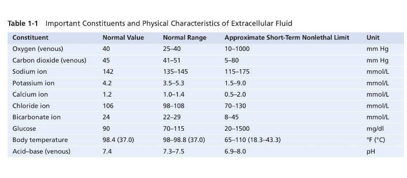

* Sinh lý YDS 2024
** 
* Guyton 15e
** Chap 1 - Functional Organization of the Human Body and Control of the “Internal Environment”
  - TB Hồng cầu: # 25 ngìn tỷ  (trillion). Là tế bào nhiều nhất trong cơ thể
  - Toàn bộ cơ thể: 35-40 ngìn tỷ TB. 
  - Vi sinh vật trong cơ thể (microbiota) nhiều hơn toàn bộ TB trong cơ thể
  - 50-70% cơ thể là nước. 2/3 nội bào, 1/3 ngoại bào
  - Ngoại bào: Na, HCO3-, Nutrients (oxy, glucose, fatty acíd, amino acids), CO2, waste products
  - Nội bào: K, Mg, Phosphate
  - Khi nghỉ: máu di chuyển toàn bộ hệ tuần hoàn khoảng 1 phút. Khi hoạt động rất mạnh: máu di chuyển 6 lần hệ tuần hoàn trong 1 phút. 
  - Ít tế bào nào nằm cách mao mạch quá 50 micromet, đảm bảo sự khuếch tán của hầu hết mọi chất từ mao mạch đến tế bào trong vòng vài giây.
  - Màng phế nang: 0.4 - 20 micromet
  - Điều hòa huyết áp: HA cao -> baroreceptors ở chỗ chia ĐMC và cung động mạch chủ -> hành não -> trung khu vận mạch (vasomotor center) -> giảm xung truyền từ trung khu vận mạch đến hệ giao cảm -> giãn mạch, giảm bơm -> hạ huyết áp
  - Ngưỡng bình thường và ngưỡng chết (Approximate Short- Term Nonlethal Limit) dịch ngoại bào 
  - Kali hạ -> giảm dãn truyền thần kinh -> liệt
  - Calci hạ 1/2 bình thường (1.0 -> 0.5) -> tetanic contraction do xung thần kinh tự phát từ dây thần kinh ngoại vi.
  - PH giảm hoặc tăng 0.5 có thể gây tử vong (6.9-7.4-8.0)
  - Negative feedback
    1. Gain = correction/error. 
  - Possitive feedback: còn gọi là "vicious cycle", càng làm nặng hơn tình trạng ban đầu. Một số có lợi như:
    1.  đông máu: hoạt hóa yếu tố đông máu -> tiếp tục hoạt hóa yếu tố đông máu bên cạnh cho đến khi cục máu đông bít chỗ chảy máu. 
    2. Phản ứng co thắt tử cung khi sanh: đầu em bé nong cổ tử cung -> co thắt càng mạnh hơn -> sanh. 
    3. Phản ứng dẫn truyền thần kinh: kích thích màng tế bào -> rò Na vào bên trong tế bào sợi tk -> thay đổi điện thết màng -> mở thêm kênh -> dẫn truyền điện là thay đổi điện thế màng bên cạnh -> cho đến đầu tận
    4. Possitive feedback là một phần trong vòng negative feedback lớn hơn: ví dụ đông máu -> negative feedback của ổn định huyết áp. 
  - Feed-forward and adaptive control (xem thêm hệ thần kinh)
** Chap 2 - The Cell and Its Functions
  1. *TỔ CHỨC TẾ BÀO*
      - Tế bào gồm: nhân và bào tương (cytoplasm)
      - Nguyên sinh chất (protoplasm) là các chất cấu tạo nên tế bào gồm 5 chất: (nước, điện giải), (protein, lipid, carbohydrate)
      - *Nước*: Nhiều nhất 70-85%, ngoại trừ tế bào mỡ
      - *Điện giải*: Nhiều: Kali, phosphate, sulfate, bicarbonate | ít: natri, clo, canxi
      - *Protein*: Nhiều thứ nhì 10-20% khối lượng TB. 2 loại: cấu trúc và chức năng
        + /Cấu trúc/: nhiều phân tử -> sợi dài polymer. Tạo vi ống (microtubules) -> khung xương tế bào cho các bào quan (lông mao, sợi trục tk, thoi phân bào), cố định các thành phần trong nguyên sinh chất. protein sợi (fibrillar proteins) bên ngoài tế bào (collagen và elastin)
        + /Chức năng/: Vài phân tử -> ống cầu (tubular-globular). Enzym, di động trong dịch nội bào (khác protein sợi)
      - *Lipid*: 2% khối lượng TB. Quan trọng nhất là phospholipid và cholesterol, tạo màng tb và màng nội bào. Triglycerid còn gọi là mỡ trung tính (neutral fats) trong tb chiếm 95% khối lượng TB, là kho năng lượng chính của cơ thể. 
      - *Carbohydrate*: dinh dưỡng tế bào và cấu trúc (tp của phân tử glycoprotein). hầu hết TB người không dự trữ nhiều carbohdrate (thườg khoảng 1% tổng khối lượng, vs 3% ở tb cơ, 6% ở tb gan). Glucose hòa toan ở dịch ngoại bào; glycogen là một polymer không tan của glucose dự trữ trong tb. 
  2. *CẤU TRÚC TẾ BÀO*
     - Nếu thiếu ty thể (mitochondria) 95% năng lượng tb sẽ ngừng ngay lập tức
     1. *CÁC CẤU TRÚC MÀNG:* màng tb, nhân, lưới nội sinh chất, ty thể, lysosome, peroxisome, bộ Golgi. /Màng tế bào/: lớp kép lipid (mỗi lớp dày 1 phân tử) + protein. 7,5-10 nanomet. TP chủ yếu protein và lipid: 55% protein, 25% phospholipid, 13% cholesterol, 4% lipid khác, 3% carbohydrate.
       - *Lớp kép lipid:* 3 loại chính - phospholipid, sphingolipid, cholesterol. Nhiều nhất là /phospholipid:/ đầu phosphate ưa nước (hướng ra ngoài), đầu acid béo kỵ nước (hút lẫn nhau, hướng vào trong).Đầu kỵ nước không thấm với chất tan trong nước (ion, glucose, ure), thấm chất tan trong mỡ (oxy, CO2, alcohol). /Sphingolipid/ chiếm lượng nhỏ, đặc biệt trong tb thần kinh; chức năng bảo vệ yếu tố độc hại, truyền tín hiệu, vị trí bám của protein ngoại bào. /Cholesterol/ kiểm soát độ lỏng của màng, giúp xác định độ thấm hoặc không thấm của màng với các chát tan trong nước. 
       - *Protein nội tại và ngoại vi* của màng tb: chủ yếu là glycoprotein. Có 2 lại protein màng: nội tại (integral) xuyên qua toàn bộ màng và ngoai vi (peripheral) gắn với protein nội tại hoặc không xuyên màng. 
         + Protein nội tại tạo kênh (hay lỗ - pores) cho các chất tan trong nước, đặc biệt là ion, khuếch tán, cũng có đặc tính chọn lọc. Một số hoạt động như protein mang (carrier) để vận chuyển chủ động. Một số hoạt động như enzyme. Một số hoạt động như receptor: tương tác với phối tử (ligands) -> hoạt hóa enzym hoặc tương tác với protein trong bào tương (chất truyền tín hiệu thứ 2). _Như vậy có 4 chức năng: kênh (lỗ), protein mang vận chuyển chủ động, enzym, receptor._ 
         + Protein ngoại vi: thường gắn với protein nội tại. 2 chức năng: enzym hoặc bộ điều khiển (controller) quá trình vận chuyển qua lỗ màng (pores)
       - *Carbohydrate màng* - "Glycocalyx" của tb: hầu như luôn gắn với protein (glycoprotein) hoặc lipid (glycolipid). Hầu hết các protein nội tại là gycoprotein, 1/10 lipid là glycolipd. Hướng ra ngoài tb.  Proteoglycan - carbohydrate gắn với lõi protein nhỏ. Như vậy toàn bộ mặt ngoài phủ 1 lớp carbohydrate lỏng lẻo gọi là /glycocalyx/, 4 chức năng:
         + Tạo điện tích âm
         + Liên kết tb: một số tb gắn với glycocalyx của nhau.
         + Thụ thể gắn kết hormon, như insulin. 
         + Tham gia vào phản ứng miễn dịch
         + __Tóm lại: Điện âm màng, liên kết tb, thụ thể, miễn dịch.__
     2. *TB CHẤT VÀ BÀO QUAN:*
        - TB chất chứa hạt mỡ trung tính (neutral fat - triglycerid), hạt glycogen (ploymer của glucose), ribosome, túi tiết (serectory vesicles), và 5 bào quan đặc biệt quan trọng: Lưới nội sinh chất, bộ Golgi, Ty thể, Lysosome, Peroxisome. 
        - *Lưới nội sinh chất:* mạng lưới cấu trúc hình túi và ống thông với nhau. Chức năng: xử lý các phân tử do tb tổng hợp và vận chuyển chúng đến vị trí sử dung bên trong hoặc ngoài tb. Thành cấu tạo bới màng kép lipid - tổng diện tích có thể 30 - 40 lần diện tích màng tb (như ở tb gan). Không gan bên trong ống và túi (khoang cisternal), chứa chất nền (matrix) khác với dịch cytosol (dịch bào) bên ngoài. Không gian bên trong ER thông với không gian giữa 2 màng nhân. Các chất được tổng hợp trong tb đi vào khoang ER và vân chuyển đến các phần khác của tb. Cung cấp cơ chế cho phần lớn chức năng chuyển hóa tb. 
        - *Ribosome và lưới nội sinh chất hạt/thô (rough ER):* Bám bên ngoài rough ER là nhiều hạt nhỏ ribosome. Ribosome cấu tạo từ hỗn hợp RNA và protein, /chức năng tổng hợp protein mới/. ER hạt liên tục trực tiếp với màng nhân cho phép liên lạc hiệu quả
        - *Lưới nội sinh chất trơn (smooth ER):* không có ribosome, ít hơn ER hạt. Chức năng: /tổng hợp lipid/, khử độc, và các chức năng khác nhờ enzym nội lưới. 
        - *Bộ Golgi:* Có màng tương tựu ER trơn. Cấu tạo từ 4 hoặc nhiều hơn lớp túi phẳng mỏng chồng lên nhau, ở một phía của nhân, đặc biệt ở tb tiết - nó nằm phía các chất được tiết ra. Bộ Golgi hoạt động kết hợp với ER. Các túi vận chuyển nhỏ (túi ER) -> hợp nhất với golgi -> xuất ra ngoài hoặc chuyển đến vị trí khác trong tb. Một số chất dùng tạo lysosome, túi tiết và các thành phần tb khác. 
        - *Lysosome:* _Tóm tắt: tạo từ golgi. 250-750nm. 40 enzym thủy phân 5-8nm.  PH 4.8. Tay-Sachs, hexosaminidase A, lipdi ganlioside, tb thần kinh._ 
          + Tạo từ golgi, phân tán khắp tb chất. Chức năng tiêu hóa nội bào: cấu trúc tb hư hỏng, hạt thức ăn được tb thu nhận, virus/vi khuẩn. Có trong all tb, nhiều trong bạch cầu. Đường kính 250-750 nanomet. Chứa tập hợp 40 enzym thủy phân (hydrolase) đường kính 5-8 nanomet. Thủy phân bằng cách gắn Hydro (H) vào 1 phần hợp chất, phần còn lại gắn Hydroxyl (OH). Protein -> Amino acid, glycogen-> glucose, lipid-> acid béo và glycerol. Môi trường trong lysosome là môi trường acid # 4.8 cho enzym hoạt động, PH trung tính của Cytosol khiến enzym tiêu hóa bất hoạt. Bệnh Tay-Sachs rối loạn di truyền do độ biến gen mã hóa enzym lysosome (hexosaminidase A) phân hủy các lipid phức tạp ganglioside trong não và tb thần kinh -> tích tụ -> tổn thương hệ thần kinh, suy giảm nhận thức, suy giảm vận động, tử vong sớm. 
        - *Peroxisome:* /Tóm tắt: tương tự lysosome. 2 khác: tự nhân đôi hoặc từ ER trơn vs golgi - và oxidase vs hydrolase. Oxy hóa độc chất và dị hóa acid béo chuỗi dài. Hội chứng Zellweger./
          + Hình thái tương tự Lysosome. Khác: thứ 1 - chủ yếu hình thành bằng tự nhân đôi hoặc tử ER trơn thay vì Golgi (không có DNA, nhận protein từ cytosol để nhân đôi); thứ 2 - Chứa Oxidase thay vì Hydrolase. Chức năng: Oxy hóa chất gây độc cho tb (1/2 cồn bị khử thành acetaldehyde bởi peroxisome gan), dị hóa hóa acid béo chuỗi dài. Hội chứng Zellweger - giảm perixosome tế bào -> rối loạn hệ thần kinh và chuyển hóa, xuất hiện ngay sau sanh, tử vong sớm trong những năm đầu đời. 
        - *Túi tiết:* tạo thành từ hệ thống ER-Golgi -> bào tương.
        - *Ty thể:* /Tóm tắt: tạo năng lượng (ATP). Kích thước và hình dạng nay đổi vài trăm nm -> 10mcm. 2 lớp màng kép. Tự nhân đôi (mtDNA có 37 gen từ mẹ). Bệnh do đột biến mtDNA hoặc 1300 gen từ DNA nhân. /
          + Là nguồn năng lượng của tb. Số lượng 100 - vài nghìn tùy nhu cầu năng lượng của tb. Thay đổi kích thước và hình dạng: hình cầu vài trăm nanomet - thuôn dài 1x10 micromet. 
          + Cấu trúc: 2 lớp mang kép lipid-protein. Màng ngoài: protein kênh (porin). Màng trong: nhiều nếp gấp (cristae), enzyme oxy hóa. Khoang bên trong chứa chất nền chứa enzym, kết hợp enzym oxy hóa trên màng trong để oxy hóa dinh dưỡng -> Co2, H2O, năng lượng -> ATP -> vận chuyển khỏi ty thể và khuếch tán. 
          + Tự nhân đôi: tùy nhu cầu tăng thêm ATP của tb. Ty thể chứa DNA (mtDNA) trong chất nền, chứa enzym và ribosome để tạo protein. mtDNA có 37 gen chủ yếu di truyền từ mẹ, hiếm gặp di truyền từ cha (ty thể tinh trùng ở đuôi -rụng khi thụ tinh). 
          + Bệnh ty thể có thể do đột biến mtDNA hoặc đột biến của khoảng 1300 gen nhân mã hóa các protein điều tiết chức năng ty thể. 
        - *Khung tb - sợi và ống:* /Tóm tắt: Sợi nhỏ 7nm actin đàn hồi. Sợi trung gian 8-12nm cứng, nhỏ hơn myosin, lớn hơn actin. Vi ống 25nm từ tubulin, khung xương, đường ray./
          + Mạng lưới protein sợi: sợi (filaments) hoặc ống (tubules). 
          + Tổng hợp: ribosome trong tb chất -> protein -> trùng hợp thành sợi. 
          + Microfilament (7nm): actin, giá đỡ đàn hồi cho màng tb. 
          + Intermediate filament (8-12 nm): cứng, lớn hơn actin, nhỏ hơn myosin. chức năng cơ học (desmin ở cơ, neruofilaments ở thần kinh, keratin ở tb biểu mô. 
          + Microtubule (25 nm): tạo từ các phân tử tubulin (alpha và beta) trùng hợp. Hoạt động như khung xương cứng, tham gia quá trình phân chia tb, di chuyển tb, đường ray di chuyển cho các bào quan trong tb. 
        - *Nhân tế bào:* /Tóm tắt: Kiểm soát các đặc điểm tế bào thông qua DNA./
          + Trung tâm điều khiển: phát triển, trưởng thành, nhân đôi, hoặc chết. 
          + Chứa DNA -> Gen -> đặc điểm protein của tb; Kiểm soát và thúc đẩy nhân đôi của tb. 
        - *Màng nhân:* /Tóm tắt: 2 màng kép, vài nghìn lỗi nhân 9nm, phân tử <44000 đi qua dễ, >44000 chọn lọc qua thụ thể./
          + 2 màng lớp kép lipid, màng ngoài liên tục với ER. 
          + Vài nghìn lỗ nhân (nulear pores), dk 9nm, cho phép phân tử 44.000 đi qua dễ dàng, phân tử lớn hơn vận chuyển chọn lọc qua thụ thể. 
        - *Hạch nhân và sự hình thành Ribosome:* /Tóm tắt: 1 hoặc nhiều hạch/nhân. RNA + protein ribosome. to ra khi tổng hợp protein. phần lớn RNA ra tb chất + protein ->ribosome./
          + Một nhân có một hoặc nhiều hạch nhân, bắt màu đậm, không có màng. 
          + Tích lũy lượng lớn RNA và các loại protein tìm thấy trong ribosome. 
          + To ra đáng kể khi tế bào tích cực tổng hợp protein. 
          + Gen DNA đặc hiệu trên nhiễm sát thể trong nhân -> tổng hợp RNA -> phần nhỏ lưu trong hạch nhân, phần lớn qua lỗ nhân -> tế bào chất, kết hợp protein đặc hiệu -> ribosome "trưởng thành", đóng vai trò thiết yếu tạo thành các protein tế bào chất. 
  3. *CHỨC NĂNG TẾ BÀO*
     1. *NỘI THỰC BÀO*
        - Hầu hết các chất đi qua màng bằng khuếch tán và vận chuyển chủ động.
        - Các hạt lớn -> nội thực bào (ẩm bào - pinocytosis, thực bào - phagocytosis)
        1. *Ẩm bào:* /Tóm tắt: 100 - 200nm. Bên trong clathrin, các protein sợi co rút, ATP. Bên ngoài Ca+./
           - Túi ẩm bào rất nhỏ 100 - 200nm
           - Quá trình: mặt trong (protein sợi clathrin, actin, myosin, ATP), bên ngoài (Ca2+ trong dịch ngoại bào)
        2. *Thực bào:* /Tóm tắt: Chỉ một số tb có (đại thực bào mô, bạch cầu). Thụ thể gắn vào kiểu khóa kéo -> thắt cuống./
           - Tương tự ẩm bào nhưng các hạt lớn hơn
           - Chỉ một số tế bào có khả năng thực bào: đặc biệt là đại thực bào mô, bạch cầu. 
           - Quá trình: gắn thụ thể -> rìa quanh điểm gắn phồng ra bao quanh, thêm nhiều thụ thể gắn vào kiểu khóa kéo -> actin và các sợi co rút -> thắt cuống. 
     2. *LYSOSOME TIÊU HÓA:* /Tóm tắt: ngay sau khi ẩm thực bào. sản phẩm amino acid, glucose, phosphate, thể cặn. Tác nhân diệt khuẩn: lysozyme hủy thành, lysoferrin gắn sắt, PH 4.8 hoạt hóa thủy phân và bất hoạt./
        - Gần như ngay sau khi ẩm/ thực bào
        - Thủy phân -> amino acid, glucose, phosphate khuếch tán qua màng túi; phần còn lại không tiêu hóa được (thể cặn - residual body) -> xuất bào. 
        - Chứa tác nhân diệt khuẩn gồm: (1) lysozyme phân hủy thành tb vk, (2) lysoferrin gắn kết sắt và các chất khác trước khi chúng có thể thúc đẩy sự phát triển của vk, (3) PH 4.8 hoạt hóa các hydrolase và bất hoạt hệ chuyển hóa của vk. 
        - Tự thực bào: dọn dẹp bào quan lỗi thời, tái chế protein lớn. Cung cấp cơ chế cho /sự phát triển mô, thiếu chất dinh dưỡng, cân bằng nội mô./
        - Ty thể ở tb gan chỉ sống khoảng 10 ngày -> lysosome phá hủy. 
     3. *TỔNG HỢP CÁC CẤU TRÚC TB - ER VÀ GOLGI*
        - *Chức năng của ER:* /Tóm tắt: ER hạt -> protein, ER trơn -> mỡ. Còn cung cấp ezym kiểm soát phân hủy glycogen, khử độc./
          + Hầu hết quá trình tổng hợp bắt đầu từ ER -> Golgi xử lý thêm -> tb chất
          + ER hạt tổng hợp protein. Ribosome đùn một ít trực tiếp vào tb chất, phần lớn vào chất nền ER.
          + ER trơn tổng hợp lipid (đặc biệt phospholipd và chol). 
          + Chức năng khác, đặc biệt ER trơn: (1) cung cấp enzym kiểm soát phân hủy glycogen, (2) cung cấp enzyme khử độc (đông tụ, oxy hóa, thủy phân, liên hợp với acid glucoronic)
        - *Chức năng của Golgi:* /Tóm tắt: thêm carbohydrate, cô đặc từ ER. 2 vd quan trọng là acid hyaluronic và chondroitin sulfate. Ca2+ xâm nhập tb kích thích xuất bào./
          + Chức năng chính là xử lý thêm các chất tạo thành từ ER. 
          + Tổng hợp một số carbohydrate không thể tạo từ ER. Vd: Acid hyaluronic và chondroitin sulfate (1) thành phần chính của proteoglycan trong chất nhầy, chất tiết, (2) thành phần chính của các khoảng gian bào, (3) thành phần chính của chất nền hữu cơ trong sụn và xương, (4) quan trọng trong hoạt động di cư và tăng sinh của tế bào. 
          + Chất tạo thành từ ER -> ER trơn -> Golgi, thêm vào các nhóm Carbohydrate, cô đặc -> tách ra và phát tán. 
          + Thời gian: tế bào tuyến tắm trong amino acid -> protein trong ER 3-5 phút -> 20 phút có trong Golgi -> 1-2 giờ tiết ra từ tb. 
          + Quá trình xuất bào được kích thích bởi sự xâm nhập của Ca2+ vào tb. 
     4. *TY THỂ TRÍCH XUẤT NĂNG LƯỢNG*
        - Thức ăn -> (glucose), (amino acid, acid béo) -> ty thể (pyruvic acid), (acetoacetic acid) -> ATP
        - *Chức năng của APT:* /Tóm tắt: ./
          + Là một nucleotide cấu tạo từ: (1) base nitơ adenine, (2) đường pentose ribose, (3) ba gốc phosphate - 2 gốc cuối kết nối bằng liên kết phosphate năng lượng cao (ký hiệu ~). Mỗi liên kết năng lượng cao chứa 12.000 calo/1mol ATP. 
          + Khi ATP giải phóng năng lượng: 1 gốc acid phosphoric bị tách tạo ra ADP. 
        - *Ty thể tạo ATP:* /Tóm tắt: Glucose -> acid pyruvic + 2ATP trong tb chất (glycosis) 5%. Ty thể 95% (pyruvic acid), (acetoacetic acid) -> Acetyl-coenzyme A (CoA), qua chu kình acid citric (Krebs) 36ATP./
          + Glucose vào tb -> acid pyruvic (quá trình glycolysis giải phóng 2 ATP) chiếm 5% tổng chuyển hóa năng lượng của tb. 
          + 95% sự hình thành ATP trong ty thể. (pyruvic acid), (acetoacetic acid) -> Acetyl-coenzyme A (CoA), qua chu kình acid citric (Krebs) phân hủy CO2 và H -> H kết hợp Oxy tạo năng lượng cho enzyme ATP synthetase tạo 36 ATP -> vận chuyển vào tb chất và dịch nhân. 
          + Toàn bộ quá trình tạo ATP gọi là cơ thế hóa thẩm thấu - chemiosmotic mechanism. 
        - *Ứng dụng của ATP:* /Tóm tắt: năng lượng cho (1) vận chuyển qua màng (tb ống thận dùng 80% ATP cho vận chuyển qua màng. (2) tổng hợp chất. (3) công cơ học./
  4. *SỰ DI CHUYỂN TẾ BÀO:*
     - Chuyển động của cơ vân, cơ trơn, cơ tim, chuyển động amip và chuyển động lông mao. 
     1. *Chuyển động amip:* 
        - Chân giả: tạo thành liên tục màng tb mới ở rìa trước chân giả, hấp thu liên tục màng ở phần giữa và sau. 
        - 2 điều kiện khác: (1) Chân giả gắn kết mô chung quanh bằng thụ thể. (2) sợi actin co
        - Kiểm soát chuyển động amip bắng hóa hướng động: hóa hướng động dương đi đến nơi có nồng độ cao và ngược lại
     2. *Lông mao và chuyển động lông mao:*
        - Có 2 loại: lông mao vận động (motile) và lông mao không vận động (nonmotile) hay lông mao nguyên phát. 
        - Lông mao vận động chuyển động roi gặp chủ yếu 2 nơi đường dẫn khí (di chuyển dịch nhầy 1cm/phút) và vòi tử cung. 
        - Cấu tạo: dài 2-4 micromet. 11 vi ống (9 ống đôi + 2 ống đơn trung tâm) nhô ra từ thể nền (basal body) ngay bên dưới màng tb. 
        - Roi của tinh trùng tương tự nhưng dài hơn nhiều và di chuỷen theo dạng sóng hình sin gần đúng thay vì chuyển động roi. 
        - Di chuyển bằng đánh nhanh (10-20 lần/s). sau đó di chuyển chậm ngược lại. 
        - Cơ chế: phức hợp ống và liên kết chéo gọi là axoneme. cần 2 điều kiện: (1) ATP, (2) ion thích hợp đặc biêt là canxi và magie. 
        - Lông mao nguyên phát: không vận động và thường chỉ có một lông mao/tb. hoạt động như sensor. VD tb biểu mô ống thận hoạt động như cảm biến dòng chảy -> thay đổi tín hiệu canxi nội nào -> khởi phát tín hiệu. Bệnh thận đa nang do khiếm khuyết trong tín hiệu của lông mao. 
** Chap 3 - Kiểm soát di truyền đối với tổng hợp Protein, chức năng tế bào và tái bản tế bào
*** *GENERAL:* /Tóm tắt: người có 20.000-25.000 gen. >100.000 protein. Proteome là toàn bộ hệ thống protein của tb. 1 gen có thể có nhiều phiên bản protein./
    - Gen kiểm soát chức năng tb bằng: quyết định cấu trúc, enzyme, các chất hóa học nào được tổng hợp. 
    - DNA -> RNA -> khuếch tán khắp tb -> protein.
    - Người có 20.000 - 25.000 gen. 
    - RNA được phiên mã từ cùng 1 gen có thể dược tb xử lý theo nhiều cách, tạo ra các phiên bản protein thay thế. 
    - Ước tính có khảng > 100.000 protein ở người.
    - Các loại tb khác nhau có *proteome* khác nhau (toàn bộ hệ thống protein được tạo ra bởi 1 tb). 
    - Hầu hết protein tế bào là enzyme, một số là cấu trúc. 
*** *NHÂN TẾ BÀO: GEN KIỂM SOÁT TỔNG HỢP PROTEIN*
    1. *Các đơn vị cấu tạo của DNA:* /Tóm tắt: 4 nucleotide có tính acid P-D-(purine A/G, pyrimidine T/C)./
       - (1) Acid phosphoric (P)
       - (2) Đường Deoxyribose (D)
       - (3) 4 base nitơ: 2 Purine - Adenine (A) và Guanine (G); 2 Pyrimidine - Thymine (T) và Cytosine (C). 
       - P-D tạo 2 khung xoắn, AGTC kết nối 2 chuỗi xoắn. 
    2. *Nucleotide:* /Tóm tắt: ./
       - P-D-A: acid deoxyandenylic
       - P-D-T: acid deoxythymidylic
       - P-D-G: acid deoxyguanylic
       - P-D-C: acid deoxycytidylic
       - 4 nucleotide này có tính acid
