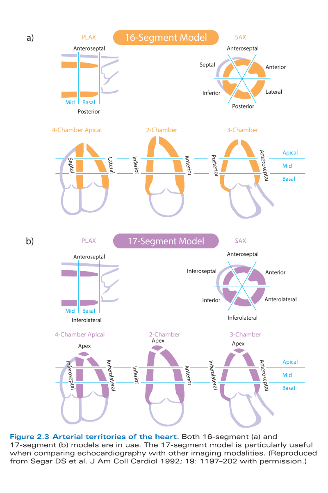

* Ôn tập siêu âm tim
** Nguyên lý siêu âm tim
    - Tần số dùng trong siêu âm 2.5 - 10MHz
    - Tần số cao -> Độ phân giải dọc cao
    - Beam width nhỏ -> độ phân giải ngang cao
** Đánh giá chức năng tâm thu thất trái
    - cơ thất T 3 lớp: xoắn trái, vòng, xoắn phải
    - Tiêu chuẩn vàng đánh giá EF CMR
    - Simpson hạn chế: rút ngắn đỉnh thất T làm tăng EF, cắt theo hướng tiếp tuyến làm giảm EF
    - Giá trị bình thường
      + EF: |BT >55% |Giảm nhẹ 45-54% |TB 30-44 |nặng <30
      + Hiện tại: |BT >=50% |borderline 50-55% |nhẹ 41 - 49 |giảm <=40%
      + fac > 45%
      + 
    - GLS 19% +/- 5%
    - s' 2 lá >= 6cm/s
    - Vận động vùng BT > 30%, 10-30 giảm đông, < 10% vô động, loạn động mỏng và ra ngoài thì *tâm thu*, phình biến dạng thì *tâm trương*
    - Giảm động không do thiếu máu: RL dẫn truyền, quá tải thất P, co thắt màng ngoài tim, sau phẫu thuật tim, không có màng ngoài tim, chèn ép (thai cổ trướng, thoát vị hoành)
    - Phân vùng tưới máu: [[./img/onTapSieuamtim_vanDongVung.jpg]]
    - Kích thước
      + IVSD 11 13 15 -1 nữ
      + LVDD nam 60 70 -10 nữ
      + LVDD/bsa 32 34 37
      + LV vol nam 155 - 50 | 180 - 60 | 200 - 70
      + lv VOL/BSA 3575 85 95
      + lv MASS/BSA 115 - 20 130 - 20 150 - 30 (NỮ NAM 95 115)
**** LV
    1. Diastolic diameter
       - LVDd (nữ):  |BT 39-53 |Nhẹ >53 |TB >58 |Nặng >61
       - LVDd (nam): |BT 42-59 |Nhẹ >59 |TB >63 |Nặng >69
       - LVDd/BSA (nữ):  |BT 24-32 |Nhẹ >32 |TB >34 |Nặng >37
       - LVDd/BSA (nam): |BT 22-31 |Nhẹ >31 |TB >34 |Nặng >36
    2. Diastolic volume
       - Nữ:  |BT 56-104 |Nhẹ >104 |TB >117 |Nặng >130
       - Nam: |BT 67-155 |Nhẹ >155 |TB >178 |Nặng >200
       - Nữ/BSA:  |BT 35-75 |Nhẹ >75 |TB >86| Nặng >96
       - Nam/BSA: |BT 35-75 |Nhẹ >75 |TB >86| Nặng >96
    3. Wall thickness (IVSd và PWd)
       - Nữ:  |BT 6-9  |Borderline 10 |Nhẹ >10 |TB >12 |Nặng >15
       - Nam: |BT 6-10 |Borderline 11 |Nhẹ >11 |TB >13 |Nặng >16
       - A thickness of 10 mm in a woman or 11 mm in a man is graded as mildly thickened in guidelines but may be normal, especially in the absence of other clinical or echocardiographic abnormalities
       - ACC/AHA 2024: HOCM >=15mm ở bất cứ thành thất T nào, (>13-14mm nếu có tiền căn gia đình hoặc bất thường gen)
       - RWT = 2PWd/LVDd
       - RWT >0.42 : Concentric. THA, hẹp ĐMC
       - RWT <=0.42: Eccentric. Hở chủ, hở 2 lá
    4. LV systolic function
       - Regional wall motion
         + 16 and 17-segment model 
    5. Global function
       - EF: |BT >50% |Borderline 50-54% |Giảm nhẹ 41-49% |Giảm <=40%
       - Systolic volume
         + Nữ:  |BT 19-49 |Nhẹ >50 |TB >59 |Nặng >69
         + Nam: |BT 22-58 |Nhẹ >59 |TB >70 |Nặng >82
         + Nữ/BSA:  |BT 12-30 |Nhẹ >30 |TB >36| Nặng >42
         + Nam/BSA: |BT 12-30 |Nhẹ >30 |TB >36| Nặng >42
       - dP/dT (nếu có hở 2 lá)
         + dP/dt(mmHg/s): |BT >1200 |Giảm <1200 |Giảm nặng <800
         + dt (ms):       |BT <25   |Giảm >25   |Giảm nặng >40
       - Doppler mô
** SA qua thực quản
*** Mặt cắt cơ bản
    - 4 buồng thực quản giữa 0 -10 độ. vị trí ME giữa thực quản
    - 5 buồng thực quản giữa 0 -10 độ. vị trí thực quản giữa
    - Mặt cắt qua mép van. góc 50-70 độ. Vị trí thưc quản giữa
    - Mặt cắt đường vào - ra thất P. góc 50-70 độ. vị trí thực quản giữa
    - Mặt cắt trục dọc thực quản giữa 120-140 độ, vị trí giữa thực quản
    - Mặt căt trục dọc ĐM chủ 120- 140 độ
    - Mặt cắt trục dọc hai tĩnh mạch chủ 90-120 độ
    - Mặt cắt xuyên dạ dày qua van 2 lá 0 - 20 độ. vị trí xuyên da dày
    - Mặt 2 buồng xuyên dạ dày
    - 
** Van tim
*** Hẹp van 2 lá
    1. Đánh giá
       - EOA: 1.5 1.0. Planimetri or PHT, có thể dùng PISA
       - PHT 150 220
       - PG mean 5 10
       - PAPs 30 50
*** Hở van 2 lá
    1. Đánh giá
       - Độ dài dòng hở 1/4 - 4/4
       - PISA (đo r, scale, Vmax hở)
         + Rvol 30 45 60
         + EROA 2 3 4
       - VC 3 6
       - Vòng van dãn >40 nam, 35 nữ
       - Hướng dòng hở
       - Phân loại carpentier
         + I vận động bình thường
         + II sa van
         + IIIa hạn chế mở
         + IIIb hạn chế đóng
       - Phân loại sa van. >2mm PLAX, >0 A4C
         + A123P123
*** Hở van ĐMC
    1. Đánh giá
       - Độ rộng dòng hở/ LVOT 25 65
       - Độ dài dòng hở
       - VC 3 6
       - PISA 
         + EROA 1 2 3
         + Rvol 30 45 60
       - PHT 500 200
       - Phân loại theo mỹ Iabcd, II, III
       - Phân loại carpentier
         + I  dãn gốc ĐMC
         + IIa sa van
         + IIb thủng van (dòng hở lệch tâm mà không có dấu hiệu sa van)
         + III số lượng, chất lượng lá van kém
*** Hẹp van DMC
    1. Đánh giá (3 thông số Vmãx, PG mean, AVA)
       - Vmax 3.0 4.0 (<2.5 không hẹp)
       - Mean PG 25 50 (Châu âu) 40 mỹ
       - Max PG 40 65
       - Phương trình liên tục
         + AVA 1.5 1.0
         + AVA/bsA 0.8 0.6