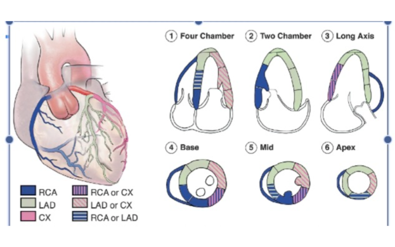
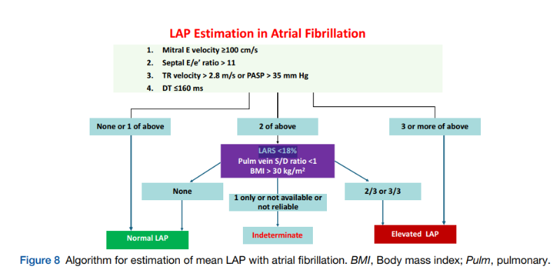

* Ôn tập siêu âm tim
** Nguyên lý siêu âm tim
    - Tần số dùng trong siêu âm 2.5 - 10MHz
    - Tần số đầu dò SAT và convex gần bằng nhau # 2.5-7MHZ, tần số đầu dò linear cao hơn
    - Tần số cao -> Độ phân giải dọc cao
    - Beam width nhỏ -> độ phân giải ngang cao
    - Độ phân giải siêu âm tim # 2mm
** Đánh giá chức năng tâm thu thất trái
    - cơ thất T 3 lớp: xoắn trái, vòng, xoắn phải
    - Tiêu chuẩn vàng đánh giá EF CMR
    - Simpson hạn chế: rút ngắn đỉnh thất T làm tăng EF, cắt theo hướng tiếp tuyến làm giảm EF
    - Giá trị bình thường
      + EF: |BT >55% |Giảm nhẹ 45-54% |TB 30-44 |nặng <30
      + Hiện tại: |BT >=50% |borderline 50-55% |nhẹ 41 - 49 |giảm <=40%
      + fac > 45%
      + dP/dT (nếu có hở 2 lá): |BT >1200 |Giảm <1200 |Giảm nặng <800
    - GLS 19% +/- 5%
    - s' 2 lá >= 6cm/s
    - Vận động vùng BT > 30%, 10-30 giảm đông, < 10% vô động, loạn động mỏng và ra ngoài thì *tâm thu*, phình biến dạng thì *tâm trương*
    - Giảm động không do thiếu máu: RL dẫn truyền, quá tải thất P, co thắt màng ngoài tim, sau phẫu thuật tim, không có màng ngoài tim, chèn ép (thai cổ trướng, thoát vị hoành)
    - Phân vùng tưới máu: 
    - Kích thước
      + IVSD 11 13 15 -1 nữ
      + LVDD nam 60 70 -10 nữ
      + LVDD/bsa 32 34 37
      + LV vol nam 155 - 50 | 180 - 60 | 200 - 70
      + lv VOL/BSA 3575 85 95
      + lv MASS/BSA 115 - 20 130 - 20 150 - 30 (NỮ NAM 95 115)
      + LAVi 34 42 48
      + LAd <40
      + Ao annulus <30
      + Asc Ao <35
      + RA < 18cm2
** Đánh giá chức năng tâm trương
   - Khi có rối loạn vận động vùng, nên dùng Avg e`
   - E/sep e' <8 áp lực đổ đầy thất T bình thường
   - E/sep e' >15 áp lực đổ đầy thất T tăng 
   - Đánh giá thư giãn: e', E/A, EDT (thời gian giảm tốc sóng E)
   - Đánh giá đàn hồi: LAVi, E/e'
   - Các bước đánh giá
     + Bước 1: Có rối loạn chức năng tâm trương? bất thường 2 trong số các chỉ số sau
       - e': 6 (6.5) 7
       - E/A: <0.8 hoặc >2
       - LAVi > 34
       - LARS (strain của nhĩ trái) < 18%
     + Bước 2: có tăng áp lực cuối tâm thu thất trái không? 
       - Lấy 3 thông số: e' < 6 (6.5) 7; E/e' > 15 (14) 13; TRVmax >2.8m/s
       - Có tất cả: E/A > 2 độ 3, E/A<2 độ 2
       - Có 2 trong các số đó xem LAVi > 34 -> E/A để phân độ
   - Lưu ý các bước trên không dùng trong trường hợp: Hở van 2 lá nguyên phát nặng, hẹp van 2 lá bất kể mức độ nào, vôi hóa vòng van (MAC) trung bình - nặng, rung nhĩ, ...
   - Trường hợp đặc biệt
     1. Rung nhĩ
        - DT < 160ms ở BN có EF giảm
        - Vận tốc đỉnh sóng E  >= 1.9m/s
        - IVRT <= 65ms
        - Sep E/e' >=11
        - TR Vmax >2.8 m/s
        - 
** Đánh giá chức năng thất P
   1. Các thông số
      - TAPSE > 17mm
      - s' > 9.5cm/s
      - RVFAC >35%
      - Quá tải thể tích: Thất P dãn. tăng độ dịch chuyển vách liên thất sang trái. chỉ số lêch tâm: dkAP/dkRL >1.1. Dấu hiệu thất P tăng động là dấu hiệu sớm, sau đó bình thường hóa và giảm
   2. Linh tinh
      - Diện tích bình thường nhĩ P < 18cm2 (ASE)
      - Dấu hiệu đặc hiệu cho thuyên tắc phổi cấp: 60/60 PAT <60ms, PAPs <60mmHg
      - Dấu hiệu mcconnell: vô động thành tự do vùng giữa thất P
      - Phân độ PAPs: 35 50 70. 
      - Tăng áp phổi: PAPm >25 khi nghỉ hoặc >30 khi gắng sức
** SA qua thực quản
*** Mặt cắt cơ bản
    - 4 buồng thực quản giữa 0 -10 độ. vị trí ME giữa thực quản
    - 5 buồng thực quản giữa 0 -10 độ. vị trí thực quản giữa
    - Mặt cắt qua mép van. góc 50-70 độ. Vị trí thưc quản giữa
    - Mặt cắt đường vào - ra thất P. góc 50-70 độ. vị trí thực quản giữa
    - Mặt cắt trục dọc thực quản giữa 120-140 độ, vị trí giữa thực quản
    - Mặt căt trục dọc ĐM chủ 120- 140 độ
    - Mặt cắt trục dọc hai tĩnh mạch chủ 90-120 độ
    - Mặt cắt xuyên dạ dày qua van 2 lá 0 - 20 độ. vị trí xuyên da dày
    - Mặt 2 buồng xuyên dạ dày
    - 
** Van tim
*** Đánh giá lá van
    - Van 2 lá dày >5mm
    - Van DMC dày > 2mm
    - Vôi hóa: sáng + bóng lưng
    - Sợi hóa: sáng hơn mô cơ tim
*** Hẹp van 2 lá
    1. Đánh giá
       - EOA: 1.5 1.0. Planimetri or PHT, có thể dùng PISA
       - PHT 150 220
       - PG mean 5 10
       - PAPs 30 50
       - Diện tích mở van bình thường 4-6cm2 (DMC 3-5cm2)
    2. Nguyên nhân
       - Nguyên nhân thường gặp nhất là hậu thấp: dính mép van, dày bìa van, vôi hóa, dày co rút thừng gân
*** Hở van 2 lá
    1. Đánh giá
       - Độ dài dòng hở 1/4 - 4/4
       - PISA (đo r, scale, Vmax hở)
         + Rvol 30 (45) 60
         + EROA 2 (3) 4
       - VC 3 6
       - Vòng van dãn >40 nam, 35 nữ
       - Hướng dòng hở
       - Phân loại carpentier
         + I vận động bình thường
         + II sa van
         + IIIa hạn chế mở (tâm trương)
         + IIIb hạn chế đóng (tâm thu)
       - Phân loại sa van. >2mm PLAX, >0 A4C
         + A123P123
    2. 5 bước đánh giá
       1. Thông tin lâm sáng
       2. Hình ảnh van
          - Cử động lá van: sa (điểm tiếp xúc sau mặt phẳng vòng van, có thành phần phồng > 2mm), billowing (balloning) điểm tiếp xúc còn nằm dưới vòng van,trôi có bờ tự do trôi vào nhĩ (có trôi van thì là hở nặng)
          - Cấu trúc: dày, sùi, vôi hóa
          - Đường kính vòng van
       3. Doppler
       4. Định lượng
          - PISA: EROA, R_vol
       5. Dấu hiệu khác
    3. Sa van 2 lá
       - Chỉ đánh giá cơ chế sa van trên PLAX, A3C, không dùng A4C
       - Hở van 2 lá do thoái hóa van
         + Barlow: sang thương lan rộng các thành phần lá van và dây chằng
         + Thiếu sợi đàn hồi: khu trú 1 thành phần của lá van
       - Định vị sa thành phần nào
         + A4C: nhĩ P (tiếp giáp A3, P3) A3A2 P2P1
         + PLAX: ĐMC (tiếp giáp A) A2 P2 (chuẩn), nếu chếch không thấy van 3 lá, thất P nhỏ lại, 1 van DMC rõ: A1, P1
         + A2C: P2A2P1
         + PSAX: từ phải sang trái 1 ->3
    4. Nguyên nhân
       - Thấp tim chiếm 1/3
       - Nhồi máu cơ tim cũ, thiếu máu cơ tim, bệnh cơ tim phì đại
       - Viêm nội tâm mạch nhiễm trùng
       - Sa van
       - Vôi hóa vòng van (thoái hóa)
       - Cấp: đứt thừng gân, cơ nhú, rối loạn hoạt động cơ nhú, thủng van (viêm nội tâm mạc)
*** Hở van ĐMC
    1. Đánh giá
       - Độ rộng dòng hở/ LVOT 25 65
       - Độ dài dòng hở
       - VC 3 6
       - PISA 
         + EROA 1 (2) 3
         + Rvol 30 (45) 60
       - PHT 500 200
       - Phân loại theo mỹ Iabcd, II, III
       - Phân loại carpentier
         + I  dãn gốc ĐMC
         + IIa sa van
         + IIb thủng van (dòng hở lệch tâm mà không có dấu hiệu sa van)
         + III số lượng, chất lượng lá van kém
    2. Nguyên nhân
       - nguyên nhân chính ở van (thấp tim - dày vôi dọc mép van - dính mép, vôi hóa thoái hóa, bẩm sinh, viêm nội tâm mạc nhiễm trùng- sùi)
       - Ở gốc ĐMC (dãn ĐMC lên): Hội chứng marfan, dãn vô căn, dãn người già - vôi vòng van chủ yếu, bóc tách ĐMC, giang mai, THA
*** Hẹp van DMC
    1. Đánh giá (3 thông số Vmãx, PG mean, AVA)
       - Vmax 3.0 4.0 (<2.5 không hẹp)
       - Mean PG 25 50 (Châu âu) 40 mỹ
       - Max PG 40 65
       - Phương trình liên tục
         + AVA 1.5 1.0
         + AVA/bsA 0.8 0.6 (chỉ người tổng trạng nhỏ, béo phì không hiệu chỉnh theo diện tích da do diện tích mở van không tăng khi béo phì)
    2. Nguyên nhân hẹp van DMC
       - 2 nguyên nhân thường gặp ở người lớn: thấp tim (dính mép van, dày vôi hóa dọc bờ lá van, thường kèm sang thương ở van 2 lá), thoái hóa van ở người già (không dính mép van, van dày, vôi hóa)
*** Hở van 3 lá
    1. Tổng quan
       - Dãn vòng van khi d>=40mm hoặc 21mm/m2
       - 3 lá: vách, trước và sau
    2. Phân loại hở van 3 lá
       - 90% hở thứ phát (dãn vòng van, dãn buồng tim , không sang thương hệ thống van
         + Vô căn: rung nhĩ, lớn tuổi (do nhĩ)
         + Tăng áp phổi (do thất)
       - 10% tiên phát: 
         + Lá van dày, +/- hẹp: hậu thấp (sang thương van + dưới van, dày van, vôi hóa, dính mép van 2 lá, đa van), carcinoid
         + Van 3 lá đóng thấp: Ebstein: di chuyển về phía mỏm > 0.8 cm/m2 (bình thường dưới <1cm, có tài liệu 1.5cm)
         + Sùi: osler (sùi có cuống), bệnh mô liên kế (lupus)
         + Sa/ trôi van: thoái hóa van, bệnh mô liên kết, osler, chấn thương ngực kín
         + thủng, rách van: Osler, PM/ICD
    3. Đánh giá mức độ nặng
       - Định tính: đậm độ dòng hở
       - Bán đính lượng: diện tích dòng hở (nyquist 50-70cm/s), VC (giảm dần scale để có hình ảnh tốt nhất 40 -70 cm/s, >=7 hở nặng), bán kính PISA (ngưỡng # 28 cm/s, >9mm chỉ điểm hở nặng, đo từ trung tâm đến đỉnh vùng hội tụ) , dòng chảy tĩnh mạch gan
       - Định lượng: 
         + EORA: |Nhẹ <0.2 |TB 0.2-0.39 |Nặng >=0.4cm2
         + R_vol: |Nhẹ <30 |TB 30-44 |Nặng >=45ml
** Tim bẩm sinh
   1. Bước 1: situs ngực bụng
      - Situs: |BT solitus |Đảo ngược inversus |Không xác định Ambigus
      - Đồng dạng: trái, phải, vô lách đi kèm đồng dạng phải, đa lách đi kèm với đồng dạng trái
   2. BƯớc 2: vị trí tim
    - Mỏm tim lệch trái: Levocardia
    - Mỏm tim lệch phải: Dextrocardia
    - Mỏm tim ở giữa: Mesocardia
   3. Bước 3: Tương quan tĩnh mạch - tâm nhĩ
   4. Bước 4: Kết nối nhĩ - nhĩ thất
   5. Bước 5: kết nối thất - động mạch
   6. Bước 6: Tương quan đại động mạch
   7. Chẩn đoán tật tim bẩm sinh
      - ASD: Chỉ có lỗ thứ phát mới có khả năng đóng dù, rìa phải trên 4mm
      - 
** Van cơ học
    - Cần phải giảm gain 2D khi đánh giá hở cạnh van DMC nhân tạo để xác định rõ ranh giới
** Siêu âm tim trong bệnh cơ tim hạn chế
    1. Định nghĩa cũ
       - Tăng nhanh áp lực trong buồng tim
       - Thể tích tâm trương thất T bình thường hoặc giảm và
       - Bề dày thành thất bình thường
    2. Định nghĩa mới
       - Sinh lý giới hạn kéo dài
       - Thường kèm giãn nhĩ
       - Thất không giãn
       - Bất kể dày thành thất và chức năng tâm thu
    3. Gợi ý siêu âm tim (sinh lý giới hạn)
       - Dãn 2 nhĩ (không do bệnh van tim và rung nhĩ)
       - Phân suất tống máu thất T, P giảm nhẹ hoặc bình thường
       - Thất không giãn
       - Tăng vận tốc sóng E. DT < 150ms
       - Giảm vận tốc sóng A => E/A >2
       - IVRT <70ms
       - e' giảm. E/e' tăng
       - Chú ý: Không luôn chỉ ra BCTHC, có thể có ở gđ cuối của bất kể bệnh tim nào, có thể có tạm thời khi sung huyết nặng và biến mất khi tối ưu dịch
    4. Chân đoán phân biệt viêm màng ngoài tim co thắt
       - Không thay đổi E 2 lá > 25% khi hô hấp
       - Không thay đổi E 3 lá > 40% khi hô hấp
       - e' < 8cm/s (co thắt e'>= 8cm/s)
    5. Amyloidosis
       - Dày thành thất T, P kèm hình ảnh lấp lánh hạt
       - Kích thước buồng thất bình thường hoặc nhor
       - Dày lan tỏa van tim và vách liên nhĩ
       - Dãn 2 nhĩ
       - TDMNT, TDMP
       - Chú ý huyết khối (38% ở thể AL - thường gặp nhất 50% -  nguyên phát chuỗi nhẹ)
       - Cherry on top
       - Triple 5: s' e' a' < 5cm/s
    6. 2 phổ bệnh
       - vô căn: không có dày dãn thất + hình ản cơ tim bình thường
       - Thâm nhiễm: dày, dãn thất nhiều mức độ, bất thường hình ảnh cơ tim